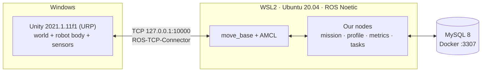

# UC6 Warehouse Robot (Mobile_Robo_SuppliesChain)

A simulated warehouse in **Unity** on Windows. One **TurtleBot3 Waffle Pi** is driven by the **ROS 1 Noetic navigation stack** running in **WSL2 Ubuntu 20.04**. The robot picks items from shelves and delivers them to drop-off points without hitting static or moving obstacles.

> **Unity is the body, ROS is the brain, MySQL is the notebook.**
> What is graded: obstacle avoidance (M1 navigate → M2 static → M3 dynamic). Everything else is support.



---

## Contents

1. [Where we are now (status checklist)](#1-where-we-are-now-status-checklist)
2. [Requirements](#2-requirements)
3. [Download the project](#3-download-the-project)
4. [Install and set up, step by step](#4-install-and-set-up-step-by-step)
5. [Run it](#5-run-it)
6. [Repository layout](#6-repository-layout)
7. [Which document to read for what](#7-which-document-to-read-for-what)
8. [Working together (Git rules)](#8-working-together-git-rules)
9. [Credits and license](#9-credits-and-license)

---

## 1. Where we are now (status checklist)

**Current phase: P0 · Environment (week 1).** Phases and gates are defined in [docs/milestones.md](docs/milestones.md).
Last updated: 2026-10-01 (branch `Nguyen-planning`).

### Done so far

**Planning and docs**
- [x] Moved the plan from ROS 2 / Nav2 / multi-robot to **ROS 1 Noetic / move_base / single robot**. The old plan is kept in [docs/_archive/2026-09-30-ros2-nav2-plan/](docs/_archive/2026-09-30-ros2-nav2-plan/)
- [x] PRD, architecture, data model, MySQL schema, test plan, milestones ([docs/](docs/))
- [x] Glossary of project words: [CONTEXT.md](CONTEXT.md)
- [x] ADR-001 to ADR-010 (decisions, see [§7](#7-which-document-to-read-for-what))
- [x] Tested setup guide for Windows + WSL2: [docs/setup-windows-wsl.md](docs/setup-windows-wsl.md) (NAT + localhost forwarding; mirrored networking was tested and rejected)

**Infrastructure**
- [x] MySQL 8 in Docker: [infra/docker-compose.yml](infra/docker-compose.yml) + [infra/.env.example](infra/.env.example), loads [docs/schema.sql](docs/schema.sql) on first start, port `3307`
- [x] `.gitattributes` forces LF endings for `ros/**`, `*.py`, `*.sh` (so Python nodes run in WSL)

**ROS side**
- [x] Package `warehouse_msgs`: 4 messages + 9 services ([ros/src/warehouse_msgs/](ros/src/warehouse_msgs/))

**Unity side**
- [x] ROS-TCP-Connector `v0.7.0` and URDF-Importer `v0.5.2` added to `Packages/manifest.json` (Unity installs them automatically)
- [x] ROS settings: protocol **ROS1**, `127.0.0.1:10000` ([Assets/Resources/ROSConnectionPrefab.prefab](WarehouseProjectURP/Assets/Resources/ROSConnectionPrefab.prefab))
- [x] C# classes generated for `warehouse_msgs` ([Assets/RosMessages/](WarehouseProjectURP/Assets/RosMessages/))
- [x] TurtleBot3 Waffle Pi imported from URDF and placed in `Warehouse.unity`, scaled **4x** ([ADR-010](docs/ADR-010-robot-scale.md))
- [x] `DiffDriveController.cs`: drives the robot through its wheel joints from a `/cmd_vel`-style command; fixes the 5 physics problems of a raw URDF import
- [x] `FloorColliderFix.cs`: gives the zero-thickness warehouse floor real colliders
- [x] `TurtleBotNavigator.cs`: Unity-only A* test mode (start → shelf → dwell → home). **Not** the graded path
- [x] Play Mode tests pass: settle, drive forward, turn, full navigator mission ([Assets/Tests/PlayMode/](WarehouseProjectURP/Assets/Tests/PlayMode/))
- [x] Old cube A* prototype retired to [_archive/unity-astar-prototype/](_archive/unity-astar-prototype/) ([ADR-008](docs/ADR-008-navigation-stack.md))

### Still to do to close P0

- [ ] Unity: `OdometryPublisher` (`/odom` + TF), `LaserScanPublisher` (`/scan`), `ClockPublisher` (`/clock`), and a `/cmd_vel` subscriber feeding `DiffDriveController`. Divide positions and ranges by the robot scale (4) before publishing ([ADR-010](docs/ADR-010-robot-scale.md))
- [ ] ROS: `warehouse_bringup` package with `bringup.launch` (endpoint + `robot_state_publisher` + RViz config)
- [ ] Smoke test ([setup guide §8](docs/setup-windows-wsl.md#8-end-to-end-smoke-test)) passes on **all 4 machines**
- [ ] `/scan` and `/odom` visible in RViz
- [ ] Assign the 4 roles in [docs/milestones.md §2](docs/milestones.md#2-roles)

### Next phases (not started)

- [ ] **P1 · M1 navigate** (week 2): gmapping map, AMCL, `move_base` + DWA, scenario S-00
- [ ] **P2 · M2 static** (weeks 3–4): S-01 to S-03, motion profiles per category
- [ ] **P3 · M3 dynamic** (weeks 5–6): NPCs, S-04, DWA vs TEB benchmark, S-05
- [ ] **P4 · Evidence** (weeks 7–8): N = 20 runs per scenario, videos, demo rehearsal

---

## 2. Requirements

### Hardware
| Item | Minimum |
|------|---------|
| OS | Windows 10 (build 19041+) or Windows 11 |
| RAM | 16 GB recommended (8 GB goes to WSL) |
| Free disk | ~40 GB on `C:` |
| BIOS | Virtualisation (Intel VT-x / AMD-V) enabled |

### Software to install
| Software | Version | Where it runs | Used for |
|----------|---------|---------------|----------|
| [Git for Windows](https://git-scm.com/download/win) | any recent | Windows | Clone the repo. **Unity also needs it** to download the git packages in `manifest.json` |
| [Unity Hub](https://unity.com/download) + **Unity 2021.1.11f1** | exactly `2021.1.11f1` | Windows | The simulation (`WarehouseProjectURP`) |
| WSL2 + **Ubuntu 20.04** | 20.04 only (not 22.04/24.04) | Windows | Linux for ROS |
| **ROS 1 Noetic** `desktop-full` | Noetic | WSL | Navigation stack, RViz |
| ROS packages: `navigation`, `teb-local-planner`, `gmapping`, `turtlebot3`, `turtlebot3-msgs`, `python3-pymysql` | Noetic | WSL | `move_base`, AMCL, mapping, MySQL driver |
| [ROS-TCP-Endpoint](https://github.com/Unity-Technologies/ROS-TCP-Endpoint) | `v0.7.0` | WSL (`~/catkin_ws/src`) | The ROS end of the Unity bridge |
| [Docker Desktop](https://www.docker.com/products/docker-desktop/) with WSL integration | any recent | Windows | Runs MySQL 8 |

Unity packages (**installed automatically** when you open the project, nothing to do): ROS-TCP-Connector `v0.7.0`, URDF-Importer `v0.5.2`.

Time needed for a fresh machine: about **2–3 hours**, mostly downloads.

---

## 3. Download the project

Clone the team branch on **Windows** (Unity needs the files on the Windows disk). Pick a path; avoid OneDrive folders.

```bash
git clone -b Nguyen-planning https://github.com/HoNguyen17/Mobile_Robo_SuppliesChain.git
```

```bash
cd Mobile_Robo_SuppliesChain
```

Already cloned? Update instead:

```bash
git fetch origin
```

```bash
git checkout Nguyen-planning
```

```bash
git pull
```

> Remember the full Windows path of your clone. In WSL you will refer to it as `/mnt/c/...`, for example
> `C:\Users\you\Projects\Mobile_Robo_SuppliesChain` → `/mnt/c/Users/you/Projects/Mobile_Robo_SuppliesChain`.

---

## 4. Install and set up, step by step

The full guide, with a **✅ Check** after every step, is **[docs/setup-windows-wsl.md](docs/setup-windows-wsl.md)**. Follow it in order. This table tells you which section to read and what is already done for you in the repo.

| # | Step | Read | Notes for teammates |
|:-:|------|------|---------------------|
| 1 | Install WSL2 + Ubuntu 20.04 | [setup §1](docs/setup-windows-wsl.md#1-install-wsl2-and-ubuntu-2004) | `wsl --install -d Ubuntu-20.04` in an **admin** PowerShell |
| 2 | Configure WSL networking and memory | [setup §2](docs/setup-windows-wsl.md#2-configure-wsl-networking-and-memory) | Use `networkingMode=nat` + `localhostForwarding=true`. **Do not** use mirrored mode |
| 3 | Install ROS 1 Noetic | [setup §3](docs/setup-windows-wsl.md#3-install-ros-1-noetic) | Use the `ros-apt-source` package; old `apt-key` guides fail |
| 4 | Install navigation packages | [setup §4](docs/setup-windows-wsl.md#4-install-the-navigation-packages) | |
| 5 | Build the catkin workspace | [setup §5](docs/setup-windows-wsl.md#5-build-the-catkin-workspace) | **Change `REPO` to your own clone path** (it contains spaces, keep the quotes). This builds `warehouse_msgs` + `ros_tcp_endpoint` |
| 6 | MySQL in Docker | [setup §6](docs/setup-windows-wsl.md#6-mysql-in-docker-docker-desktop--wsl-integration) | `cp .env.example .env`, set your own passwords. **Never commit `infra/.env`** |
| 7 | Open the Unity project | [setup §7](docs/setup-windows-wsl.md#7-unity-project-windows) | See below: most of §7 is already done in the repo |
| 8 | End-to-end smoke test | [setup §8](docs/setup-windows-wsl.md#8-end-to-end-smoke-test) | This is the P0 gate. Tell the team when yours passes |

### Step 7 shortcut: what is already done in the repo

| Setup §7 item | Status | What you do |
|---------------|--------|-------------|
| 7.1 Add `WarehouseProjectURP` in Unity Hub with 2021.1.11f1 | You | Unity Hub → **Add** → select the `WarehouseProjectURP` folder. First open takes a while (it builds `Library/`) |
| 7.2 Add ROS-TCP-Connector + URDF-Importer | ✅ In `manifest.json` | Nothing. If Unity shows a package error, check that `git --version` works in a Windows terminal, then restart Unity |
| 7.3 ROS Settings (ROS1, `127.0.0.1`, `10000`) | ✅ Committed | Just verify in **Robotics → ROS Settings** |
| 7.4 Import the Waffle Pi URDF | ✅ Robot is in `Warehouse.unity` | Nothing. Only redo it if the robot is missing |
| 7.5 Generate C# for `warehouse_msgs` | ✅ In `Assets/RosMessages/` | Redo only when a `.msg`/`.srv` changes: **Robotics → Generate ROS Messages…** → browse to **your** `ros/src/warehouse_msgs` |

Open the scene **`Assets/Scenes/Warehouse.unity`**.

### Verify Unity works on your machine

1. **Window → General → Test Runner → PlayMode → Run All.** Both tests must pass:
   - `RobotDriveTests.Drives_on_warehouse_scene`: robot settles, drives forward, turns
   - `RobotNavigatorTests.Navigator_goes_to_shelf_and_home`: robot reaches the shelf and comes back
2. Press **Play** in `Warehouse.unity`: the robot rests on the floor and does not fall or jitter. See [§5](#5-run-it) to make it drive.

If both work, your Unity side is ready.

---

## 5. Run it

### Today (P0): Unity-only test mode

No ROS needed. Open `Warehouse.unity` and select the robot `turtlebot3_waffle_pi`:
- **TurtleBotNavigator**: drag a shelf into **Target**, press **Play**. The robot plans with A*, drives there, dwells, and drives home.
- **DiffDriveController → Keyboard Teleop** (ticked): when the navigator is idle, drive with the arrow keys (up = forward, left = turn left). Leave the *Invert Wheel* boxes unticked.

### Bridge smoke test (Unity ↔ ROS)

Each command in its own WSL terminal:

```bash
roscore
```

```bash
roslaunch ros_tcp_endpoint endpoint.launch tcp_ip:=0.0.0.0 tcp_port:=10000
```

Then press **Play** in Unity. The HUD arrows in the top-left turn **blue** when connected.
From a Windows PowerShell you can also check the port:

```powershell
(Test-NetConnection 127.0.0.1 -Port 10000).TcpTestSucceeded
```

> `/clock`, `/scan`, `/odom` and driving through `/cmd_vel` need the Unity publishers that are still on the P0 to-do list. Until they exist, rows 5–6 of the smoke test cannot pass yet.

### MySQL

From WSL, in your clone:

```bash
cd "$REPO/infra" && docker compose up -d
```

```bash
docker compose exec mysql mysql -uwarehouse -p warehouse -e "SHOW TABLES;"
```

Expected: `categories`, `items`, `run_events`, `runs`, `shelf_slots`, `tasks`.

### Later (from P1)

```bash
roslaunch warehouse_bringup bringup.launch
```

---

## 6. Repository layout

```text
.
├─ README.md                    ← you are here
├─ CONTEXT.md                   glossary: the exact words we use
├─ docs/                        PRD, architecture, setup guide, test plan, milestones, ADRs
│  └─ _archive/                 superseded ROS 2 / Nav2 plan
├─ infra/                       MySQL docker-compose + .env.example
├─ ros/src/
│  └─ warehouse_msgs/           our ROS messages and services
├─ WarehouseProjectURP/         ← the Unity project you open
│  └─ Assets/
│     ├─ Scenes/Warehouse.unity main scene (robot already placed)
│     ├─ Scripts/Robot/         DiffDriveController, FloorColliderFix, TurtleBotNavigator
│     ├─ Tests/PlayMode/        robot drive + navigator tests
│     ├─ URDF/                  TurtleBot3 Waffle Pi URDF + meshes
│     ├─ RosMessages/           C# generated from warehouse_msgs
│     └─ Resources/             ROS connection settings
├─ com.unity.robotics.warehouse.*   Unity warehouse packages (upstream, used by the project)
├─ WarehouseProjectHDRP/        upstream HDRP version (not used)
└─ _archive/                    retired code and the upstream README
```

---

## 7. Which document to read for what

| Read | When you need to know… |
|------|------------------------|
| [docs/README.md](docs/README.md) | Overview and reading order |
| [docs/prd.md](docs/prd.md) | What we build, what we don't, how we are graded |
| [docs/architecture.md](docs/architecture.md) | Nodes, topics, services, diagrams |
| [docs/setup-windows-wsl.md](docs/setup-windows-wsl.md) | **How to install everything** (+ troubleshooting table) |
| [docs/test-plan.md](docs/test-plan.md) | Scenarios S-00…S-05, metrics, pass/fail numbers |
| [docs/milestones.md](docs/milestones.md) | Week-by-week plan, roles, risks |
| [docs/data-model.md](docs/data-model.md) + [docs/schema.sql](docs/schema.sql) | MySQL tables |
| [CONTEXT.md](CONTEXT.md) | Glossary |

**Decisions (ADRs):**

| ADR | Decision |
|-----|----------|
| [001](docs/ADR-001-robot-platform.md) | TurtleBot3 Waffle Pi, no arm. Pickup = dwell, then attach in Unity |
| [002](docs/ADR-002-perception-scope.md) | No ML perception. Shelf poses come from the catalog |
| [003](docs/ADR-003-ros1-noetic.md) | ROS 1 Noetic (course requirement) |
| [004](docs/ADR-004-local-planner.md) | Local planner: DWA vs TEB, chosen by benchmark |
| [005](docs/ADR-005-mysql-database.md) | MySQL. Only `task_manager` touches it |
| [006](docs/ADR-006-single-robot.md) | Single robot only |
| [007](docs/ADR-007-windows-wsl-environment.md) | Unity on Windows + ROS in WSL2, over localhost |
| [008](docs/ADR-008-navigation-stack.md) | move_base + AMCL + static map. Unity A* is test mode only |
| [009](docs/ADR-009-simulation-clock.md) | Unity publishes `/clock`. ROS uses sim time |
| [010](docs/ADR-010-robot-scale.md) | Robot scaled 4x in Unity; ROS still sees true metres |

Stuck during setup? Check the **Troubleshooting** table at the end of [docs/setup-windows-wsl.md](docs/setup-windows-wsl.md) first.

---

## 8. Working together (Git rules)

- Branch from `Nguyen-planning` for your work; open a pull request back into it.
- Issues and tasks live in [GitHub Issues](https://github.com/HoNguyen17/Mobile_Robo_SuppliesChain/issues).
- Commit messages: `feat: …`, `fix: …`, `docs: …`, `chore: …`.
- **Never commit** `infra/.env`, `WarehouseProjectURP/Library/`, `Temp/`, `Logs/`, `UserSettings/` (already in `.gitignore`).
- Always commit Unity `.meta` files together with their asset.
- Do not delete files: move retired ones to `_archive/`.
- Do not change the robot's 4x scale once the ROS map is built ([ADR-010](docs/ADR-010-robot-scale.md)).
- Only one person edits `Warehouse.unity` at a time. Unity scenes merge badly; say so in the group chat before you change it.

---

## 9. Credits and license

The warehouse environment comes from [Unity-Technologies/Robotics-Warehouse](https://github.com/Unity-Technologies/Robotics-Warehouse) (its original README is kept in [_archive/unity-warehouse-upstream/README.md](_archive/unity-warehouse-upstream/README.md)). TurtleBot3 models are from [ROBOTIS](https://github.com/ROBOTIS-GIT/turtlebot3).

[Apache License 2.0](LICENSE)
