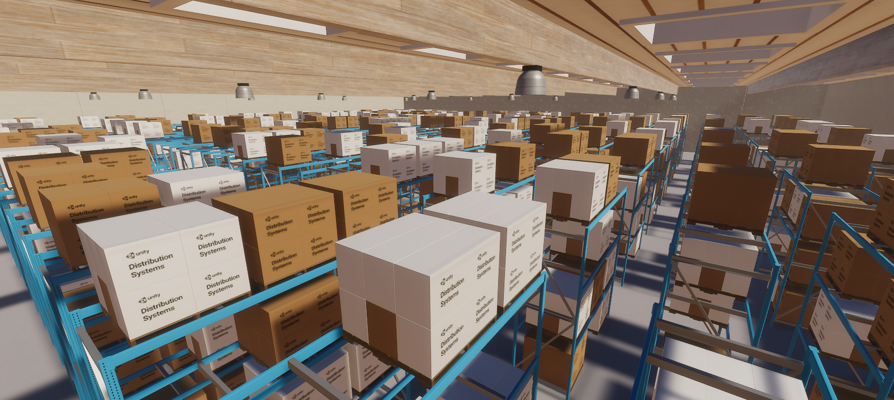
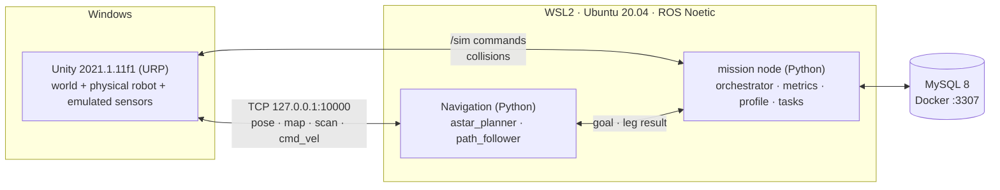

# UC6 Warehouse Robot (Mobile_Robo_SuppliesChain)

A simulated warehouse in **Unity** on Windows. One **TurtleBot3 Waffle Pi** is driven by our own **ROS 1 Noetic Python navigation nodes** running in **WSL2 Ubuntu 20.04**. The robot picks items from shelves and delivers them to drop-off points without hitting static or moving obstacles.

> **Unity is the body, ROS is the brain, MySQL is the notebook.**
> What is graded: obstacle avoidance (M1 navigate → M2 static → M3 dynamic). Everything else is support.



---

## Contents

1. [Where we are now (status checklist)](#1-where-we-are-now-status-checklist)
2. [Requirements](#2-requirements)
3. [Download the project](#3-download-the-project)
4. [Install and set up, step by step](#4-install-and-set-up-step-by-step)
5. [Run it](#5-run-it)
6. [Repository layout](#6-repository-layout)
7. [Which document to read for what](#7-which-document-to-read-for-what)
8. [Working together (Git rules)](#8-working-together-git-rules)
9. [Credits and license](#9-credits-and-license)

---

## 1. Where we are now (status checklist)

**Current phase: P0 · Environment (week 1).** The body pivot is built and its exit is met (Unity tests green, acceptance run passed; both reported by the user on 2026-10-05); the rest of the P1 gate is the `mission` node and scenario S-00. Phases and gates are defined in [docs/milestones.md](docs/milestones.md).
Last updated: 2026-10-05 (branch `claude/summary-progress-next-steps-168aad`, on top of `nguyen`).

On 2026-10-04 the project changed direction: **our own Python navigation** (A* planner + path follower) with **standard ROS messages only** ([ADR-012](docs/ADR-012-custom-python-navigation.md), [ADR-014](docs/ADR-014-ros-interfaces.md)). The robot body went from a kinematic Cube back to the **physical TurtleBot3 Waffle Pi at scale 4, with the physics standard** ([ADR-015](docs/ADR-015-physical-waffle-pi-body.md)). The earlier `move_base` plan is on branch `Nguyen-planning`.

### Done so far

**Planning and docs**
- [x] Plan moved from ROS 2 / Nav2 / multi-robot to ROS 1 Noetic / single robot ([old plan](docs/_archive/2026-09-30-ros2-nav2-plan/)), then from `move_base` to our own Python navigation ([archived `move_base` ADRs](docs/_archive/2026-10-04-move-base-plan/))
- [x] PRD, architecture, data model, MySQL schema, test plan, milestones, glossary ([docs/](docs/), [CONTEXT.md](CONTEXT.md)), ADR-001 to ADR-015
- [x] Setup guide for Windows + WSL2: [docs/setup-windows-wsl.md](docs/setup-windows-wsl.md). The WSL networking and ROS install parts were tested on `Nguyen-planning` (NAT + localhost forwarding; mirrored networking was tested and rejected). The steps changed on 2026-10-04 (workspace, Unity, smoke test) have **not** been run end to end on a clean machine

**Infrastructure**
- [x] MySQL 8 in Docker: [infra/docker-compose.yml](infra/docker-compose.yml) + [infra/.env.example](infra/.env.example), loads [docs/schema.sql](docs/schema.sql) on first start, port `3307`
- [x] `.gitattributes` forces LF endings for `ros1/**`, `*.py`, `*.sh`, `*.launch`, `*.yaml`, `*.xml` (so Python nodes run in WSL)

**ROS side**
- [x] `ros1/turtlebot_control`: A* planner and path follower in true robot metres on sim time, with `/nav/cancel` and `/nav/leg_result`. 109 unit tests pass on Windows (Python 3.14) and in WSL (Python 3.8.10), including a closed-loop model of a Waffle Pi that checks its 0.257 m footprint never touches a wall
- [x] The real nodes ran against a stand-in for Unity in WSL (sim time, clock restart): scenarios A to I pass
- [x] `ros1/warehouse_bringup`: `bringup.launch` starts the endpoint, planner, follower and RViz. Ran against the real Unity in the acceptance run (reported by the user, 2026-10-05)

**Unity side**
- [x] The physical Waffle Pi at scale 4 (`DiffDriveController`, holding brake), the physics standard ([ADR-011](docs/ADR-011-physics-standard.md)) and their tests, taken from `Nguyen-planning`
- [x] New ROS scripts: `RobotPosePublisher` (`/robot/pose`), `WarehouseMapPublisher` (raw `/map`), `CollisionReporter` (`/sim/collision`), and the menu *Robotics > Warehouse > Add ROS Bridge*. All C# assemblies compile offline with Unity's own compiler; 30 pure Edit Mode tests pass outside Unity (2 more need the Unity runtime)
- [x] The project opens and imports in Unity 2021.1.11f1 without a compile error. *Add ROS Bridge* was run, the scene saved, and one Play without ROS built the map (317 × 317 cells of 0.05 m)
- [x] ROS-TCP-Connector `v0.7.0` and URDF-Importer `v0.5.2` are pinned in `Packages/manifest.json`; ROS settings `127.0.0.1:10000` are in [Assets/Resources/ROSConnectionPrefab.prefab](WarehouseProjectURP/Assets/Resources/ROSConnectionPrefab.prefab)
- [x] Edit Mode and Play Mode tests are green in the Unity Test Runner (reported by the user, 2026-10-05; no figures recorded)
- [x] The Cube prototype is archived: Unity scripts in [_archive/unity-cube-prototype/](_archive/unity-cube-prototype/README.md), ROS package in [_archive/ros1-cube-prototype/](_archive/ros1-cube-prototype/README.md)

### Still to do to close P0

- [ ] First integrated run: `bringup.launch` + Unity Play, with `/map` and `/robot/pose` visible in RViz (the acceptance run below used this stack; the RViz check itself was not reported)
- [ ] Smoke test ([setup guide §8](docs/setup-windows-wsl.md#8-end-to-end-smoke-test)) passes on **all 4 machines**
- [ ] Assign the 4 roles in [docs/milestones.md §2](docs/milestones.md#2-roles)
- [ ] Agree who edits `Warehouse.unity` (see [§8](#8-working-together-git-rules))

### Exit of the body pivot (met 2026-10-05, part of the P1 gate)

- [x] Edit Mode and Play Mode tests run in the Unity Test Runner: green (reported by the user, no figures)
- [x] Acceptance run: HomePoint → point in front of the target shelf → HomePoint, driven by ROS (`ros1/turtlebot_control`), **5 consecutive runs**, each with `leg_result = succeeded`, a stop within 0.15 m of the goal, no collision and no tip. Passed (reported by the user, no per-run figures)
- [x] Archived afterwards: `ros1/cube_control` and `README_ROS1_Prototype.md` in [_archive/ros1-cube-prototype/](_archive/ros1-cube-prototype/README.md), ADR-013 in [docs/_archive/2026-10-04-kinematic-cube-plan/](docs/_archive/2026-10-04-kinematic-cube-plan/README.md)

**Open question (not decided):** the S-01 clearance threshold of 0.15 m cannot be met with the default inflation of 0.35 m (about 9 cm of clearance around the 0.257 m footprint). The first S-01 dry run decides ([docs/test-plan.md](docs/test-plan.md)).

**Planned feature (after the graded milestones are safe):** mobile manipulator + inventory panel, see [docs/features/mobile-manipulator-inventory/requirements.md](docs/features/mobile-manipulator-inventory/requirements.md).

### Next phases (not started)

- [ ] **P1 · M1 navigate** (week 2): Unity tests and the acceptance run passed (2026-10-05); still open: `mission` node, scenario S-00
- [ ] **P2 · M2 static** (weeks 3–4): obstacle layer from `/scan`, replan and recovery, S-01 to S-03, motion profiles per category
- [ ] **P3 · M3 dynamic** (weeks 5–6): NPCs, S-04, S-05
- [ ] **P4 · Evidence** (weeks 7–8): N = 20 runs per scenario, videos, demo rehearsal

---

## 2. Requirements

### Hardware
| Item | Minimum |
|------|---------|
| OS | Windows 10 (build 19041+) or Windows 11 |
| RAM | 16 GB recommended (8 GB goes to WSL) |
| Free disk | ~40 GB on `C:` |
| BIOS | Virtualisation (Intel VT-x / AMD-V) enabled |

### Software to install
| Software | Version | Where it runs | Used for |
|----------|---------|---------------|----------|
| [Git for Windows](https://git-scm.com/download/win) | any recent | Windows | Clone the repo. **Unity also needs it** to download the git packages in `manifest.json` |
| [Unity Hub](https://unity.com/download) + **Unity 2021.1.11f1** | exactly `2021.1.11f1` | Windows | The simulation (`WarehouseProjectURP`) |
| WSL2 + **Ubuntu 20.04** | 20.04 only (not 22.04/24.04) | Windows | Linux for ROS |
| **ROS 1 Noetic** `desktop-full` | Noetic | WSL | ROS runtime, RViz |
| ROS packages: `python3-pymysql`, `python-is-python3`, `ros-noetic-turtlebot3-description` | Noetic | WSL | MySQL driver, `python` command, the Waffle Pi model for RViz |
| [ROS-TCP-Endpoint](https://github.com/Unity-Technologies/ROS-TCP-Endpoint) | `v0.7.0` | WSL (`~/catkin_ws/src`) | The ROS end of the Unity bridge |
| [Docker Desktop](https://www.docker.com/products/docker-desktop/) with WSL integration | any recent | Windows | Runs MySQL 8 |

Unity packages (**installed automatically** when you open the project, nothing to do): ROS-TCP-Connector `v0.7.0` and URDF-Importer `v0.5.2`, pinned in `Packages/manifest.json`.

Time needed for a fresh machine: about **2–3 hours**, mostly downloads.

---

## 3. Download the project

Clone the repo on **Windows** (Unity needs the files on the Windows disk). Pick a path; avoid OneDrive folders.

```bash
git clone https://github.com/HoNguyen17/Mobile_Robo_SuppliesChain.git
```

```bash
cd Mobile_Robo_SuppliesChain
```

Then check out the branch you need:

```bash
git checkout claude/summary-progress-next-steps-168aad
```

> **Branches.** `Nguyen-planning` is still the team branch. It holds the earlier `move_base` plan with the physical robot. `nguyen` holds the Python-navigation plan on top of `Nhan-turtlebot`, and `claude/summary-progress-next-steps-168aad` (this README) builds on it with the physical Waffle Pi and `ros1/turtlebot_control`. Both are working branches and are **not pushed yet**; the team switches only after everyone agrees. Until they are pushed, the checkout only works on the machine where they were created.

> Remember the full Windows path of your clone. In WSL you will refer to it as `/mnt/c/...`, for example
> `C:\Users\you\Projects\Mobile_Robo_SuppliesChain` → `/mnt/c/Users/you/Projects/Mobile_Robo_SuppliesChain`.

---

## 4. Install and set up, step by step

The full guide, with a **✅ Check** after every step, is **[docs/setup-windows-wsl.md](docs/setup-windows-wsl.md)**. Follow it in order. This table tells you which section to read and what is already done for you in the repo.

| # | Step | Read | Notes for teammates |
|:-:|------|------|---------------------|
| 1 | Install WSL2 + Ubuntu 20.04 | [setup §1](docs/setup-windows-wsl.md#1-install-wsl2-and-ubuntu-2004) | `wsl --install -d Ubuntu-20.04` in an **admin** PowerShell |
| 2 | Configure WSL networking and memory | [setup §2](docs/setup-windows-wsl.md#2-configure-wsl-networking-and-memory) | Use `networkingMode=nat` + `localhostForwarding=true`. **Do not** use mirrored mode |
| 3 | Install ROS 1 Noetic | [setup §3](docs/setup-windows-wsl.md#3-install-ros-1-noetic) | Use the `ros-apt-source` package; old `apt-key` guides fail |
| 4 | Install the extra packages | [setup §4](docs/setup-windows-wsl.md#4-install-the-extra-packages) | `python3-pymysql`, `python-is-python3` and `ros-noetic-turtlebot3-description` |
| 5 | Build the catkin workspaces | [setup §5](docs/setup-windows-wsl.md#5-build-the-catkin-workspaces) | **Change `REPO` to your own clone path** (it contains spaces, keep the quotes). `~/catkin_ws` builds `ros_tcp_endpoint`; `~/nav_ws` links `ros1/turtlebot_control` and `ros1/warehouse_bringup` |
| 6 | MySQL in Docker | [setup §6](docs/setup-windows-wsl.md#6-mysql-in-docker-docker-desktop--wsl-integration) | `cp .env.example .env`, set your own passwords. **Never commit `infra/.env`** |
| 7 | Open the Unity project | [setup §7](docs/setup-windows-wsl.md#7-unity-project-windows) | See below: most of §7 is already done in the repo |
| 8 | End-to-end smoke test | [setup §8](docs/setup-windows-wsl.md#8-end-to-end-smoke-test) | This is the P0 gate. Tell the team when yours passes |

### Step 7 shortcut: what is already done in the repo

| Setup §7 item | Status | What you do |
|---------------|--------|-------------|
| 7.1 Add `WarehouseProjectURP` in Unity Hub with 2021.1.11f1 | You | Unity Hub → **Add** → select the `WarehouseProjectURP` folder. The first import is long (it builds `Library/`) |
| 7.2 ROS-TCP-Connector + URDF-Importer | ✅ Pinned in `manifest.json` | Nothing. If Unity shows a package error, check that `git --version` works in a Windows terminal, then restart Unity |
| 7.3 ROS Settings (ROS1, `127.0.0.1`, `10000`) | ✅ Committed | Just verify in **Robotics → ROS Settings** |
| 7.4 The robot | ✅ The physical Waffle Pi, scale 4, in `Warehouse.unity` | Nothing. Do not re-import the URDF ([ADR-010](docs/ADR-010-robot-scale.md)) |
| 7.5 ROS bridge components | You | **Robotics → Warehouse → Add ROS Bridge**, then save the scene. Safe to run twice |
| 7.6 Tests | You | **Window → General → Test Runner**: run the **EditMode** and **PlayMode** tabs. Green on 2026-10-05 (reported by the user) |

Open the scene **`Assets/Scenes/Warehouse.unity`**, then press **Play** (without ROS): the robot stands on the floor and the Console prints the home point, the target shelf and the robot position, then the size of the map. If it does, your Unity side is ready. The red HUD arrows and the `Connection to 127.0.0.1:10000 …` lines in the Console are normal until the ROS endpoint runs.

---

## 5. Run it

After the setup, one command in a WSL terminal starts the bridge endpoint (port 10000), the planner, the follower and RViz (fixed frame `map`). Start it **before** you press Play:

```bash
roslaunch warehouse_bringup bringup.launch
```

`nav:=false` starts only the bridge, the robot model and RViz (drive by hand with `/cmd_vel`); `rviz:=false` skips RViz.

Press **Play** in Unity. The HUD arrows in the top-left of the Game view turn **blue** when the bridge is connected. From a Windows PowerShell you can also check the port:

```powershell
(Test-NetConnection 127.0.0.1 -Port 10000).TcpTestSucceeded
```

The planner and the follower are **silent until a goal arrives**. Send one and watch the result. `x` and `y` are in robot metres; read them from the `RobotPosePublisher` line in Unity's Console at Play (home point, target shelf, robot position):

```bash
rostopic pub -1 /move_base_simple/goal geometry_msgs/PoseStamped "{header: {frame_id: 'map'}, pose: {position: {x: <x>, y: <y>, z: 0.0}, orientation: {w: 1.0}}}"
```

```bash
rostopic echo /nav/leg_result
```

`{"outcome": "succeeded", ...}` means the robot arrived. A goal in a frame other than `map` is refused. Details, topics and parameters: [setup §8a](docs/setup-windows-wsl.md#8a-send-a-goal-and-read-the-result) and [ros1/turtlebot_control/README.md](ros1/turtlebot_control/README.md).

### Python tests

The navigation logic is plain Python, tested without ROS and without Unity. From the repo root, in WSL (on Windows use `python` instead of `python3`):

```bash
cd ros1/turtlebot_control
python3 -m unittest discover -s test -v
```

### MySQL

From WSL, in your clone:

```bash
cd "$REPO/infra" && docker compose up -d
```

```bash
docker compose exec mysql mysql -uwarehouse -p warehouse -e "SHOW TABLES;"
```

Expected: `categories`, `items`, `run_events`, `runs`, `shelf_slots`, `tasks`.

---

## 6. Repository layout

```text
.
├─ README.md                    ← you are here
├─ CONTEXT.md                   glossary: the exact words we use
├─ docs/                        PRD, architecture, setup guide, test plan, milestones, ADRs
│  └─ _archive/                 superseded plans (ROS 2 / Nav2, move_base, kinematic Cube ADR-013)
├─ infra/                       MySQL docker-compose + .env.example
├─ ros1/                        catkin packages (built in WSL)
│  ├─ turtlebot_control/        astar_planner, path_follower, unit tests, runbook
│  └─ warehouse_bringup/        bringup.launch + RViz config
├─ WarehouseProjectURP/         ← the Unity project you open
│  └─ Assets/
│     ├─ Scenes/Warehouse.unity main scene (the physical Waffle Pi at scale 4)
│     ├─ Scripts/               Physics/ (physics standard), Robot/ (DiffDriveController, TurtleBotNavigator), Ros/ (publishers, map, collisions)
│     ├─ Tests/                 EditMode/ and PlayMode/ tests
│     ├─ URDF/                  TurtleBot3 Waffle Pi URDF + meshes
│     └─ Resources/             ROS connection settings
├─ com.unity.robotics.warehouse.*   Unity warehouse packages (upstream, used by the project)
├─ WarehouseProjectHDRP/        upstream HDRP version (not used)
└─ _archive/                    the upstream README, and the Cube prototype: unity-cube-prototype/ (Unity scripts), ros1-cube-prototype/ (cube_control, README_ROS1_Prototype.md)
```

Archived (moved, not deleted): the ROS 2 / Nav2, `move_base` and kinematic-Cube (ADR-013) plans in `docs/_archive/`, and the Cube prototype in `_archive/`: the Unity scripts in `unity-cube-prototype/`, and `ros1/cube_control` with `README_ROS1_Prototype.md` in `ros1-cube-prototype/` (moved after the acceptance run passed on 2026-10-05).

---

## 7. Which document to read for what

| Read | When you need to know… |
|------|------------------------|
| [docs/README.md](docs/README.md) | Overview and reading order |
| [docs/prd.md](docs/prd.md) | What we build, what we don't, how we are graded |
| [docs/architecture.md](docs/architecture.md) | Nodes, topics, interface contract, diagrams |
| [docs/setup-windows-wsl.md](docs/setup-windows-wsl.md) | **How to install everything** (+ troubleshooting table) |
| [docs/test-plan.md](docs/test-plan.md) | Scenarios S-00…S-05, metrics, pass/fail numbers |
| [docs/milestones.md](docs/milestones.md) | Week-by-week plan, roles, risks |
| [docs/data-model.md](docs/data-model.md) + [docs/schema.sql](docs/schema.sql) | MySQL tables |
| [ros1/turtlebot_control/README.md](ros1/turtlebot_control/README.md) | Running the planner and follower, topics, parameters, tests |
| [CONTEXT.md](CONTEXT.md) | Glossary |

**Decisions (ADRs):**

| ADR | Decision |
|-----|----------|
| [001](docs/ADR-001-robot-platform.md) | TurtleBot3 Waffle Pi, no arm. Pickup = dwell, then attach in Unity |
| [002](docs/ADR-002-perception-scope.md) | No ML perception. Shelf poses come from the catalog; pose and map are ground truth |
| [003](docs/ADR-003-ros1-noetic.md) | ROS 1 Noetic (course requirement), standard messages only |
| [004](docs/_archive/2026-10-04-move-base-plan/ADR-004-local-planner.md) | _Archived._ Local planner DWA vs TEB (superseded by 012) |
| [005](docs/ADR-005-mysql-database.md) | MySQL. Only the `task_manager` class touches it |
| [006](docs/ADR-006-single-robot.md) | Single robot only |
| [007](docs/ADR-007-windows-wsl-environment.md) | Unity on Windows + ROS in WSL2, over localhost |
| [008](docs/_archive/2026-10-04-move-base-plan/ADR-008-navigation-stack.md) | _Archived._ move_base + AMCL + static map (superseded by 012) |
| [009](docs/ADR-009-simulation-clock.md) | Unity publishes `/clock`. ROS uses sim time |
| [010](docs/ADR-010-robot-scale.md) | Robot scaled 4x in Unity; ROS sees true robot metres |
| [011](docs/ADR-011-physics-standard.md) | Physics standard: Unity is an exact 4x model of Earth (gravity 39.24 m/s² in Unity) |
| [012](docs/ADR-012-custom-python-navigation.md) | Navigation: custom Python A* planner + path follower, ground-truth pose |
| [013](docs/_archive/2026-10-04-kinematic-cube-plan/ADR-013-kinematic-robot-body.md) | _Archived, superseded by 015._ Robot body: kinematic Cube with a Waffle Pi visual model, emulated sensors |
| [014](docs/ADR-014-ros-interfaces.md) | ROS interfaces: standard messages only, one `mission` node |
| [015](docs/ADR-015-physical-waffle-pi-body.md) | Robot body: physical Waffle Pi at scale 4. Supersedes 013, re-activates 010 and 011 |

Stuck during setup? Check the **Troubleshooting** table at the end of [docs/setup-windows-wsl.md](docs/setup-windows-wsl.md) first.

---

## 8. Working together (Git rules)

- Branch from `Nguyen-planning` for your work; open a pull request back into it. This stays the rule until the team agrees on a new base branch (see [§3](#3-download-the-project)).
- Issues and tasks live in [GitHub Issues](https://github.com/HoNguyen17/Mobile_Robo_SuppliesChain/issues).
- Commit messages: `feat: …`, `fix: …`, `docs: …`, `chore: …`.
- **Never commit** `infra/.env`, `WarehouseProjectURP/Library/`, `Temp/`, `Logs/`, `UserSettings/` (already in `.gitignore`).
- Always commit Unity `.meta` files together with their asset.
- Do not delete files: move retired ones to `_archive/`.
- The robot scale (4) lives in one Transform, and only scale 4 is verified for the physical robot. Do not change it without updating [ADR-010](docs/ADR-010-robot-scale.md) and [ADR-015](docs/ADR-015-physical-waffle-pi-body.md).
- Only one person edits `Warehouse.unity` at a time. Unity scenes merge badly; say so in the group chat before you change it.

---

## 9. Credits and license

The warehouse environment comes from [Unity-Technologies/Robotics-Warehouse](https://github.com/Unity-Technologies/Robotics-Warehouse) (its original README is kept in [_archive/unity-warehouse-upstream/README.md](_archive/unity-warehouse-upstream/README.md)). TurtleBot3 models are from [ROBOTIS](https://github.com/ROBOTIS-GIT/turtlebot3).

[Apache License 2.0](LICENSE)
