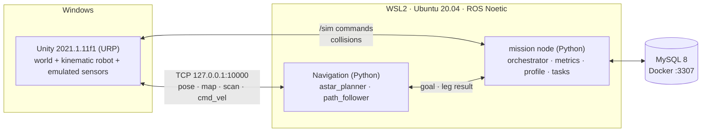

# UC6 Warehouse Robot (Mobile_Robo_SuppliesChain)

A simulated warehouse in **Unity** on Windows. One **TurtleBot3 Waffle Pi** is driven by our own **ROS 1 Noetic Python navigation nodes** running in **WSL2 Ubuntu 20.04**. The robot picks items from shelves and delivers them to drop-off points without hitting static or moving obstacles.

> **Unity is the body, ROS is the brain, MySQL is the notebook.**
> What is graded: obstacle avoidance (M1 navigate → M2 static → M3 dynamic). Everything else is support.



---

## Contents

1. [Where we are now (status checklist)](#1-where-we-are-now-status-checklist)
2. [Requirements](#2-requirements)
3. [Download the project](#3-download-the-project)
4. [Install and set up, step by step](#4-install-and-set-up-step-by-step)
5. [Run it](#5-run-it)
6. [Repository layout](#6-repository-layout)
7. [Which document to read for what](#7-which-document-to-read-for-what)
8. [Working together (Git rules)](#8-working-together-git-rules)
9. [Credits and license](#9-credits-and-license)

---

## 1. Where we are now (status checklist)

**Current phase: P0 · Environment (week 1).** Phases and gates are defined in [docs/milestones.md](docs/milestones.md).
Last updated: 2026-10-04 (branch `nguyen`, built on `Nhan-turtlebot` @ `3f0f7bd`).

On 2026-10-04 the project changed direction: **our own Python navigation** (A* planner + path follower) on a **kinematic robot body**, with **standard ROS messages only** ([ADR-012](docs/ADR-012-custom-python-navigation.md), [ADR-013](docs/ADR-013-kinematic-robot-body.md), [ADR-014](docs/ADR-014-ros-interfaces.md)). The earlier `move_base` plan, with the physical robot, is on branch `Nguyen-planning`.

### Done so far

**Planning and docs**
- [x] Plan moved from ROS 2 / Nav2 / multi-robot to ROS 1 Noetic / single robot ([old plan](docs/_archive/2026-09-30-ros2-nav2-plan/)), then from `move_base` to our own Python navigation ([archived `move_base` ADRs](docs/_archive/2026-10-04-move-base-plan/))
- [x] PRD, architecture, data model, MySQL schema, test plan, milestones, re-aligned on 2026-10-04 ([docs/](docs/))
- [x] Glossary of project words: [CONTEXT.md](CONTEXT.md)
- [x] ADR-001 to ADR-014 (see [§7](#7-which-document-to-read-for-what))
- [x] Setup guide for Windows + WSL2: [docs/setup-windows-wsl.md](docs/setup-windows-wsl.md). The WSL networking and ROS install parts were tested on `Nguyen-planning` (NAT + localhost forwarding; mirrored networking was tested and rejected). The steps changed on 2026-10-04 (§4, §5, §7, §8) are **not tested yet**

**Infrastructure**
- [x] MySQL 8 in Docker: [infra/docker-compose.yml](infra/docker-compose.yml) + [infra/.env.example](infra/.env.example), loads [docs/schema.sql](docs/schema.sql) on first start, port `3307` (carried unchanged from `Nguyen-planning`)
- [x] `.gitattributes` forces LF endings for `ros1/**`, `*.py`, `*.sh`, `*.launch`, `*.yaml`, `*.xml` (so Python nodes run in WSL)

**ROS side (Nhan)**
- [x] Package `cube_control` ([ros1/cube_control/](ros1/cube_control/)): `astar_planner.py` (A* on `/map`), `path_follower.py`, `go_to_goal.py`, `map_viewer.py` and three demo scripts. [README_ROS1_Prototype.md](README_ROS1_Prototype.md) records two goals reached

**Unity side (Nhan)**
- [x] ROS-TCP-Connector and URDF-Importer in `Packages/manifest.json` (**not pinned yet**)
- [x] ROS settings `127.0.0.1:10000` ([Assets/Resources/ROSConnectionPrefab.prefab](WarehouseProjectURP/Assets/Resources/ROSConnectionPrefab.prefab))
- [x] The robot is the object `Cube`: `CubeCmdVelSubscriber` (`/cmd_vel`), `CubePosePublisher` (`/cube/pose`), `OccupancyGridPublisher` (`/map`) in [Assets/Scripts/](WarehouseProjectURP/Assets/Scripts/)
- [x] TurtleBot3 Waffle Pi model attached to the `Cube` as a visual child, scale 3.2, physics stripped ([Assets/URDF/](WarehouseProjectURP/Assets/URDF/), [Assets/Editor/StripPhysicsFromRobot.cs](WarehouseProjectURP/Assets/Editor/StripPhysicsFromRobot.cs))
- [x] `CubeCarNavigator.cs` is used as the grid builder for `/map`; its own planning stays switched off

**Only on `Nguyen-planning` (not carried, deferred)**
- The physical Waffle Pi body (`DiffDriveController`, scale 4, holding brake), the physics standard ([ADR-011](docs/ADR-011-physics-standard.md)), their Edit Mode and Play Mode tests
- `OdometryPublisher`, `LaserScanPublisher`, `ClockPublisher`, the `warehouse_msgs` package, `bringup.launch` with TF. The LIDAR and clock scripts are ported in P1 and P2

### Still to do to close P0

- [ ] Smoke test ([setup guide §8](docs/setup-windows-wsl.md#8-end-to-end-smoke-test)) passes on **all 4 machines**
- [ ] Adapt `ros1/warehouse_bringup` (copied from `Nguyen-planning`): endpoint + planner + follower, `use_sim_time`, RViz fixed frame `map`
- [ ] Pin the Unity packages in `manifest.json` (ROS-TCP-Connector `v0.7.0`, URDF-Importer `v0.5.2`)
- [ ] Assign the 4 roles in [docs/milestones.md §2](docs/milestones.md#2-roles)
- [ ] Agree who edits `Warehouse.unity` (see [§8](#8-working-together-git-rules))

**Planned feature (after the graded milestones are safe):** mobile manipulator + inventory panel, see [docs/features/mobile-manipulator-inventory/requirements.md](docs/features/mobile-manipulator-inventory/requirements.md).

### Next phases (not started)

- [ ] **P1 · M1 navigate** (week 2): robot metres + sim time + raw map, `mission` node, scenario S-00
- [ ] **P2 · M2 static** (weeks 3–4): LIDAR emulation + obstacle layer, replan and recovery, S-01 to S-03, motion profiles per category
- [ ] **P3 · M3 dynamic** (weeks 5–6): NPCs, S-04, S-05
- [ ] **P4 · Evidence** (weeks 7–8): N = 20 runs per scenario, videos, demo rehearsal

---

## 2. Requirements

### Hardware
| Item | Minimum |
|------|---------|
| OS | Windows 10 (build 19041+) or Windows 11 |
| RAM | 16 GB recommended (8 GB goes to WSL) |
| Free disk | ~40 GB on `C:` |
| BIOS | Virtualisation (Intel VT-x / AMD-V) enabled |

### Software to install
| Software | Version | Where it runs | Used for |
|----------|---------|---------------|----------|
| [Git for Windows](https://git-scm.com/download/win) | any recent | Windows | Clone the repo. **Unity also needs it** to download the git packages in `manifest.json` |
| [Unity Hub](https://unity.com/download) + **Unity 2021.1.11f1** | exactly `2021.1.11f1` | Windows | The simulation (`WarehouseProjectURP`) |
| WSL2 + **Ubuntu 20.04** | 20.04 only (not 22.04/24.04) | Windows | Linux for ROS |
| **ROS 1 Noetic** `desktop-full` | Noetic | WSL | ROS runtime, RViz |
| ROS packages: `python3-pymysql`, `python-is-python3` | Noetic | WSL | MySQL driver, `python` command |
| [ROS-TCP-Endpoint](https://github.com/Unity-Technologies/ROS-TCP-Endpoint) | `v0.7.0` | WSL (`~/catkin_ws/src`) | The ROS end of the Unity bridge |
| [Docker Desktop](https://www.docker.com/products/docker-desktop/) with WSL integration | any recent | Windows | Runs MySQL 8 |

Unity packages (**installed automatically** when you open the project, nothing to do): ROS-TCP-Connector and URDF-Importer. P0 pins them to `v0.7.0` and `v0.5.2`.

Time needed for a fresh machine: about **2–3 hours**, mostly downloads.

---

## 3. Download the project

Clone the repo on **Windows** (Unity needs the files on the Windows disk). Pick a path; avoid OneDrive folders.

```bash
git clone https://github.com/HoNguyen17/Mobile_Robo_SuppliesChain.git
```

```bash
cd Mobile_Robo_SuppliesChain
```

Then check out the branch you need:

```bash
git checkout nguyen
```

> **Branches.** `Nguyen-planning` is still the team branch. It holds the earlier `move_base` plan with the physical robot. `nguyen` (this README) holds the Python-navigation plan on top of `Nhan-turtlebot`. It is a working branch and is **not pushed yet**; the team switches only after everyone agrees. Until it is pushed, `git checkout nguyen` only works on the machine where it was created.

> Remember the full Windows path of your clone. In WSL you will refer to it as `/mnt/c/...`, for example
> `C:\Users\you\Projects\Mobile_Robo_SuppliesChain` → `/mnt/c/Users/you/Projects/Mobile_Robo_SuppliesChain`.

---

## 4. Install and set up, step by step

The full guide, with a **✅ Check** after every step, is **[docs/setup-windows-wsl.md](docs/setup-windows-wsl.md)**. Follow it in order. This table tells you which section to read and what is already done for you in the repo.

| # | Step | Read | Notes for teammates |
|:-:|------|------|---------------------|
| 1 | Install WSL2 + Ubuntu 20.04 | [setup §1](docs/setup-windows-wsl.md#1-install-wsl2-and-ubuntu-2004) | `wsl --install -d Ubuntu-20.04` in an **admin** PowerShell |
| 2 | Configure WSL networking and memory | [setup §2](docs/setup-windows-wsl.md#2-configure-wsl-networking-and-memory) | Use `networkingMode=nat` + `localhostForwarding=true`. **Do not** use mirrored mode |
| 3 | Install ROS 1 Noetic | [setup §3](docs/setup-windows-wsl.md#3-install-ros-1-noetic) | Use the `ros-apt-source` package; old `apt-key` guides fail |
| 4 | Install the extra packages | [setup §4](docs/setup-windows-wsl.md#4-install-the-extra-packages) | Only `python3-pymysql` and `python-is-python3` |
| 5 | Build the catkin workspace | [setup §5](docs/setup-windows-wsl.md#5-build-the-catkin-workspace) | **Change `REPO` to your own clone path** (it contains spaces, keep the quotes). This links `ros1/` and builds `ros_tcp_endpoint` |
| 6 | MySQL in Docker | [setup §6](docs/setup-windows-wsl.md#6-mysql-in-docker-docker-desktop--wsl-integration) | `cp .env.example .env`, set your own passwords. **Never commit `infra/.env`** |
| 7 | Open the Unity project | [setup §7](docs/setup-windows-wsl.md#7-unity-project-windows) | See below: most of §7 is already done in the repo |
| 8 | End-to-end smoke test | [setup §8](docs/setup-windows-wsl.md#8-end-to-end-smoke-test) | This is the P0 gate. Tell the team when yours passes |

### Step 7 shortcut: what is already done in the repo

| Setup §7 item | Status | What you do |
|---------------|--------|-------------|
| 7.1 Add `WarehouseProjectURP` in Unity Hub with 2021.1.11f1 | You | Unity Hub → **Add** → select the `WarehouseProjectURP` folder. First open takes a while (it builds `Library/`) |
| 7.2 ROS-TCP-Connector + URDF-Importer | ✅ In `manifest.json` (not pinned yet) | Nothing. If Unity shows a package error, check that `git --version` works in a Windows terminal, then restart Unity |
| 7.3 ROS Settings (ROS1, `127.0.0.1`, `10000`) | ✅ Committed | Just verify in **Robotics → ROS Settings** |
| 7.4 Waffle Pi model | ✅ On the `Cube` in `Warehouse.unity` | Nothing. Only rebuild it if it is missing ([README_ROS1_Prototype.md](README_ROS1_Prototype.md)) |

Open the scene **`Assets/Scenes/Warehouse.unity`**, then press **Play**: the robot (the Waffle Pi model on the `Cube`) stands on the floor. If it does, your Unity side is ready. There are no Unity tests on this branch yet.

---

## 5. Run it

### Today (P0): the navigation prototype

Full steps, topics and troubleshooting: **[README_ROS1_Prototype.md](README_ROS1_Prototype.md)**. In short, start these in separate WSL terminals, in this order:

```bash
roscore
```

```bash
roslaunch ros_tcp_endpoint endpoint.launch tcp_ip:=0.0.0.0 tcp_port:=10000
```

Press **Play** in Unity. Then start the planner and the follower:

```bash
rosrun cube_control astar_planner.py
```

```bash
rosrun cube_control path_follower.py
```

Start the follower **before** you send a goal. Then send one:

```bash
rostopic pub -1 /move_base_simple/goal geometry_msgs/PoseStamped "{header: {frame_id: 'map'}, pose: {position: {x: -8.0, y: 0.0, z: 0.0}, orientation: {w: 1.0}}}"
```

The HUD arrows in the top-left of Unity's Game view turn **blue** when the bridge is connected. From a Windows PowerShell you can also check the port:

```powershell
(Test-NetConnection 127.0.0.1 -Port 10000).TcpTestSucceeded
```

### MySQL

From WSL, in your clone:

```bash
cd "$REPO/infra" && docker compose up -d
```

```bash
docker compose exec mysql mysql -uwarehouse -p warehouse -e "SHOW TABLES;"
```

Expected: `categories`, `items`, `run_events`, `runs`, `shelf_slots`, `tasks`.

### Later (after P0 adapts the launch file)

```bash
roslaunch warehouse_bringup bringup.launch
```

---

## 6. Repository layout

```text
.
├─ README.md                    ← you are here
├─ README_ROS1_Prototype.md     how to run the Python navigation prototype (Nhan)
├─ CONTEXT.md                   glossary: the exact words we use
├─ docs/                        PRD, architecture, setup guide, test plan, milestones, ADRs
│  └─ _archive/                 superseded plans (ROS 2 / Nav2, move_base)
├─ infra/                       MySQL docker-compose + .env.example
├─ ros1/                        catkin packages (built in WSL)
│  ├─ cube_control/             astar_planner, path_follower, demo scripts
│  └─ warehouse_bringup/        launch + RViz config (adapted in P0)
├─ WarehouseProjectURP/         ← the Unity project you open
│  └─ Assets/
│     ├─ Scenes/Warehouse.unity main scene (the Cube with the Waffle Pi model)
│     ├─ Scripts/               Cube* ROS scripts, OccupancyGridPublisher, CubeCarNavigator (grid builder)
│     ├─ Editor/                StripPhysicsFromRobot.cs
│     ├─ URDF/                  TurtleBot3 Waffle Pi URDF + meshes (visual model)
│     └─ Resources/             ROS connection settings
├─ com.unity.robotics.warehouse.*   Unity warehouse packages (upstream, used by the project)
├─ WarehouseProjectHDRP/        upstream HDRP version (not used)
└─ _archive/                    the upstream README
```

---

## 7. Which document to read for what

| Read | When you need to know… |
|------|------------------------|
| [docs/README.md](docs/README.md) | Overview and reading order |
| [docs/prd.md](docs/prd.md) | What we build, what we don't, how we are graded |
| [docs/architecture.md](docs/architecture.md) | Nodes, topics, interface contract, diagrams |
| [docs/setup-windows-wsl.md](docs/setup-windows-wsl.md) | **How to install everything** (+ troubleshooting table) |
| [docs/test-plan.md](docs/test-plan.md) | Scenarios S-00…S-05, metrics, pass/fail numbers |
| [docs/milestones.md](docs/milestones.md) | Week-by-week plan, roles, risks |
| [docs/data-model.md](docs/data-model.md) + [docs/schema.sql](docs/schema.sql) | MySQL tables |
| [README_ROS1_Prototype.md](README_ROS1_Prototype.md) | Running the planner, follower and Unity scripts |
| [CONTEXT.md](CONTEXT.md) | Glossary |

**Decisions (ADRs):**

| ADR | Decision |
|-----|----------|
| [001](docs/ADR-001-robot-platform.md) | TurtleBot3 Waffle Pi, no arm. Pickup = dwell, then attach in Unity |
| [002](docs/ADR-002-perception-scope.md) | No ML perception. Shelf poses come from the catalog; pose and map are ground truth |
| [003](docs/ADR-003-ros1-noetic.md) | ROS 1 Noetic (course requirement), standard messages only |
| [004](docs/_archive/2026-10-04-move-base-plan/ADR-004-local-planner.md) | _Archived._ Local planner DWA vs TEB (superseded by 012) |
| [005](docs/ADR-005-mysql-database.md) | MySQL. Only the `task_manager` class touches it |
| [006](docs/ADR-006-single-robot.md) | Single robot only |
| [007](docs/ADR-007-windows-wsl-environment.md) | Unity on Windows + ROS in WSL2, over localhost |
| [008](docs/_archive/2026-10-04-move-base-plan/ADR-008-navigation-stack.md) | _Archived._ move_base + AMCL + static map (superseded by 012) |
| [009](docs/ADR-009-simulation-clock.md) | Unity publishes `/clock`. ROS uses sim time |
| [010](docs/ADR-010-robot-scale.md) | Robot scaled 3.2x in Unity; ROS sees true robot metres |
| [011](docs/ADR-011-physics-standard.md) | Physics standard: **deferred**, the robot body is kinematic |
| [012](docs/ADR-012-custom-python-navigation.md) | Navigation: custom Python A* planner + path follower, ground-truth pose |
| [013](docs/ADR-013-kinematic-robot-body.md) | Robot body: kinematic Cube with a Waffle Pi visual model, emulated sensors |
| [014](docs/ADR-014-ros-interfaces.md) | ROS interfaces: standard messages only, one `mission` node |

Stuck during setup? Check the **Troubleshooting** table at the end of [docs/setup-windows-wsl.md](docs/setup-windows-wsl.md) first.

---

## 8. Working together (Git rules)

- Branch from `Nguyen-planning` for your work; open a pull request back into it. This stays the rule until the team agrees on a new base branch (see [§3](#3-download-the-project)).
- Issues and tasks live in [GitHub Issues](https://github.com/HoNguyen17/Mobile_Robo_SuppliesChain/issues).
- Commit messages: `feat: …`, `fix: …`, `docs: …`, `chore: …`.
- **Never commit** `infra/.env`, `WarehouseProjectURP/Library/`, `Temp/`, `Logs/`, `UserSettings/` (already in `.gitignore`).
- Always commit Unity `.meta` files together with their asset.
- Do not delete files: move retired ones to `_archive/`.
- The robot scale (3.2) lives in one Transform. Do not change it without updating [ADR-010](docs/ADR-010-robot-scale.md).
- Only one person edits `Warehouse.unity` at a time. Unity scenes merge badly; say so in the group chat before you change it.

---

## 9. Credits and license

The warehouse environment comes from [Unity-Technologies/Robotics-Warehouse](https://github.com/Unity-Technologies/Robotics-Warehouse) (its original README is kept in [_archive/unity-warehouse-upstream/README.md](_archive/unity-warehouse-upstream/README.md)). TurtleBot3 models are from [ROBOTIS](https://github.com/ROBOTIS-GIT/turtlebot3).

[Apache License 2.0](LICENSE)
