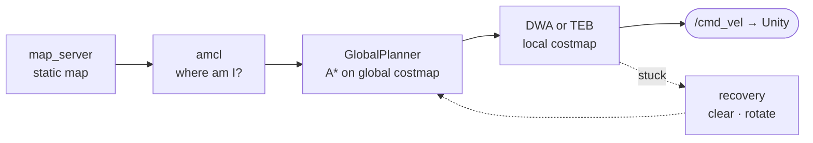

# ADR-008: Navigation = move_base + AMCL + Static Map

**Status:** Accepted · retires the Unity-side A* prototype (`CubeCarNavigator.cs`)

## Context
The Unity prototype plans with A* inside Unity. With ROS required, planning must move to ROS. Otherwise ROS would just relay messages, and the graded avoidance would not be done by ROS at all. The ROS 1 standard for a differential-drive robot is the **navigation stack** (`move_base`).

## Decision

| Piece | Choice | Why |
|-------|--------|-----|
| Map | Built **once** with `gmapping`, saved with `map_saver` | Standard ROS workflow; static map = walls + shelves |
| Localisation | `amcl` | Standard, works with the Waffle Pi LIDAR |
| Global planner | `global_planner/GlobalPlanner`, A* mode | Same idea as the prototype, now in ROS |
| Replanning | `planner_frequency: 0` | Replans only when the local planner is blocked, which makes the replan count meaningful |
| Local planner | DWA, with TEB as candidate | See [ADR-004](ADR-004-local-planner.md) |
| Recovery | clear costmap → rotate → aggressive clear | Stock `move_base` behaviours |
| Starting configs | Copied from `turtlebot3_navigation` | Proven defaults for this exact robot |

## Consequences
- `CubeCarNavigator.cs` and the Unity NavMesh are **moved to `_archive/`** in P0. Unity only drives the body from `/cmd_vel`.
- Obstacles for M2/M3 are **not** in the static map; they are seen live by the LIDAR through the costmap `obstacle_layer`.
- If AMCL is unstable in the repetitive warehouse, `fake_localization` (perfect pose from odometry) is the fallback. It must be recorded here if used.

## Alternatives rejected
| Option | Why not |
|--------|---------|
| Keep A* in Unity, ROS as a relay | ROS would do no real work; avoidance of moving obstacles would need to be written from scratch |
| Write our own planner node in Python | Re-inventing `move_base`; slower and riskier |
| SLAM while navigating (gmapping live) | The map would change between runs, which breaks repeatability |
