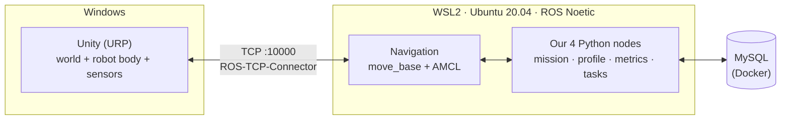

# UC6 Warehouse Robot: Documentation

A simulated warehouse in **Unity** on Windows. One **TurtleBot3 Waffle Pi** is driven by the **ROS 1 Noetic navigation stack**, which runs in **WSL2 Ubuntu 20.04**. The robot picks items from shelves and delivers them to drop-off points without hitting static or moving obstacles.

> **What is graded:** obstacle avoidance (M1 → M2 → M3).
> **What is not graded:** item identification, pickup mechanics, the database. Keep these small.

---

## Reading order

| # | Document | Read it when you need to know… |
|:-:|----------|--------------------------------|
| 1 | [prd.md](prd.md) | What we build, what we don't, how we are graded |
| 2 | [architecture.md](architecture.md) | How the pieces fit: diagrams, nodes, topics, services |
| 3 | [setup-windows-wsl.md](setup-windows-wsl.md) | How to install everything on your machine |
| 4 | [test-plan.md](test-plan.md) | Scenarios, metrics, pass/fail numbers |
| 5 | [milestones.md](milestones.md) | Week-by-week plan, owners, risks |
| 6 | [data-model.md](data-model.md) + [schema.sql](schema.sql) | MySQL tables and the write path |
| 7 | [../CONTEXT.md](../CONTEXT.md) | Glossary: the exact words to use |

## Decisions (ADRs)

| ADR | Decision |
|-----|----------|
| [001](ADR-001-robot-platform.md) | TurtleBot3 Waffle Pi, no arm. Pickup = dwell, then attach in Unity |
| [002](ADR-002-perception-scope.md) | No ML perception. Shelf poses come from the catalog |
| [003](ADR-003-ros1-noetic.md) | ROS 1 Noetic (course requirement) |
| [004](ADR-004-local-planner.md) | Local planner: DWA vs TEB, chosen by benchmark |
| [005](ADR-005-mysql-database.md) | MySQL. Only `task_manager` touches it |
| [006](ADR-006-single-robot.md) | Single robot only (multi-robot dropped) |
| [007](ADR-007-windows-wsl-environment.md) | Unity on Windows + ROS in WSL2, connected over localhost |
| [008](ADR-008-navigation-stack.md) | move_base + AMCL + static map. Unity A* prototype is retired |
| [009](ADR-009-simulation-clock.md) | Unity publishes `/clock`. ROS uses sim time |
| [010](ADR-010-robot-scale.md) | Robot scaled 4x in Unity; ROS still sees true robot metres |

## One-minute summary

- **Unity is the body.** It simulates physics, the LIDAR, odometry and moving NPCs. It does no path planning.
- **ROS is the brain.** It localises, plans and avoids obstacles (move_base), and runs the task sequence.
- **MySQL is the notebook.** It holds tasks going in and results coming out. It never blocks a run.

Superseded ROS 2 / Nav2 documents are kept in [`_archive/2026-09-30-ros2-nav2-plan/`](_archive/2026-09-30-ros2-nav2-plan/).
