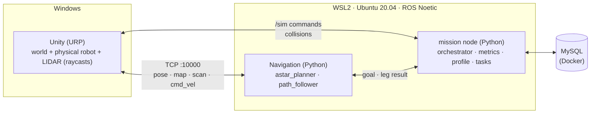

# UC6 Warehouse Robot: Documentation

A simulated warehouse in **Unity** on Windows. One **TurtleBot3 Waffle Pi** is driven by our own **ROS 1 Noetic Python navigation nodes**, which run in **WSL2 Ubuntu 20.04**. The robot picks items from shelves and delivers them to drop-off points without hitting static or moving obstacles.

> **What is graded:** obstacle avoidance (M1 → M2 → M3).
> **What is not graded:** item identification, pickup mechanics, the database. Keep these small.

---

## Reading order

| # | Document | Read it when you need to know… |
|:-:|----------|--------------------------------|
| 1 | [prd.md](prd.md) | What we build, what we don't, how we are graded |
| 2 | [architecture.md](architecture.md) | How the pieces fit: diagrams, nodes, topics, interfaces |
| 3 | [setup-windows-wsl.md](setup-windows-wsl.md) | How to install everything on your machine |
| 4 | [test-plan.md](test-plan.md) | Scenarios, metrics, pass/fail numbers |
| 5 | [milestones.md](milestones.md) | Week-by-week plan, owners, risks |
| 6 | [data-model.md](data-model.md) + [schema.sql](schema.sql) | MySQL tables and the write path |
| 7 | [../CONTEXT.md](../CONTEXT.md) | Glossary: the exact words to use |
| 8 | [features/](features/) | Agreed features beyond the graded plan, e.g. [mobile manipulator + inventory panel](features/mobile-manipulator-inventory/requirements.md) |
| 9 | [../ros1/turtlebot_control/README.md](../ros1/turtlebot_control/README.md) | How to build and run the navigation nodes (planner, follower, bringup) and their tests |

## Decisions (ADRs)

| ADR | Decision |
|-----|----------|
| [001](ADR-001-robot-platform.md) | TurtleBot3 Waffle Pi, no arm. Pickup = dwell, then attach in Unity |
| [002](ADR-002-perception-scope.md) | No ML perception. Shelf poses come from the catalog; pose and map are ground truth |
| [003](ADR-003-ros1-noetic.md) | ROS 1 Noetic (course requirement), standard messages only |
| [004](_archive/2026-10-04-move-base-plan/ADR-004-local-planner.md) | _Archived._ Local planner DWA vs TEB (superseded by 012) |
| [005](ADR-005-mysql-database.md) | MySQL. Only the `task_manager` class touches it |
| [006](ADR-006-single-robot.md) | Single robot only (multi-robot dropped) |
| [007](ADR-007-windows-wsl-environment.md) | Unity on Windows + ROS in WSL2, connected over localhost |
| [008](_archive/2026-10-04-move-base-plan/ADR-008-navigation-stack.md) | _Archived._ move_base + AMCL + static map (superseded by 012) |
| [009](ADR-009-simulation-clock.md) | Unity publishes `/clock`. ROS uses sim time |
| [010](ADR-010-robot-scale.md) | Robot scaled 4x in Unity; ROS sees true robot metres |
| [011](ADR-011-physics-standard.md) | Physics standard: Unity is an exact 4x model of Earth (gravity 39.24 m/s² in Unity) |
| [012](ADR-012-custom-python-navigation.md) | Navigation: custom Python A* planner + path follower, ground-truth pose |
| [013](_archive/2026-10-04-kinematic-cube-plan/ADR-013-kinematic-robot-body.md) | _Archived, superseded by 015._ Robot body: kinematic Cube with a Waffle Pi visual model, emulated sensors |
| [014](ADR-014-ros-interfaces.md) | ROS interfaces: standard messages only, one `mission` node |
| [015](ADR-015-physical-waffle-pi-body.md) | Robot body: physical Waffle Pi at scale 4. Supersedes 013, re-activates 010 and 011 |

## One-minute summary

- **Unity is the body.** It simulates the world, a physical robot (articulated wheels, real contacts), the LIDAR (raycasts), collisions and moving NPCs. It does no path planning.
- **ROS is the brain.** It plans, follows the path and avoids obstacles (our Python nodes), and runs the task sequence.
- **MySQL is the notebook.** It holds tasks going in and results coming out. It never blocks a run.

Superseded documents are kept in [`_archive/2026-09-30-ros2-nav2-plan/`](_archive/2026-09-30-ros2-nav2-plan/) (ROS 2 / Nav2), [`_archive/2026-10-04-move-base-plan/`](_archive/2026-10-04-move-base-plan/) (`move_base`) and [`_archive/2026-10-04-kinematic-cube-plan/`](_archive/2026-10-04-kinematic-cube-plan/) (ADR-013, the kinematic Cube). The code of the Cube prototype is in [`../_archive/unity-cube-prototype/`](../_archive/unity-cube-prototype/README.md) (Unity scripts) and [`../_archive/ros1-cube-prototype/`](../_archive/ros1-cube-prototype/README.md) (`ros1/cube_control` and `README_ROS1_Prototype.md`), moved after the acceptance run passed on 2026-10-05.
