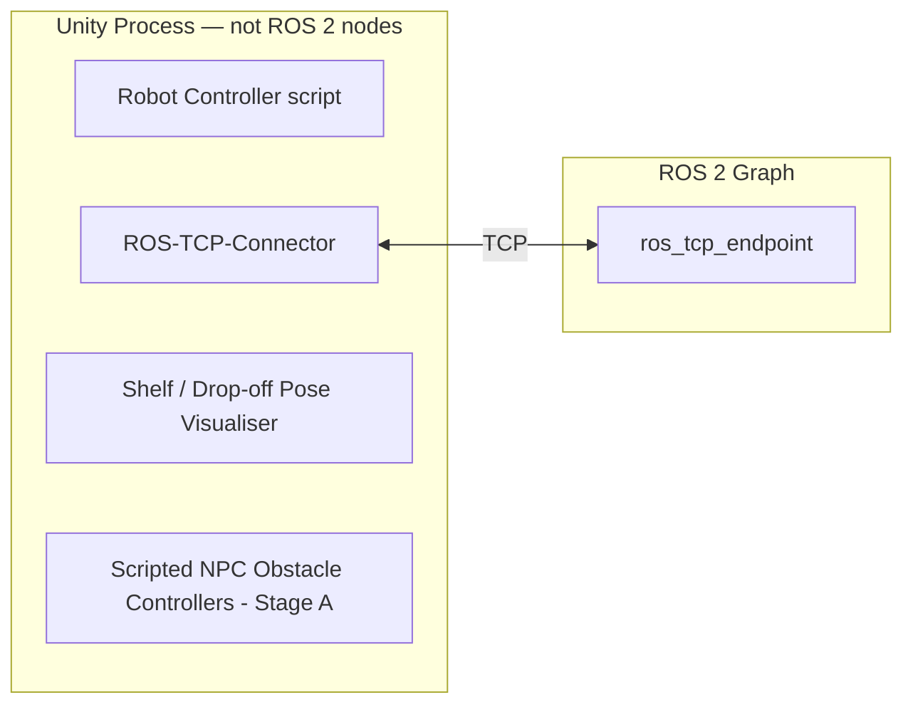
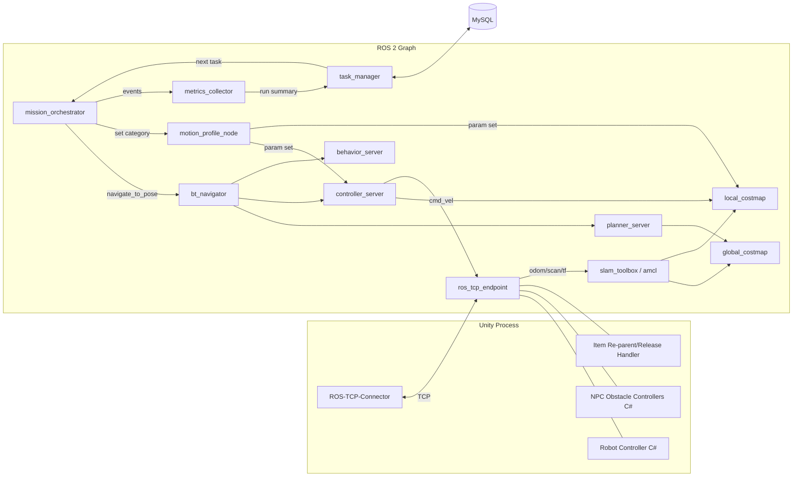

# Architecture — UC6 Mobile Robot Warehouse System

## 1. ROS 2 Node Graph (Stage A: single robot)

| Node | Language | Responsibility | Touches MySQL? |
|------|----------|-----------------|:---:|
| `mission_orchestrator` | Python | Per-task FSM: navigate→shelf, dwell, apply profile, navigate→drop-off, dwell, report. | No |
| `motion_profile_node` | Python | Maps item category to Nav2 runtime parameters via `ros2 param set`-equivalent service calls. | No |
| `metrics_collector` | Python | Subscribes to collision/replan/clearance topics during the run; aggregates a run summary. | No |
| `task_manager` | Python | Reads next task from MySQL at episode start; writes `runs`/`run_events` at episode end. | **Yes — the only node** |
| `bt_navigator` | Python (Nav2 stock) | Executes the `navigate_to_pose` behaviour tree. | No |
| `planner_server` | Python (Nav2 stock) | Global path planning (M2). | No |
| `controller_server` | Python (Nav2 stock) | Local trajectory tracking/avoidance (M2/M3); hosts DWB or TEB (ADR-004). | No |
| `behavior_server` / recoveries | Python (Nav2 stock) | Spin, back-up, wait, clear-costmap recoveries. [VERIFY] exact server name depends on the pinned distro (ADR-003). | No |
| `global_costmap` / `local_costmap` | Python (Nav2 stock) | Maintain static+obstacle+inflation layers. | No |
| `slam_toolbox` or `amcl` | Python (Nav2 stock) | Localisation, per the adapted M1 tutorial. [VERIFY] which of the two the tutorial uses. | No |
| `ros_tcp_endpoint` | Python (Unity-Robotics-Hub) | ROS-side half of the Unity bridge. | No |

Unity-side, not ROS 2 nodes: the robot controller script, the Unity Robotics Hub `ROS-TCP-Connector`, the shelf/drop-off pose visualiser, and scripted NPC obstacle controllers (Stage A).

Full Stage A node graph:

## 2. Unity ↔ ROS Bridge Contract

Transport: Unity-Robotics-Hub `ROS-TCP-Connector` (Unity) ↔ `ROS-TCP-Endpoint` (ROS 2), one TCP connection per robot instance (see §5 for multi-robot).

| Purpose | Direction | Message type |
|---------|-----------|--------------|
| Velocity command | ROS → Unity | `geometry_msgs/Twist` on `/cmd_vel` |
| Odometry | Unity → ROS | `nav_msgs/Odometry` on `/odom` |
| LIDAR scan | Unity → ROS | `sensor_msgs/LaserScan` on `/scan` |
| Transforms | Unity → ROS | `tf2_msgs/TFMessage` on `/tf`, `/tf_static` |
| Pickup trigger (dwell complete at shelf) | ROS → Unity | custom `warehouse_msgs/PickupEvent` (item_id, robot_ns) |
| Pickup acknowledged (re-parent done) | Unity → ROS | custom `warehouse_msgs/PickupAck` (item_id, success) |
| Place trigger (dwell complete at drop-off) | ROS → Unity | custom `warehouse_msgs/PlaceEvent` (item_id, robot_ns) |
| Place acknowledged (un-parent done) | Unity → ROS | custom `warehouse_msgs/PlaceAck` (item_id, success) |
| Collision notification | Unity → ROS | custom `warehouse_msgs/CollisionEvent` (contact_point, other_tag, robot_ns) |

Exact field-level message definitions are an implementation task, not specified here; names above are the contract graders should expect to see referenced in code. [VERIFY] against the Unity Robotics Hub example's actual default topic set before Phase 1, since the tutorial's own demo topics may differ in naming convention.

## 3. Topic / Service / Action Tables

### Topics

| Name | Type | Publisher | Subscriber | Rate |
|------|------|-----------|------------|------|
| `/cmd_vel` | `geometry_msgs/Twist` | `controller_server` | Unity robot controller (via bridge) | Nav2 controller frequency, default 20 Hz [VERIFY] |
| `/odom` | `nav_msgs/Odometry` | Unity robot controller (via bridge) | `slam_toolbox`/`amcl`, `local_costmap` | Unity physics tick, target 30–50 Hz |
| `/scan` | `sensor_msgs/LaserScan` | Unity LIDAR sim (via bridge) | `global_costmap`, `local_costmap` | 5–10 Hz (typical TurtleBot3 LIDAR) [VERIFY] |
| `/tf`, `/tf_static` | `tf2_msgs/TFMessage` | Unity + localisation node | all Nav2 nodes | event-driven |
| `/mission/active_category` | custom `warehouse_msgs/CategoryUpdate` | `mission_orchestrator` | `motion_profile_node` | event-driven (per task) |
| `/metrics/collision_event` | custom `warehouse_msgs/CollisionEvent` | Unity (via bridge) | `metrics_collector` | event-driven |
| `/metrics/replan_event` | custom `warehouse_msgs/ReplanEvent` | `bt_navigator` (replan hook) | `metrics_collector` | event-driven |
| `/metrics/clearance_sample` | custom `warehouse_msgs/ClearanceSample` | `local_costmap`-derived sampler in `metrics_collector` | `metrics_collector` (self) | fixed 2 Hz |
| `/task/next_task_result` | custom `warehouse_msgs/TaskResult` | `mission_orchestrator` | `task_manager` | once per episode end |

### Services

| Name | Type | Server | Client | Notes |
|------|------|--------|--------|-------|
| `/task_manager/get_next_task` | custom `warehouse_srvs/GetNextTask` | `task_manager` | `mission_orchestrator` | Read-only MySQL query wrapped as a service call. |
| `/motion_profile/set_category` | custom `warehouse_srvs/SetCategory` | `motion_profile_node` | `mission_orchestrator` | Triggers Nav2 param updates (§6). |
| `/global_costmap/clear_entirely_global_costmap` | Nav2 stock `nav2_msgs/ClearEntireCostmap` | `global_costmap` | `behavior_server` (recovery) | Stock Nav2 recovery service. |

### Actions

| Name | Type | Server | Client | Notes |
|------|------|--------|--------|-------|
| `/navigate_to_pose` | `nav2_msgs/action/NavigateToPose` | `bt_navigator` | `mission_orchestrator` | Used for both shelf-pose and drop-off-pose legs. |

## 4. Nav2 Configuration Strategy

Nav2 is configured via YAML parameter files layered on top of the adapted M1 tutorial defaults; no Nav2 source is modified.

| Layer | M1 | M2 | M3 |
|-------|----|----|----|
| Global planner | Stock (e.g. NavFn) at tutorial defaults | Tuned for static-obstacle costmap responsiveness | Unchanged from M2 |
| Local planner/controller | Stock DWB at tutorial defaults | Tuned per ADR-004 candidate | Benchmark-selected (DWB or TEB), per ADR-004 |
| Costmap obstacle layer | Disabled/minimal | Enabled, static obstacles only | Enabled, static + dynamic (LIDAR-observed) |
| Recovery behaviours | Stock defaults | Stock defaults | Tuned: spin/back-up/wait timeouts reduced to keep replans responsive |
| Category parameter overrides | None (single "standard" profile) | Applied at task start (§6) | Applied at task start (§6) |

[VERIFY] Exact stock default file names and node names against whichever branch of the Unity Robotics Hub Nav2+SLAM example is pinned in Phase 0.

## 5. Costmap Layer Design

| Costmap | Layer | Source | Notes |
|---------|-------|--------|-------|
| Global | `static_layer` | Map produced by the M1 SLAM/mapping step | One map per scenario; regenerated if the warehouse layout changes. |
| Global | `obstacle_layer` | `/scan` | Marks known static obstacles for global re-planning. |
| Global | `inflation_layer` | Derived | `inflation_radius` set per active category profile (§6). |
| Local | `obstacle_layer` | `/scan` (rolling window) | Drives short-horizon dynamic avoidance (M3). |
| Local | `inflation_layer` | Derived | Same category-driven radius as global, kept in sync by `motion_profile_node`. |

## 6. Category → Motion-Profile Parameter Mechanism

`motion_profile_node` receives the active category on `/mission/active_category` and issues parameter updates to `controller_server` and both costmap inflation layers before `mission_orchestrator` sends the next `navigate_to_pose` goal. This is framed strictly as reinforcing obstacle avoidance (wider inflation and lower speed reduce collision risk for fragile/heavy items) — it is not a standalone feature (PRD G4).

| Category | `max_vel_x` (m/s) | `acc_lim_x` (m/s²) | `inflation_radius` (m) | Rationale |
|----------|:--:|:--:|:--:|-----------|
| Standard | 0.26 | 2.5 | 0.30 | Waffle Pi published nominal max linear velocity [VERIFY against the simulated URDF/diff-drive plugin limits, which may clamp lower in Unity]. |
| Fragile | 0.10 | 2.5 (unchanged) | 0.50 | Low speed + large inflation minimises jostling/contact risk; acceleration left at nominal since jerk limiting is out of scope. |
| Heavy | 0.15 | 1.0 | 0.35 | Reduced acceleration and a moderately widened inflation approximate a wider effective turning clearance without modelling payload dynamics. |

These are tunable defaults with the stated basis above, applied identically in simulation regardless of measured item mass; a `weight_kg` column is retained in `items` for future refinement but is not read at runtime in the graded path.

Fail-safe: if the `/motion_profile/set_category` service call fails or times out, `controller_server` and costmap parameters remain at the **Fragile** values (most conservative), and a warning `run_event` is logged. This favours collision avoidance over throughput when the mechanism itself misbehaves.

## 7. Multi-Robot Namespacing and TF-Prefix Scheme

| Stage | Robots | Namespace | TF prefix | Gate to enter |
|-------|--------|-----------|-----------|----------------|
| A | 1 | `/robot1` | `robot1/` | Default; M3 baseline. |
| B | +1 (2 total) | `/robot1`, `/robot2` | `robot1/`, `robot2/` | Stage A exit gate met (see `docs/milestones.md`). |
| C | +1 (3 total) | `/robot1`…`/robot3` | `robot1/`…`robot3/` | Stage B exit gate met. |

Each robot runs a fully independent Nav2 stack (own `bt_navigator`, `planner_server`, `controller_server`, costmaps) under its namespace, per the standard Nav2 multi-robot pattern; `map`/`odom` frames are prefixed per robot except a single shared `map` frame used for global localisation consistency. [VERIFY] whether the pinned distro's Nav2 multi-robot launch pattern requires a shared or per-robot `map` frame.

**ROS-TCP-Endpoint bandwidth risk:** a single `ROS-TCP-Endpoint` instance is understood to serve one Unity↔ROS TCP connection. [VERIFY] whether one endpoint can multiplex multiple namespaced robots over that connection, or whether each robot's Unity instance/prefab needs its own endpoint process bound to a distinct port. Mitigation, gated by Stage: run one `ros_tcp_endpoint` per robot (ports incrementing from a base, e.g. 10000+n) if multiplexing is unsupported, documented and load-tested before entering Stage B.

## 8. Failure-Mode Table

| Failure | Detection | Response | Blocks sim run? |
|---------|-----------|----------|:---:|
| MySQL unreachable at episode start | `task_manager` connection error | Fall back to last-cached task list / bundled default task; log warning (FR-16) | No |
| MySQL unreachable at episode end | `task_manager` write error | Buffer run record to local disk; retry at next episode start | No |
| Global plan fails | `planner_server` returns failure to `bt_navigator` | Trigger recovery behaviour, then retry planning | No (bounded retries, then abort with outcome=fail) |
| Local controller stuck / oscillating | Recovery-behaviour timeout | Spin/back-up/wait, then clear costmap; if still stuck, abort with outcome=fail | No |
| Dynamic obstacle intrusion mid-path | Local costmap obstacle detection | Trigger global re-plan; log `replan_event` | No |
| Unity↔ROS TCP disconnect | `ros_tcp_endpoint` connection drop | Abort current run as outcome=fail; attempt auto-reconnect before next episode | Yes, for the in-flight run only |
| `/motion_profile/set_category` service failure | Service call timeout in `mission_orchestrator` | Remain at Fragile (most conservative) parameters; log warning event (§6) | No |
| Second/third robot TF or namespace collision (Stage B/C) | Duplicate TF warning / navigation instability | Fail the stage gate; ship the prior stage (FR-18/FR-19) | No (that stage is simply not shipped) |
