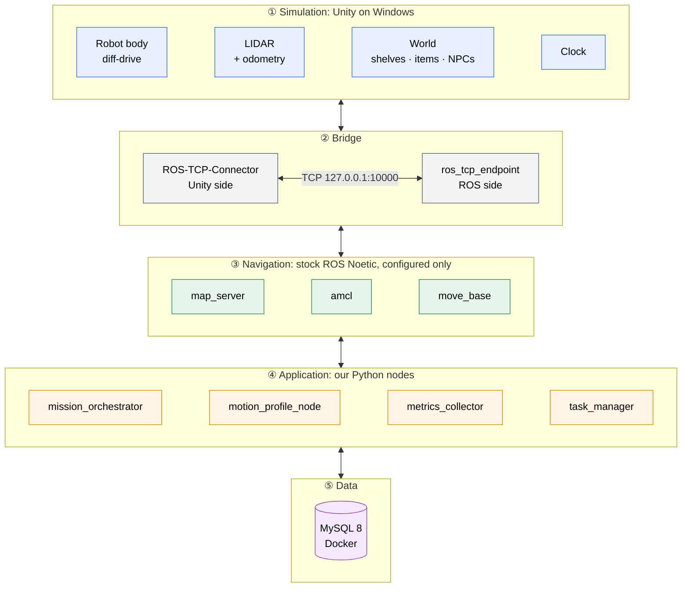
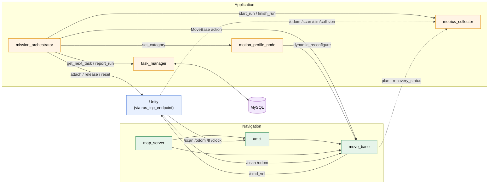
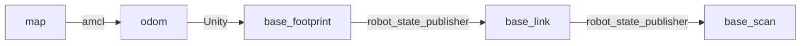
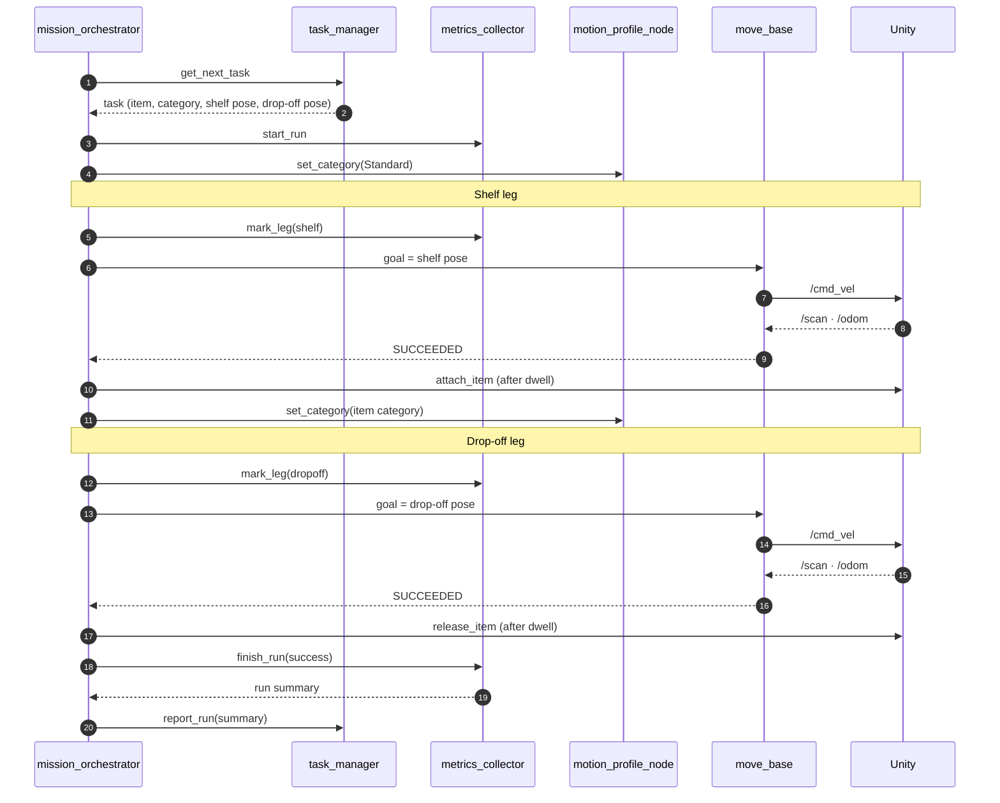
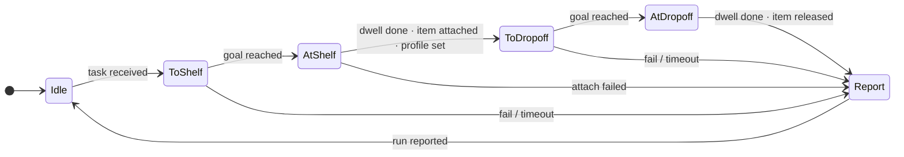

# Architecture: UC6 Warehouse Robot

**Reading guide:** §1 gives the big picture in five layers. §2–§4 zoom into each side. §5 is the interface contract. §6–§7 show runtime behaviour. §8–§11 are reference tables.

---

## 1. The five layers


```mermaid
flowchart TB
    subgraph SIM["① Simulation: Unity on Windows"]
        direction LR
        S1[Robot body<br/>diff-drive] ~~~ S2[LIDAR<br/>+ odometry] ~~~ S3[World<br/>shelves · items · NPCs] ~~~ S4[Clock]
    end
    subgraph BRIDGE["② Bridge"]
        direction LR
        B1[ROS-TCP-Connector<br/>Unity side] <-->|"TCP 127.0.0.1:10000"| B2[ros_tcp_endpoint<br/>ROS side]
    end
    subgraph NAV["③ Navigation: stock ROS Noetic, configured only"]
        direction LR
        N1[map_server] ~~~ N2[amcl] ~~~ N3[move_base]
    end
    subgraph APP["④ Application: our Python nodes"]
        direction LR
        A1[mission_orchestrator] ~~~ A2[motion_profile_node] ~~~ A3[metrics_collector] ~~~ A4[task_manager]
    end
    subgraph DATA["⑤ Data"]
        D1[(MySQL 8<br/>Docker)]
    end

    SIM <--> BRIDGE
    BRIDGE <--> NAV
    NAV <--> APP
    APP <--> DATA

    classDef sim fill:#E8F0FE,stroke:#3B6FD8,color:#000
    classDef br fill:#F1F3F4,stroke:#5F6368,color:#000
    classDef nav fill:#E6F4EA,stroke:#2E8B57,color:#000
    classDef app fill:#FFF4E5,stroke:#E08A00,color:#000
    classDef db fill:#F3E8FD,stroke:#8E44AD,color:#000
    class S1,S2,S3,S4 sim
    class B1,B2 br
    class N1,N2,N3 nav
    class A1,A2,A3,A4 app
    class D1 db
```

| Layer | Owns | Must never |
|-------|------|------------|
| ① Simulation | Physics, sensors, NPC motion, item attach/release, collision detection, `/clock` | Plan paths or decide where to go |
| ② Bridge | Moving ROS messages between Windows and WSL | Contain logic |
| ③ Navigation | Localisation, global + local planning, obstacle avoidance, recovery | Be modified in source; it is configured by YAML only |
| ④ Application | The task sequence, category profiles, measuring runs, persistence | Plan paths itself |
| ⑤ Data | Task catalog and run results | Be on the navigation path; an outage never blocks a run |

**Dependency rule:** each layer talks only to its neighbours. The one exception is that `metrics_collector` and `mission_orchestrator` also listen to or call the simulation's topics and services, which pass through the bridge.

---

## 2. Unity side (Windows)

| Component (C#) | Does | ROS interface |
|----------------|------|---------------|
| `DiffDriveController` | Moves the robot from `/cmd_vel`. Stops if no command arrives for 0.5 s. | sub `/cmd_vel` |
| `OdometryPublisher` | Publishes the robot pose and velocity, plus the `odom → base_footprint` TF. | pub `/odom`, `/tf` |
| `LaserScanPublisher` | 360-beam raycast LIDAR (LDS-01-like: 0.12–3.5 m, 5 Hz). | pub `/scan` |
| `ClockPublisher` | Publishes simulation time ([ADR-009](ADR-009-simulation-clock.md)). | pub `/clock` |
| `CollisionReporter` | Reports robot contacts with walls, shelves, obstacles and NPCs. | pub `/sim/collision` |
| `ItemCarrier` | Attaches the item to the robot (re-parent) and releases it. | srv `/sim/attach_item`, `/sim/release_item` |
| `ScenarioLoader` | Loads obstacle and NPC layout for a scenario and resets the robot pose. | srv `/sim/reset_scenario` |
| `NpcMover` | Moves NPC workers on scripted waypoints. Not a ROS node. | none |

The robot's physical model is the TurtleBot3 Waffle Pi URDF, imported with Unity's URDF Importer. The `base_footprint → base_link → base_scan` static TFs come from `robot_state_publisher` on the ROS side, not from Unity.

---

## 3. ROS side (WSL2)

### Stock nodes: configured, never modified

| Node | Package | Role |
|------|---------|------|
| `ros_tcp_endpoint` | `ros_tcp_endpoint` | ROS end of the Unity bridge |
| `robot_state_publisher` | `robot_state_publisher` | Static robot TFs from the Waffle Pi URDF |
| `map_server` | `map_server` | Serves the pre-built warehouse map |
| `amcl` | `amcl` | Localisation: publishes the `map → odom` TF |
| `move_base` | `move_base` | Global planner + local planner + costmaps + recovery |

### Our nodes: Python 3, package `warehouse_mission`

| Node | One job | Talks to MySQL? |
|------|---------|:---------------:|
| `mission_orchestrator` | Runs the episode state machine (§7) | No |
| `motion_profile_node` | Applies a category's speed/margin profile to `move_base` | No |
| `metrics_collector` | Measures one run and returns a summary | No |
| `task_manager` | Reads tasks from and writes runs to MySQL | **Yes, the only one** |

### Node graph


```mermaid
flowchart LR
    U["Unity<br/>(via ros_tcp_endpoint)"]

    subgraph NAV["Navigation"]
        MS[map_server] --> AM[amcl]
        AM --> MB[move_base]
        MS --> MB
    end

    subgraph APP["Application"]
        MO[mission_orchestrator]
        MP[motion_profile_node]
        MC[metrics_collector]
        TM[task_manager]
    end

    DB[(MySQL)]

    U -- "/scan /odom /tf /clock" --> AM
    U -- "/scan /odom" --> MB
    MB -- "/cmd_vel" --> U

    MO -- "MoveBase action" --> MB
    MO -- "set_category" --> MP
    MP -- "dynamic_reconfigure" --> MB
    MO -- "attach / release / reset" --> U
    MO -- "start_run / finish_run" --> MC
    MO -- "get_next_task / report_run" --> TM
    U -. "/odom /scan /sim/collision" .-> MC
    MB -. "plan · recovery_status" .-> MC
    TM <--> DB

    classDef nav fill:#E6F4EA,stroke:#2E8B57,color:#000
    classDef app fill:#FFF4E5,stroke:#E08A00,color:#000
    classDef sim fill:#E8F0FE,stroke:#3B6FD8,color:#000
    classDef db fill:#F3E8FD,stroke:#8E44AD,color:#000
    class MS,AM,MB nav
    class MO,MP,MC,TM app
    class U sim
    class DB db
```

<sub>Solid = command/request. Dotted = passive listening (metrics only).</sub>

`mission_orchestrator` is the only node that gives orders. Every other application node is a service it calls.

---

## 4. TF tree


```mermaid
flowchart LR
    map -->|amcl| odom -->|Unity| base_footprint -->|robot_state_publisher| base_link -->|robot_state_publisher| base_scan
```

---

## 5. Interface contract

Custom types live in the catkin package **`warehouse_msgs`**. Unity generates matching C# classes via *Robotics → Generate ROS Messages*.

### Topics

| Topic | Type | From → To | Rate |
|-------|------|-----------|------|
| `/cmd_vel` | `geometry_msgs/Twist` | move_base → Unity | 10 Hz (controller) |
| `/odom` | `nav_msgs/Odometry` | Unity → amcl, move_base, metrics | 30 Hz |
| `/scan` | `sensor_msgs/LaserScan` | Unity → amcl, move_base, metrics | 5 Hz |
| `/tf` | `tf2_msgs/TFMessage` | Unity (`odom→base_footprint`), amcl (`map→odom`) | 30 Hz |
| `/clock` | `rosgraph_msgs/Clock` | Unity → all nodes | 100 Hz |
| `/sim/collision` | `warehouse_msgs/CollisionEvent` | Unity → metrics | on contact |
| `/move_base/GlobalPlanner/plan` | `nav_msgs/Path` | move_base → metrics | per plan |
| `/move_base/recovery_status` | `move_base_msgs/RecoveryStatus` | move_base → metrics | per recovery |

### Services

| Service | Type | Server | Caller |
|---------|------|--------|--------|
| `/sim/reset_scenario` | `warehouse_msgs/ResetScenario` | Unity | runner / mission_orchestrator |
| `/sim/attach_item` | `warehouse_msgs/AttachItem` | Unity | mission_orchestrator |
| `/sim/release_item` | `warehouse_msgs/ReleaseItem` | Unity | mission_orchestrator |
| `/task_manager/get_next_task` | `warehouse_msgs/GetNextTask` | task_manager | mission_orchestrator |
| `/task_manager/report_run` | `warehouse_msgs/ReportRun` | task_manager | mission_orchestrator |
| `/motion_profile/set_category` | `warehouse_msgs/SetCategory` | motion_profile_node | mission_orchestrator |
| `/metrics/start_run` | `warehouse_msgs/StartRun` | metrics_collector | mission_orchestrator |
| `/metrics/mark_leg` | `warehouse_msgs/MarkLeg` | metrics_collector | mission_orchestrator (at the start of each leg) |
| `/metrics/finish_run` | `warehouse_msgs/FinishRun` | metrics_collector | mission_orchestrator |

### Action

| Action | Type | Server | Client |
|--------|------|--------|--------|
| `/move_base` | `move_base_msgs/MoveBaseAction` | move_base | mission_orchestrator |

The field-level definitions live in [`ros/src/warehouse_msgs/`](../ros/src/warehouse_msgs/). That package is the single source of truth, and each file is commented.

| Messages (`msg/`) | Services (`srv/`) |
|-------------------|-------------------|
| `Task`, `CollisionEvent`, `RunEvent`, `RunSummary` | `AttachItem`, `ReleaseItem`, `ResetScenario`, `GetNextTask`, `ReportRun`, `SetCategory`, `StartRun`, `MarkLeg`, `FinishRun` |

Allowed string values (categories, outcomes, fail reasons, event types, collision tags, legs) are **constants** in the messages, e.g. `Task.CATEGORY_FRAGILE` and `RunSummary.FAIL_TIMEOUT`. Use the constants in code instead of typing the strings.

---

## 6. One episode, step by step


```mermaid
sequenceDiagram
    autonumber
    participant MO as mission_orchestrator
    participant TM as task_manager
    participant MC as metrics_collector
    participant MP as motion_profile_node
    participant MB as move_base
    participant U as Unity

    MO->>TM: get_next_task
    TM-->>MO: task (item, category, shelf pose, drop-off pose)
    MO->>MC: start_run
    MO->>MP: set_category(Standard)
    Note over MO,U: Shelf leg
    MO->>MC: mark_leg(shelf)
    MO->>MB: goal = shelf pose
    MB->>U: /cmd_vel
    U-->>MB: /scan · /odom
    MB-->>MO: SUCCEEDED
    MO->>U: attach_item (after dwell)
    MO->>MP: set_category(item category)
    Note over MO,U: Drop-off leg
    MO->>MC: mark_leg(dropoff)
    MO->>MB: goal = drop-off pose
    MB->>U: /cmd_vel
    U-->>MB: /scan · /odom
    MB-->>MO: SUCCEEDED
    MO->>U: release_item (after dwell)
    MO->>MC: finish_run(success)
    MC-->>MO: run summary
    MO->>TM: report_run(summary)
```

---

## 7. Mission state machine (`mission_orchestrator`)


```mermaid
stateDiagram-v2
    direction LR
    [*] --> Idle
    Idle --> ToShelf: task received
    ToShelf --> AtShelf: goal reached
    AtShelf --> ToDropoff: dwell done · item attached · profile set
    ToDropoff --> AtDropoff: goal reached
    AtDropoff --> Report: dwell done · item released

    ToShelf --> Report: fail / timeout
    ToDropoff --> Report: fail / timeout
    AtShelf --> Report: attach failed
    Report --> Idle: run reported
```

Obstacle avoidance and recovery happen **inside** `ToShelf` and `ToDropoff`, handled by `move_base`. The orchestrator only sees the final `SUCCEEDED` / `ABORTED` and its own leg timeout.

---

## 8. Navigation configuration

All settings are YAML files in `warehouse_bringup/config/`. See [ADR-008](ADR-008-navigation-stack.md) for why this stack was chosen.

| Part | Choice | Key settings |
|------|--------|--------------|
| Map | Static map built once with `gmapping`, saved by `map_saver` | `maps/warehouse.yaml`, resolution 0.05 m |
| Localisation | `amcl` | `odom_model_type: diff`, initial pose set by the runner after each reset |
| Global planner | `global_planner/GlobalPlanner` | `use_dijkstra: false` (A*), `planner_frequency: 0.0` (replan only when needed) |
| Local planner | `DWAPlannerROS` **or** `TebLocalPlannerROS` | Chosen by benchmark ([ADR-004](ADR-004-local-planner.md)) |
| Global costmap | `static_layer` + `obstacle_layer` (`/scan`) + `inflation_layer` | `update_frequency: 5` |
| Local costmap | rolling 4 m × 4 m, `obstacle_layer` + `inflation_layer` | `update_frequency: 5`, `publish_frequency: 2` |
| Recovery | `conservative_reset` → `rotate_recovery` → `aggressive_reset` | `max_planning_retries: 3` |
| Footprint | Waffle Pi polygon `[[-0.205,-0.155],[-0.205,0.155],[0.077,0.155],[0.077,-0.155]]` | from `turtlebot3_navigation` |

The static map contains **walls and shelves only**. Scenario obstacles and NPCs are **not** in the map; the robot must find them with its LIDAR. That is what M2 and M3 test.

---

## 9. Category motion profiles

Stored in `warehouse_bringup/config/motion_profiles.yaml`, which is the single source of truth. The database only stores the category name.

| Category | `max_vel_x` (m/s) | `acc_lim_x` (m/s²) | `inflation_radius` (m) | Idea |
|----------|:----:|:----:|:----:|------|
| **Standard** | 0.26 | 2.5 | 0.30 | Waffle Pi nominal top speed |
| **Heavy** | 0.15 | 1.0 | 0.35 | Slow to accelerate and brake |
| **Fragile** | 0.10 | 2.5 | 0.50 | Slow, with a wide safety margin |

Rules:

1. **Shelf leg:** always Standard, because the robot is empty.
2. **Drop-off leg:** the item's category.
3. `motion_profile_node` applies the profile via `dynamic_reconfigure` to the active local planner and to **both** costmaps' `inflation_layer`.
4. **If applying fails:** revert to **Fragile** (the safest), log a `warning` event, and continue.

---

## 10. How each metric is measured (`metrics_collector`)

| Metric | Measured as |
|--------|-------------|
| `collisions` | Count of `/sim/collision` messages. Unity debounces repeated contact with the same object to 1 s. |
| `replans` | Per leg: number of `/move_base/GlobalPlanner/plan` messages − 1. With `planner_frequency: 0` this counts only replans that were actually needed. |
| `recoveries` | Count of `/move_base/recovery_status` messages |
| `min_clearance_m` | Minimum over the run of `min(scan.ranges) − 0.21 m`, where 0.21 m ≈ footprint radius. Sampled on each `/scan`. |
| `path_length_m` | Sum of distances between consecutive `/odom` positions |
| `baseline_m` | `‖start→shelf‖ + ‖shelf→drop-off‖` (straight lines) |
| `path_ratio` | `path_length_m / baseline_m` |
| `duration_s` | Sim time from dispatch to item release (or to failure) |
| `dropoff_mean_speed_mps` | Mean of `/odom` linear speed during the **drop-off leg only**, since that leg uses the category profile |

---

## 11. Failure handling

| Failure | Who notices | What happens | Run blocked? |
|---------|-------------|--------------|:------------:|
| MySQL down at start | `task_manager` | Returns the bundled default task, `from_fallback = true` | No |
| MySQL down at end | `task_manager` | Writes summary to `~/.warehouse/pending/*.json`; uploads on next start | No |
| No path / robot stuck | `move_base` | Recovery behaviours → then `ABORTED` → `outcome = fail`, `fail_reason = nav_aborted` | No |
| Leg takes too long | `mission_orchestrator` | Cancels goal → `fail_reason = timeout` | No |
| Attach/release fails | `mission_orchestrator` | `fail_reason = item_error` | No |
| Profile can't be applied | `motion_profile_node` | Revert to Fragile, `warning` event | No |
| Unity ↔ ROS link lost | `mission_orchestrator` (no `/clock` for 2 s) | `fail_reason = bridge_lost`; runner pauses until link returns | Current run only |

---

## 12. Code layout

```text
repo/
├─ WarehouseProjectURP/                 Unity project (Windows)
│  └─ Assets/Scripts/Robot/, Sim/, Ros/ C# components from §2
└─ ros/src/                             catkin packages (built in WSL, see setup guide)
   ├─ warehouse_msgs/                   .msg / .srv from §5
   ├─ warehouse_bringup/                launch/, config/, maps/, rviz/
   ├─ warehouse_mission/                the 4 Python nodes
   └─ warehouse_eval/                   headless runner, CSV exporter, scenarios.yaml
```

One launch file starts everything on the ROS side:

```bash
roslaunch warehouse_bringup bringup.launch local_planner:=dwa
```
