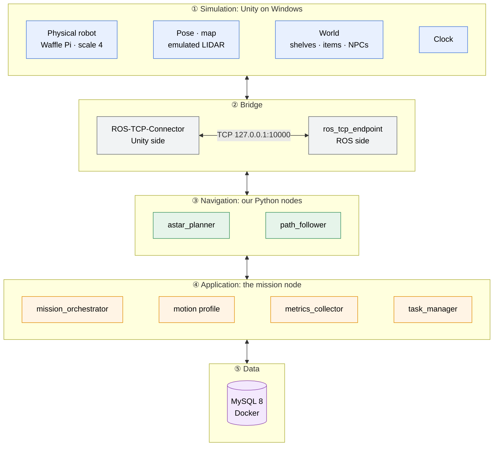
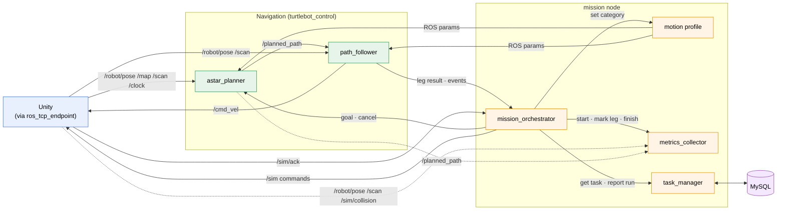
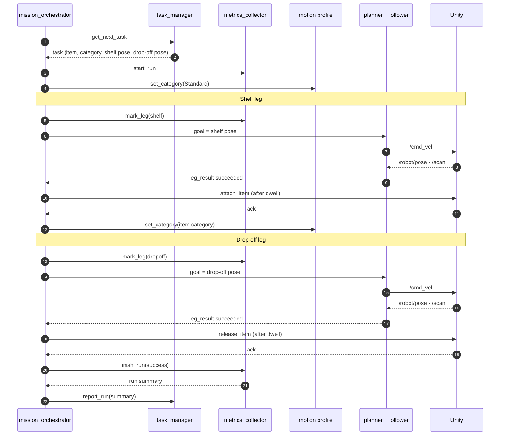
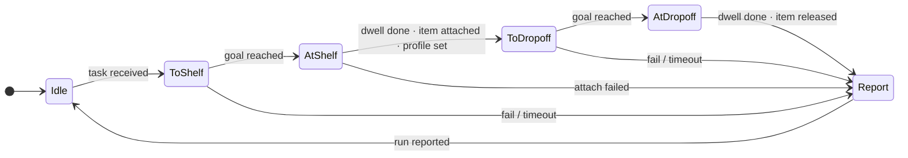

# Architecture: UC6 Warehouse Robot

**Reading guide:** §1 gives the big picture in five layers. §2–§4 zoom into each side. §5 is the interface contract. §6–§7 show runtime behaviour. §8–§12 are reference tables.

> **Status.** This is the target architecture after the 2026-10-04 changes of direction ([ADR-012](ADR-012-custom-python-navigation.md), [ADR-014](ADR-014-ros-interfaces.md), [ADR-015](ADR-015-physical-waffle-pi-body.md)). The robot is the physical Waffle Pi at scale 4 ([ADR-015](ADR-015-physical-waffle-pi-body.md)). The code base is the navigation code of the `Nhan-turtlebot` prototype (now `ros1/turtlebot_control`) on the physical robot of branch `Nguyen-planning`. Components marked P1, P2 or P3 in §2 and §3 do not exist yet. The Unity project opens and compiles in the Editor, and *Add ROS Bridge* has been run on the scene (Unity's Editor.log, 2026-10-05). The Edit Mode and Play Mode tests are green and the integrated Unity + ROS acceptance run passed (both reported by the user, 2026-10-05).

---

## 1. The five layers


```mermaid
flowchart TB
    subgraph SIM["① Simulation: Unity on Windows"]
        direction LR
        S1[Physical robot<br/>Waffle Pi · scale 4] ~~~ S2[Pose · map<br/>emulated LIDAR] ~~~ S3[World<br/>shelves · items · NPCs] ~~~ S4[Clock]
    end
    subgraph BRIDGE["② Bridge"]
        direction LR
        B1[ROS-TCP-Connector<br/>Unity side] <-->|"TCP 127.0.0.1:10000"| B2[ros_tcp_endpoint<br/>ROS side]
    end
    subgraph NAV["③ Navigation: our Python nodes"]
        direction LR
        N1[astar_planner] ~~~ N2[path_follower]
    end
    subgraph APP["④ Application: the mission node"]
        direction LR
        A1[mission_orchestrator] ~~~ A2[motion profile] ~~~ A3[metrics_collector] ~~~ A4[task_manager]
    end
    subgraph DATA["⑤ Data"]
        D1[(MySQL 8<br/>Docker)]
    end

    SIM <--> BRIDGE
    BRIDGE <--> NAV
    NAV <--> APP
    APP <--> DATA

    classDef sim fill:#E8F0FE,stroke:#3B6FD8,color:#000
    classDef br fill:#F1F3F4,stroke:#5F6368,color:#000
    classDef nav fill:#E6F4EA,stroke:#2E8B57,color:#000
    classDef app fill:#FFF4E5,stroke:#E08A00,color:#000
    classDef db fill:#F3E8FD,stroke:#8E44AD,color:#000
    class S1,S2,S3,S4 sim
    class B1,B2 br
    class N1,N2 nav
    class A1,A2,A3,A4 app
    class D1 db
```

| Layer | Owns | Must never |
|-------|------|------------|
| ① Simulation | The physical robot body (wheel physics, speed ramp), the physics of the warehouse, ground-truth pose, the map, the emulated LIDAR, NPC motion, item attach/release, collision detection, `/clock` | Plan paths or decide where to go |
| ② Bridge | Moving ROS messages between Windows and WSL | Contain logic |
| ③ Navigation | Planning (A*), path following, the obstacle layer from the LIDAR, replans and recovery | Know about tasks, categories or the database |
| ④ Application | The task sequence, category profiles, measuring runs, persistence | Plan paths itself |
| ⑤ Data | Task catalog and run results | Be on the navigation path; an outage never blocks a run |

**Dependency rule:** each layer talks only to its neighbours. The one exception is that `metrics_collector` and `mission_orchestrator` also listen to or call the simulation's topics, which pass through the bridge.

---

## 2. Unity side (Windows)

The robot is the physical TurtleBot3 Waffle Pi: the model imported from the URDF, with `ArticulationBody` wheels, scaled 4 on the robot's root object ([ADR-015](ADR-015-physical-waffle-pi-body.md), [ADR-010](ADR-010-robot-scale.md)). The warehouse follows the physics standard ([ADR-011](ADR-011-physics-standard.md)): gravity 39.24 m/s² in Unity and a `PhysicalBody` on the shell, the stations, the 12 racks (static) and the 81 boxes (dynamic). Unity units are 4 × robot metres. Every length that goes to ROS is divided by the scale, and `/cmd_vel` is read in robot metres, so ROS sees robot metres. Only scale 4 is verified.

The body is physical: shelves and walls stop it, it can slide or tip, and `CollisionReporter` records the contacts for the metrics.

| Component (C#) | Does | ROS interface | Status |
|----------------|------|---------------|--------|
| `DiffDriveController` (+ `WheelHold`, `FloorColliderFix`) | Drives the wheel `ArticulationBody`s from a linear (m/s) and an angular (rad/s) command in robot units. Speed ramp 1 m/s² linear and 3 rad/s² angular, 0.5 s command watchdog, holding brake once stopped (`WheelHold`). Scales the URDF masses and the wheel torque by the robot scale. `FloorColliderFix` thickens the zero-thickness floor colliders. | none | Exists |
| `PhysicalBody` (+ `PhysicsStandard`) | Gives walls, stations, racks and boxes their real mass, friction and gravity. Menu `Robotics > Warehouse > Apply Physics Standard`. | none | Exists |
| `TurtleBotNavigator` | Unity-only test mode: HomePoint → target shelf → dwell → home, with its own A* and P controller. The first `/cmd_vel` switches it off; `autoStart` is off in the scene. | none | Exists |
| `CmdVelSubscriber` | Passes `/cmd_vel` to `DiffDriveController`. Stops if no command arrives for 0.5 s (the controller's watchdog). | sub `/cmd_vel` | Exists |
| `RobotPosePublisher` | Publishes the ground-truth pose of the robot base in robot metres, stamped with sim time, and the transform `map → base_footprint`. | pub `/robot/pose`, `/tf` | Exists |
| `WarehouseMapPublisher` (+ `MapGridMath`) | Builds the raw static map at every Play from the colliders of static bodies in a height band 0.03–1.0 m above the robot base (walls, racks, stations; not the dynamic boxes), in 0.05 m cells, and publishes it every second. `MapGridMath` is the pure grid geometry. | pub `/map` | Exists |
| `ClockPublisher` | Publishes simulation time every frame ([ADR-009](ADR-009-simulation-clock.md)). | pub `/clock` | Exists |
| `CollisionReporter` (+ `CollisionRelay`, `CollisionBook`) | Reports contacts of the robot's links with walls, shelves, boxes and NPCs. Floor contacts are ignored; a repeat on the same object within 1 s counts once (the object is the tagged object above the hit collider, up to its `PhysicalBody` owner: a rack is one object, and `other_tag` is `Shelf`). `CollisionRelay` passes each link's contacts to the reporter; `CollisionBook` (pure) does the debounce and the JSON. Warns once in the Console if the robot tips over. | pub `/sim/collision` | Exists |
| `OdometryPublisher` | Odometry of the base in the `odom` frame (it starts at the robot's pose at Play), robot metres. Its TF is switched off, because `RobotPosePublisher` owns `map → base_footprint`. Navigation does not use it. | pub `/odom` | Exists |
| `LaserScanPublisher` + `LaserScanner` | Emulated 360-beam LIDAR by raycasts from the `base_scan` link (LDS-01-like: 0.12–3.5 m, 5 Hz). | pub `/scan` | Exists; navigation does not use it before P2 |
| `ItemCarrier` | Attaches the item to the robot and releases it. | sub `/sim/attach_item`, `/sim/release_item`; pub `/sim/ack` | P1 |
| `ScenarioLoader` | Loads the obstacle and NPC layout of a scenario and puts the robot on the fixed start pose. | sub `/sim/reset_scenario`; pub `/sim/ack` | P1 (S-00), P2 (S-01 to S-03), P3 (S-04) |
| `NpcMover` | Moves NPC workers on scripted waypoints. Not a ROS node. | none | P3 |

`RosConversions`, `Pose2D` and `PublishTimer` are the shared helpers of the ROS components. The menu `Robotics > Warehouse > Add ROS Bridge` adds the ROS components to the robot and one `ClockPublisher` to the scene (it only adds what is missing), and switches off the TF of `OdometryPublisher` and `autoStart` of `TurtleBotNavigator`.

---

## 3. ROS side (WSL2)

### Stock nodes

The bridge, `ros_tcp_endpoint` (and `roscore`), and, for RViz, `robot_state_publisher` and `joint_state_publisher`, which publish the robot's fixed frames (`base_footprint` → `base_link` → `base_scan`). Navigation is **not** a stock stack any more ([ADR-012](ADR-012-custom-python-navigation.md)).

### Our navigation nodes: Python 3, package `turtlebot_control`

| Node | One job |
|------|---------|
| `astar_planner` | Inflates the raw `/map` by `/nav/inflation_radius` (one inflated copy per radius is cached), snaps a blocked start or goal to a free cell, plans with A* when a goal arrives and publishes `/planned_path`. Reports `aborted` / `no_path` on `/nav/leg_result` when no path exists, and also for a goal that is not in frame `map` or not a number, a `/robot/pose` older than 1 s, or a missing map or pose. Adding the obstacles seen on `/scan` and replanning when the path is blocked are P2 |
| `path_follower` | Follows `/planned_path` at 20 Hz at `/nav/max_lin` and sends `/cmd_vel`. Stops when `/robot/pose` is older than 0.5 s of sim time. Reports `succeeded` on `/nav/leg_result` when the goal is reached, and `aborted` / `cancelled` after `/nav/cancel` or when Unity restarts its clock (it then carries on and ignores the old latched path). Stopping when the way ahead is blocked (a recovery, reported on `/nav/event`) is P2 |

The logic sits in three plain Python modules without `rospy`, so it is unit tested anywhere: `grid_planner.py` (map, inflation, A*, line of sight), `path_tracker.py` (path state and controller) and `nav_common.py` (result JSON, parameter checks, waiting for `/clock`). Both nodes wait for Unity's first `/clock` message and run on sim time.

### Launch package: `warehouse_bringup`

`roslaunch warehouse_bringup bringup.launch` starts `ros_tcp_endpoint` (port 10000), the robot model and its state publishers, the planner and the follower (it includes `turtlebot_control/launch/navigation.launch`), and RViz (fixed frame `map`; it shows the robot model, TF, `/scan`, `/map` and `/planned_path`, and its *2D Nav Goal* tool sends `/move_base_simple/goal`). It sets `use_sim_time`. The arguments are in §12.

### Our application node: Python 3, package `warehouse_mission` (P1)

One node, `mission`, with four classes ([ADR-014](ADR-014-ros-interfaces.md)):

| Class | One job | Talks to MySQL? |
|-------|---------|:---------------:|
| `mission_orchestrator` | Runs the episode state machine (§7) | No |
| motion profile | Applies a category's speed/margin profile as ROS parameters | No |
| `metrics_collector` | Measures one run and returns a summary | No |
| `task_manager` | Reads tasks from and writes runs to MySQL, on its own worker thread | **Yes, the only one** |

### Node graph


```mermaid
flowchart LR
    U["Unity<br/>(via ros_tcp_endpoint)"]

    subgraph NAV["Navigation (turtlebot_control)"]
        PL[astar_planner] -- "/planned_path" --> FO[path_follower]
    end

    subgraph APP["mission node"]
        MO[mission_orchestrator]
        MP[motion profile]
        MC[metrics_collector]
        TM[task_manager]
    end

    DB[(MySQL)]

    U -- "/robot/pose /map /scan /clock" --> PL
    U -- "/robot/pose /scan" --> FO
    FO -- "/cmd_vel" --> U
    MO -- "goal · cancel" --> PL
    FO -- "leg result · events" --> MO
    MO -- "set category" --> MP
    MP -- "ROS params" --> PL
    MP -- "ROS params" --> FO
    MO -- "/sim commands" --> U
    U -- "/sim/ack" --> MO
    MO -- "start · mark leg · finish" --> MC
    MO -- "get task · report run" --> TM
    U -. "/robot/pose /scan /sim/collision" .-> MC
    PL -. "/planned_path" .-> MC
    TM <--> DB

    classDef nav fill:#E6F4EA,stroke:#2E8B57,color:#000
    classDef app fill:#FFF4E5,stroke:#E08A00,color:#000
    classDef sim fill:#E8F0FE,stroke:#3B6FD8,color:#000
    classDef db fill:#F3E8FD,stroke:#8E44AD,color:#000
    class PL,FO nav
    class MO,MP,MC,TM app
    class U sim
    class DB db
```

<sub>Solid = command/request. Dotted = passive listening (metrics only). Today the planner and the follower use `/map`, `/robot/pose` and `/clock`; `/scan` on the navigation side and `/nav/event` (P2) and the mission node with its `/sim` commands (P1) are still to come.</sub>

`mission_orchestrator` is the only part that gives orders. Every other class is a call it makes.

---

## 4. Frames and units

There is **one world frame, `map`**. It is Unity's world converted to ROS axes (ROS x = Unity Z, ROS y = -Unity X, ROS yaw = -Unity rotation Y, counter-clockwise positive) and divided by the robot scale 4. Its origin is the Unity world origin. The scale is read from the robot root's Transform and must equal `PhysicsStandard.WorldScale` ([ADR-010](ADR-010-robot-scale.md), [ADR-011](ADR-011-physics-standard.md)).

The TF tree is short. Unity publishes one transform, `map → base_footprint` (`RobotPosePublisher`, the same data as `/robot/pose`), and `robot_state_publisher` adds the robot's fixed frames below it (`base_link`, `base_scan` and the rest of the URDF). `/odom` is published in an `odom` frame, but its TF is switched off, so `odom` is not in the tree. There is no localisation node. RViz uses `map` as its fixed frame. All lengths, speeds and sensor ranges in ROS are robot metres, radians and seconds of sim time.

---

## 5. Interface contract

All interfaces use **standard ROS types** ([ADR-014](ADR-014-ros-interfaces.md)). A payload without a standard type is a JSON object in a `std_msgs/String`. This section is the single source of truth: there is no message package.

### Topics

| Topic | Type | From → To | Rate | Notes |
|-------|------|-----------|------|-------|
| `/cmd_vel` | `geometry_msgs/Twist` | path_follower → Unity | 20 Hz while a leg runs | Robot m/s and rad/s; Unity applies the scale. Unity stops after 0.5 s without a command |
| `/robot/pose` | `geometry_msgs/PoseStamped` | Unity → planner, follower, mission | 30 Hz | Ground truth, frame `map`, robot metres, stamped with sim time. Also sent as TF `map → base_footprint` |
| `/tf` | `tf2_msgs/TFMessage` | Unity → RViz | 30 Hz | `map → base_footprint` only |
| `/map` | `nav_msgs/OccupancyGrid` | Unity → planner | 1 Hz | Raw static map (0 free, 100 occupied), 0.05 m cells, frame `map`. Built at every Play from the static bodies, so dynamic boxes are not in it. Re-sent because the endpoint cannot latch |
| `/scan` | `sensor_msgs/LaserScan` | Unity → planner, follower, mission | 5 Hz | Emulated LDS-01, robot metres, frame `base_scan`. Published; navigation does not use it before P2 |
| `/odom` | `nav_msgs/Odometry` | Unity → (no node) | 30 Hz | Frame `odom`, robot metres, TF off. Navigation does not use it |
| `/clock` | `rosgraph_msgs/Clock` | Unity → all nodes | every frame | [ADR-009](ADR-009-simulation-clock.md) |
| `/move_base_simple/goal` | `geometry_msgs/PoseStamped` | mission (or RViz) → planner | per leg | Goal in `map`. The name keeps the RViz *2D Nav Goal* tool working |
| `/nav/cancel` | `std_msgs/Empty` | mission → follower | on timeout or cancel | Drop the goal and stop |
| `/planned_path` | `nav_msgs/Path` | planner → follower, mission | per plan | Latched. A new message only when the planner really plans |
| `/nav/leg_result` | `std_msgs/String` (JSON) | planner, follower → mission | per leg | See below |
| `/nav/event` | `std_msgs/String` (JSON) | follower → mission | per event | See below. Not published yet (P2) |
| `/sim/reset_scenario` | `std_msgs/String` | runner → Unity | per episode | Scenario id, e.g. `S-02` |
| `/sim/attach_item` | `std_msgs/Int32` | mission → Unity | per task | Item id |
| `/sim/release_item` | `std_msgs/Empty` | mission → Unity | per task | |
| `/sim/ack` | `std_msgs/String` (JSON) | Unity → mission, runner | per command | See below |
| `/sim/collision` | `std_msgs/String` (JSON) | Unity → mission | on contact | See below. Contact with the floor is not reported; a repeat on the same object within 1 s is the same collision |

### JSON payloads

| Topic | Fields |
|-------|--------|
| `/sim/ack` | `cmd` (`reset_scenario`, `attach_item`, `release_item`), `ok` (bool), `error` (`""` when ok) |
| `/sim/collision` | `other_tag` (`Wall`, `Shelf`, `Obstacle`, `NPC`; from the Unity tags `WallPanel`, `Shelf`, `NPC`, any other object is `Obstacle`), `sim_time_s`, `x`, `y` (contact point in `map`, robot metres) |
| `/nav/leg_result` | `outcome` (`succeeded`, `aborted`), `reason` (`""` when succeeded; otherwise `no_path`, `cancelled`, and `blocked` from P2) |
| `/nav/event` | `type` (`recovery`), `sim_time_s` |

### ROS parameters

| Parameter | Unit | Set by → read by | Meaning |
|-----------|------|------------------|---------|
| `/nav/max_lin` | m/s | motion profile → follower | Speed limit of the current leg. Read at every control step. Default 0.26 |
| `/nav/inflation_radius` | m | motion profile → planner | The robot centre stays at least this far from every obstacle. Read at every plan. Default 0.35 |
| `~snap_distance` | m | launch file → planner | How far a blocked start or goal may move to a free cell. Default 2.0 |
| `~waypoint_tol` | m | launch file → follower | Arrival distance for corners before the last. Default 0.15 |

### Services and actions

None. Commands to Unity are topics with an acknowledgement; the mission waits for `/sim/ack` with a timeout.

### Records and allowed values

Task, run summary and event records are Python data classes in `warehouse_mission`. Their stored form is in [data-model.md](data-model.md). Use the constants in code instead of typing the strings.

| Value | Allowed |
|-------|---------|
| category | `Standard`, `Heavy`, `Fragile` |
| leg | `shelf`, `dropoff` |
| outcome | `success`, `fail` |
| fail_reason | `nav_aborted`, `timeout`, `item_error`, `bridge_lost` |
| event_type | `collision`, `replan`, `recovery`, `warning` |
| scenario_id | `S-00` … `S-05` |

| Record | Fields |
|--------|--------|
| Task | `task_id`, `item_id`, `category`, `shelf_pose` and `dropoff_pose` (x, y, theta in `map`) |
| Run summary | `task_id`, `scenario_id`, `planner`, `outcome`, `fail_reason`, `start_x`, `start_y`, `collisions`, `replans`, `recoveries`, `min_clearance_m`, `path_length_m`, `baseline_m`, `path_ratio`, `duration_s`, `dropoff_mean_speed_mps`, `started_at`, `ended_at`, `events`. A metric that was not measured is NaN (stored as NULL) |
| Run event | `event_type`, `sim_time_s` (seconds since run start), `payload` (JSON, e.g. `{"other_tag":"NPC"}`) |

---

## 6. One episode, step by step

The runner resets the scenario before each episode (`/sim/reset_scenario`, then it waits for `/sim/ack`). Then:


```mermaid
sequenceDiagram
    autonumber
    participant MO as mission_orchestrator
    participant TM as task_manager
    participant MC as metrics_collector
    participant MP as motion profile
    participant NV as planner + follower
    participant U as Unity

    MO->>TM: get_next_task
    TM-->>MO: task (item, category, shelf pose, drop-off pose)
    MO->>MC: start_run
    MO->>MP: set_category(Standard)
    Note over MO,U: Shelf leg
    MO->>MC: mark_leg(shelf)
    MO->>NV: goal = shelf pose
    NV->>U: /cmd_vel
    U-->>NV: /robot/pose · /scan
    NV-->>MO: leg_result succeeded
    MO->>U: attach_item (after dwell)
    U-->>MO: ack
    MO->>MP: set_category(item category)
    Note over MO,U: Drop-off leg
    MO->>MC: mark_leg(dropoff)
    MO->>NV: goal = drop-off pose
    NV->>U: /cmd_vel
    U-->>NV: /robot/pose · /scan
    NV-->>MO: leg_result succeeded
    MO->>U: release_item (after dwell)
    U-->>MO: ack
    MO->>MC: finish_run(success)
    MC-->>MO: run summary
    MO->>TM: report_run(summary)
```

---

## 7. Mission state machine (`mission_orchestrator`)


```mermaid
stateDiagram-v2
    direction LR
    [*] --> Idle
    Idle --> ToShelf: task received
    ToShelf --> AtShelf: goal reached
    AtShelf --> ToDropoff: dwell done · item attached · profile set
    ToDropoff --> AtDropoff: goal reached
    AtDropoff --> Report: dwell done · item released

    ToShelf --> Report: fail / timeout
    ToDropoff --> Report: fail / timeout
    AtShelf --> Report: attach failed
    Report --> Idle: run reported
```

Obstacle avoidance and recovery happen **inside** `ToShelf` and `ToDropoff`, handled by the planner and the follower. The orchestrator only sees the final `succeeded` / `aborted` result and its own leg timeout. On a timeout it publishes `/nav/cancel`.

---

## 8. Navigation configuration

The settings are ROS parameters of the two nodes. Their defaults are in the nodes and in `ros1/turtlebot_control/launch/navigation.launch` (§12). Everything is in robot metres. The follower constants are in `path_tracker.py`; the closed-loop model of the Waffle Pi in the unit tests checks them, and the real Unity robot drove them in the acceptance run (reported by the user, 2026-10-05, no figures).

| Part | Choice | Key settings |
|------|--------|--------------|
| Map | Raw static map from Unity: the colliders of static `PhysicalBody` objects (walls, racks, stations) in the height band 0.03–1.0 m above the robot base | Cell size 0.05 m, 1 Hz, rebuilt at every Play (317 × 317 cells in the current scene) |
| Pose | Ground truth on `/robot/pose` | No localisation node. The planner rejects a pose older than 1 s, the follower stops at 0.5 s |
| Inflation | In the planner, a hard limit | `/nav/inflation_radius`, default 0.35 m, from the profile (§9) once profiles exist (P2) |
| Global planner | 8-connected A* without corner cutting, goal snapping, line-of-sight smoothing | `~snap_distance` 2.0 m; about 40 ms per plan on the 0.05 m map |
| Obstacle layer | Cells hit by the `/scan` beams are blocked, then inflated like the rest | P2 |
| Follower | P controller to the next waypoint, turns on the spot when the heading error is above 45° | 20 Hz; `K_ANG` 2.0, `K_LIN` 0.5 (final approach only), `MAX_ANG` 1.0 rad/s, `~waypoint_tol` 0.15 m, final tolerance 0.10 m, `/nav/max_lin` 0.26 m/s |
| Recovery | Stop when the path ahead is blocked, replan; if no path, rotate in place and retry | Attempt limit set in P2 |
| Footprint | The Waffle Pi: a circle of 0.257 m around the wheel axis centre | The clearance metric (§10) uses the same 0.257 m. Inflation 0.35 m leaves about 9 cm; see the open clearance question in [test-plan.md](test-plan.md) |

The static map contains the **static bodies only**: walls, racks and stations. The 81 dynamic boxes, scenario obstacles and NPCs are **not** in the map. The robot has to find them with its LIDAR, which is what M2 and M3 test; the obstacle layer is P2, so until then the robot can drive into a box that lies in an aisle.

---

## 9. Category motion profiles

Stored in `ros1/warehouse_bringup/config/motion_profiles.yaml`, which is the single source of truth. The file does not exist yet (P2); until then the defaults are the arguments of `navigation.launch`. The database only stores the category name. Values are in robot metres.

| Category | `max_lin` (m/s) | `inflation_radius` (m) | Idea |
|----------|:----:|:----:|------|
| **Standard** | 0.26 | 0.30 | Waffle Pi nominal top speed |
| **Heavy** | 0.15 | 0.35 | Slow, with a little more margin |
| **Fragile** | 0.10 | 0.50 | Slow, with a wide safety margin |

The inflation values are from the earlier plan and have not been checked against the 0.257 m footprint: with a hard inflation, Standard leaves 0.30 − 0.257 = about 4 cm. They are re-tuned together with the open S-01 clearance question ([test-plan.md](test-plan.md)).

The earlier plan also set an acceleration limit per category (2.5, 1.0 and 2.5 m/s²). The follower has no speed ramp, and the ramp in `DiffDriveController` is fixed (1 m/s² linear, 3 rad/s² angular), so this stays a stretch goal.

Rules:

1. **Shelf leg:** always Standard, because the robot is empty.
2. **Drop-off leg:** the item's category.
3. The mission applies a profile by setting `/nav/max_lin` and `/nav/inflation_radius`. The planner reads the inflation at every plan and the follower reads the speed at every control step.
4. **If applying fails:** revert to **Fragile** (the safest), log a `warning` event, and continue.

---

## 10. How each metric is measured (`metrics_collector`)

| Metric | Measured as |
|--------|-------------|
| `collisions` | Count of `/sim/collision` messages. Unity debounces repeated contact with the same object to 1 s. |
| `replans` | Per leg: number of `/planned_path` messages − 1. The first plan of a leg is not a replan. The planner must publish a path only when it really plans, not on every `/map` update. |
| `recoveries` | Count of `/nav/event` messages of type `recovery`. One recovery is one stop + replan caused by a blocked path. |
| `min_clearance_m` | Minimum over the run of `min(scan.ranges) − 0.257 m`, where 0.257 m is the footprint radius (the Waffle Pi's reach from the wheel axis centre). Sampled on each `/scan`. |
| `path_length_m` | Sum of distances between consecutive `/robot/pose` positions |
| `baseline_m` | `‖start→shelf‖ + ‖shelf→drop-off‖` (straight lines). The start is the first pose after the reset acknowledgement. |
| `path_ratio` | `path_length_m / baseline_m` |
| `duration_s` | Sim time from dispatch to item release (or to failure) |
| `dropoff_mean_speed_mps` | Mean speed from the `/robot/pose` stamps during the **drop-off leg only**, since that leg uses the category profile |

---

## 11. Failure handling

| Failure | Who notices | What happens | Run blocked? |
|---------|-------------|--------------|:------------:|
| MySQL down at start | `task_manager` | Returns the bundled default task, `from_fallback = true` | No |
| MySQL down at end | `task_manager` | Writes summary to `~/.warehouse/pending/*.json`; uploads on next start | No |
| No path / robot stuck | planner + follower | Stop and replan (recovery), then rotate and retry. After repeated failures `/nav/leg_result` is `aborted` → `outcome = fail`, `fail_reason = nav_aborted` | No |
| Leg takes too long | `mission_orchestrator` | Publishes `/nav/cancel` → `fail_reason = timeout` | No |
| Attach/release fails, or no `/sim/ack` in time | `mission_orchestrator` | `fail_reason = item_error` | No |
| Profile can't be applied | motion profile | Revert to Fragile, `warning` event | No |
| Unity ↔ ROS link lost | `mission_orchestrator` (no `/clock` for 2 s) | `fail_reason = bridge_lost`; runner pauses until link returns | Current run only |
| Scenario reset not acknowledged | runner | Retries once, then the episode is a failure with `fail_reason = bridge_lost` | Current run only |

---

## 12. Code layout

```text
repo/
├─ WarehouseProjectURP/                 Unity project (Windows)
│  ├─ Assets/Scripts/Physics/           PhysicsStandard, PhysicalBody, SurfaceMaterial, Friction, BoxCategory, Editor/ menu
│  ├─ Assets/Scripts/Robot/             DiffDriveController, WheelHold, FloorColliderFix, TurtleBotNavigator
│  ├─ Assets/Scripts/Ros/               the ROS components from §2, Editor/RosBridgeSetupMenu
│  ├─ Assets/Tests/EditMode, PlayMode   Unity tests (green in the Test Runner)
│  ├─ Assets/URDF/                      Waffle Pi model
│  └─ Assets/Scenes/Warehouse.unity
├─ _archive/                            the earlier Cube prototype, kept for reference (ADR-015):
│  ├─ unity-cube-prototype/             the Unity scripts
│  └─ ros1-cube-prototype/              cube_control (earlier navigation package), README_ROS1_Prototype.md
└─ ros1/                                catkin packages (built in WSL, see setup guide)
   ├─ turtlebot_control/                astar_planner, path_follower, plain-Python modules, launch/, test/, README.md
   ├─ warehouse_bringup/                launch/, rviz/ (config/ with the motion profiles comes in P2)
   ├─ warehouse_mission/                the mission node (P1)
   └─ warehouse_eval/                   headless runner, CSV exporter, scenarios.yaml (P1)
```

The Unity code is split into assemblies by folder: `Warehouse.Physics`, `Warehouse.Robot` and `Warehouse.Ros`, each with an Editor assembly where it has editor code, plus the two test assemblies.

One launch file starts everything on the ROS side:

```bash
roslaunch warehouse_bringup bringup.launch
```

| Argument | Default | Meaning |
|----------|---------|---------|
| `tcp_ip` | `0.0.0.0` | Listen address of the endpoint, so Windows reaches it through WSL localhost forwarding |
| `tcp_port` | `10000` | Endpoint port |
| `model` | `waffle_pi` | TurtleBot3 model for `robot_state_publisher`; matches the URDF imported into Unity |
| `rviz` | `true` | Start RViz |
| `nav` | `true` | Include `turtlebot_control/launch/navigation.launch` (planner and follower). `nav:=false` starts only the bridge, the robot model and RViz |

`navigation.launch` has its own arguments: `snap_distance` (2.0 m), `max_lin` (0.26 m/s), `inflation_radius` (0.35 m) and `print_map` (false). `bringup.launch` includes it with these defaults. `/nav/max_lin` and `/nav/inflation_radius` are read at every control step and plan, so `rosparam set` changes them at run time.
