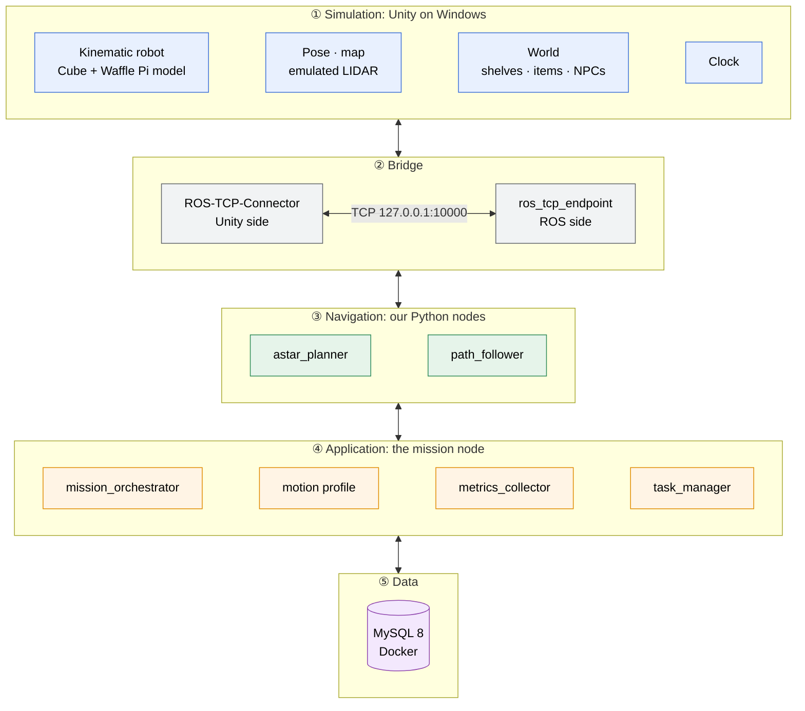
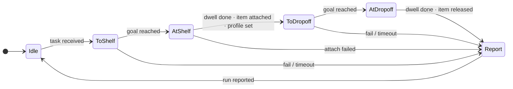

# Architecture: UC6 Warehouse Robot

**Reading guide:** §1 gives the big picture in five layers. §2–§4 zoom into each side. §5 is the interface contract. §6–§7 show runtime behaviour. §8–§12 are reference tables.

> **Status.** This is the target architecture after the 2026-10-04 change of direction ([ADR-012](ADR-012-custom-python-navigation.md), [ADR-013](ADR-013-kinematic-robot-body.md), [ADR-014](ADR-014-ros-interfaces.md)). The code base is the `Nhan-turtlebot` prototype. Components marked P1, P2 or P3 in §2 do not exist yet.

---

## 1. The five layers


```mermaid
flowchart TB
    subgraph SIM["① Simulation: Unity on Windows"]
        direction LR
        S1[Kinematic robot<br/>Cube + Waffle Pi model] ~~~ S2[Pose · map<br/>emulated LIDAR] ~~~ S3[World<br/>shelves · items · NPCs] ~~~ S4[Clock]
    end
    subgraph BRIDGE["② Bridge"]
        direction LR
        B1[ROS-TCP-Connector<br/>Unity side] <-->|"TCP 127.0.0.1:10000"| B2[ros_tcp_endpoint<br/>ROS side]
    end
    subgraph NAV["③ Navigation: our Python nodes"]
        direction LR
        N1[astar_planner] ~~~ N2[path_follower]
    end
    subgraph APP["④ Application: the mission node"]
        direction LR
        A1[mission_orchestrator] ~~~ A2[motion profile] ~~~ A3[metrics_collector] ~~~ A4[task_manager]
    end
    subgraph DATA["⑤ Data"]
        D1[(MySQL 8<br/>Docker)]
    end

    SIM <--> BRIDGE
    BRIDGE <--> NAV
    NAV <--> APP
    APP <--> DATA

    classDef sim fill:#E8F0FE,stroke:#3B6FD8,color:#000
    classDef br fill:#F1F3F4,stroke:#5F6368,color:#000
    classDef nav fill:#E6F4EA,stroke:#2E8B57,color:#000
    classDef app fill:#FFF4E5,stroke:#E08A00,color:#000
    classDef db fill:#F3E8FD,stroke:#8E44AD,color:#000
    class S1,S2,S3,S4 sim
    class B1,B2 br
    class N1,N2 nav
    class A1,A2,A3,A4 app
    class D1 db
```

| Layer | Owns | Must never |
|-------|------|------------|
| ① Simulation | The kinematic robot body, ground-truth pose, the map, the emulated LIDAR, NPC motion, item attach/release, collision detection, `/clock` | Plan paths or decide where to go |
| ② Bridge | Moving ROS messages between Windows and WSL | Contain logic |
| ③ Navigation | Planning (A*), path following, the obstacle layer from the LIDAR, replans and recovery | Know about tasks, categories or the database |
| ④ Application | The task sequence, category profiles, measuring runs, persistence | Plan paths itself |
| ⑤ Data | Task catalog and run results | Be on the navigation path; an outage never blocks a run |

**Dependency rule:** each layer talks only to its neighbours. The one exception is that `metrics_collector` and `mission_orchestrator` also listen to or call the simulation's topics, which pass through the bridge.

---

## 2. Unity side (Windows)

The robot's body is the kinematic object `Cube`. The TurtleBot3 Waffle Pi is a visual child of it, scale 3.2 ([ADR-013](ADR-013-kinematic-robot-body.md)). Every length that goes to ROS is divided by that scale, so ROS sees robot metres ([ADR-010](ADR-010-robot-scale.md)).

| Component (C#) | Does | ROS interface | Status |
|----------------|------|---------------|--------|
| `CubeCmdVelSubscriber` | Moves the `Cube` from `/cmd_vel`. Stops if no command arrives for 0.5 s. | sub `/cmd_vel` | Exists; multiply the linear speed by the scale (P1) |
| `CubePosePublisher` | Publishes the ground-truth pose in robot metres, stamped with sim time. | pub `/cube/pose` | Exists as `Pose`; `PoseStamped` and the scale (P1) |
| `OccupancyGridPublisher` | Publishes the raw static map (walls and shelves, not inflated) every second. | pub `/map` | Exists, but inflated and without walls; raw, `WallPanel` tag and the scale (P1) |
| `CubeCarNavigator` | Only its grid builder is used (`BuildGridForRos`). Its own A* and driving stay switched off. | none | Exists |
| `ClockPublisher` | Publishes simulation time ([ADR-009](ADR-009-simulation-clock.md)). | pub `/clock` | P1 (port from `Nguyen-planning`) |
| `CollisionReporter` | Reports `Cube` overlaps with walls, shelves, obstacles and NPCs. Debounced to 1 s per object. | pub `/sim/collision` | P1 |
| `ItemCarrier` | Attaches the item to the robot (re-parent) and releases it. | sub `/sim/attach_item`, `/sim/release_item`; pub `/sim/ack` | P1 |
| `ScenarioLoader` | Loads the obstacle and NPC layout of a scenario and puts the robot on the fixed start pose. | sub `/sim/reset_scenario`; pub `/sim/ack` | P1 (S-00), P2 (S-01 to S-03), P3 (S-04) |
| `LaserScanPublisher` + `LaserScanner` | Emulated 360-beam LIDAR by raycasts (LDS-01-like: 0.12–3.5 m, 5 Hz). | pub `/scan` | P2 (port from `Nguyen-planning`) |
| `NpcMover` | Moves NPC workers on scripted waypoints. Not a ROS node. | none | P3 |

---

## 3. ROS side (WSL2)

### Stock nodes

Only the bridge: `ros_tcp_endpoint` (and `roscore`). Navigation is **not** a stock stack any more ([ADR-012](ADR-012-custom-python-navigation.md)).

### Our navigation nodes: Python 3, package `cube_control`

| Node | One job |
|------|---------|
| `astar_planner` | Inflates the raw `/map` by `/nav/inflation_radius`, adds the obstacles seen on `/scan`, plans with A* when a goal arrives, publishes `/planned_path`, and replans when the path is blocked. Reports `aborted` on `/nav/leg_result` when no path exists |
| `path_follower` | Follows `/planned_path` at `/nav/max_lin` and sends `/cmd_vel`. Stops when the way ahead is blocked (a recovery, reported on `/nav/event`). Reports `succeeded` on `/nav/leg_result` when the goal is reached |

### Our application node: Python 3, package `warehouse_mission` (P1)

One node, `mission`, with four classes ([ADR-014](ADR-014-ros-interfaces.md)):

| Class | One job | Talks to MySQL? |
|-------|---------|:---------------:|
| `mission_orchestrator` | Runs the episode state machine (§7) | No |
| motion profile | Applies a category's speed/margin profile as ROS parameters | No |
| `metrics_collector` | Measures one run and returns a summary | No |
| `task_manager` | Reads tasks from and writes runs to MySQL, on its own worker thread | **Yes, the only one** |

### Node graph


```mermaid
flowchart LR
    U["Unity<br/>(via ros_tcp_endpoint)"]

    subgraph NAV["Navigation (cube_control)"]
        PL[astar_planner] -- "/planned_path" --> FO[path_follower]
    end

    subgraph APP["mission node"]
        MO[mission_orchestrator]
        MP[motion profile]
        MC[metrics_collector]
        TM[task_manager]
    end

    DB[(MySQL)]

    U -- "/cube/pose /map /scan /clock" --> PL
    U -- "/cube/pose /scan" --> FO
    FO -- "/cmd_vel" --> U
    MO -- "goal · cancel" --> PL
    FO -- "leg result · events" --> MO
    MO -- "set category" --> MP
    MP -- "ROS params" --> PL
    MP -- "ROS params" --> FO
    MO -- "/sim commands" --> U
    U -- "/sim/ack" --> MO
    MO -- "start · mark leg · finish" --> MC
    MO -- "get task · report run" --> TM
    U -. "/cube/pose /scan /sim/collision" .-> MC
    PL -. "/planned_path" .-> MC
    TM <--> DB

    classDef nav fill:#E6F4EA,stroke:#2E8B57,color:#000
    classDef app fill:#FFF4E5,stroke:#E08A00,color:#000
    classDef sim fill:#E8F0FE,stroke:#3B6FD8,color:#000
    classDef db fill:#F3E8FD,stroke:#8E44AD,color:#000
    class PL,FO nav
    class MO,MP,MC,TM app
    class U sim
    class DB db
```

<sub>Solid = command/request. Dotted = passive listening (metrics only).</sub>

`mission_orchestrator` is the only part that gives orders. Every other class is a call it makes.

---

## 4. Frames and units

There is **one frame, `map`**. It is Unity's world converted to ROS axes (ROS x = Unity Z, ROS y = -Unity X, ROS yaw = -Unity rotation Y, counter-clockwise positive) and divided by the robot scale 3.2. Its origin is the Unity world origin.

Nothing publishes `/tf`. RViz uses `map` as its fixed frame. All lengths, speeds and sensor ranges in ROS are robot metres, radians and seconds of sim time.

---

## 5. Interface contract

All interfaces use **standard ROS types** ([ADR-014](ADR-014-ros-interfaces.md)). A payload without a standard type is a JSON object in a `std_msgs/String`. This section is the single source of truth: there is no message package.

### Topics

| Topic | Type | From → To | Rate | Notes |
|-------|------|-----------|------|-------|
| `/cmd_vel` | `geometry_msgs/Twist` | path_follower → Unity | 20 Hz | Robot m/s and rad/s. Unity stops after 0.5 s without a command |
| `/cube/pose` | `geometry_msgs/PoseStamped` | Unity → planner, follower, mission | 30 Hz (target) | Ground truth, frame `map`, robot metres, stamped with sim time |
| `/map` | `nav_msgs/OccupancyGrid` | Unity → planner | 1 Hz | Raw static map (0 free, 100 occupied). Re-sent because the endpoint cannot latch |
| `/scan` | `sensor_msgs/LaserScan` | Unity → planner, follower, mission | 5 Hz | Emulated LDS-01, robot metres (P2) |
| `/clock` | `rosgraph_msgs/Clock` | Unity → all nodes | 100 Hz | [ADR-009](ADR-009-simulation-clock.md) |
| `/move_base_simple/goal` | `geometry_msgs/PoseStamped` | mission (or RViz) → planner | per leg | Goal in `map`. The name keeps the RViz *2D Nav Goal* tool working |
| `/nav/cancel` | `std_msgs/Empty` | mission → planner, follower | on timeout or cancel | Drop the goal and stop |
| `/planned_path` | `nav_msgs/Path` | planner → follower, mission | per plan | Latched. A new message only when the planner really plans |
| `/nav/leg_result` | `std_msgs/String` (JSON) | planner, follower → mission | per leg | See below |
| `/nav/event` | `std_msgs/String` (JSON) | follower → mission | per event | See below |
| `/sim/reset_scenario` | `std_msgs/String` | runner → Unity | per episode | Scenario id, e.g. `S-02` |
| `/sim/attach_item` | `std_msgs/Int32` | mission → Unity | per task | Item id |
| `/sim/release_item` | `std_msgs/Empty` | mission → Unity | per task | |
| `/sim/ack` | `std_msgs/String` (JSON) | Unity → mission, runner | per command | See below |
| `/sim/collision` | `std_msgs/String` (JSON) | Unity → mission | on contact | See below |

### JSON payloads

| Topic | Fields |
|-------|--------|
| `/sim/ack` | `cmd` (`reset_scenario`, `attach_item`, `release_item`), `ok` (bool), `error` (`""` when ok) |
| `/sim/collision` | `other_tag` (`Wall`, `Shelf`, `Obstacle`, `NPC`), `sim_time_s`, `x`, `y` (contact point in `map`) |
| `/nav/leg_result` | `outcome` (`succeeded`, `aborted`), `reason` (`""` when succeeded; otherwise `no_path`, `blocked`, `cancelled`) |
| `/nav/event` | `type` (`recovery`), `sim_time_s` |

### ROS parameters

| Parameter | Unit | Set by → read by | Meaning |
|-----------|------|------------------|---------|
| `/nav/max_lin` | m/s | motion profile → follower | Speed limit of the current leg |
| `/nav/inflation_radius` | m | motion profile → planner | The robot centre stays at least this far from every obstacle |

### Services and actions

None. Commands to Unity are topics with an acknowledgement; the mission waits for `/sim/ack` with a timeout.

### Records and allowed values

Task, run summary and event records are Python data classes in `warehouse_mission`. Their stored form is in [data-model.md](data-model.md). Use the constants in code instead of typing the strings.

| Value | Allowed |
|-------|---------|
| category | `Standard`, `Heavy`, `Fragile` |
| leg | `shelf`, `dropoff` |
| outcome | `success`, `fail` |
| fail_reason | `nav_aborted`, `timeout`, `item_error`, `bridge_lost` |
| event_type | `collision`, `replan`, `recovery`, `warning` |
| scenario_id | `S-00` … `S-05` |

| Record | Fields |
|--------|--------|
| Task | `task_id`, `item_id`, `category`, `shelf_pose` and `dropoff_pose` (x, y, theta in `map`) |
| Run summary | `task_id`, `scenario_id`, `planner`, `outcome`, `fail_reason`, `start_x`, `start_y`, `collisions`, `replans`, `recoveries`, `min_clearance_m`, `path_length_m`, `baseline_m`, `path_ratio`, `duration_s`, `dropoff_mean_speed_mps`, `started_at`, `ended_at`, `events`. A metric that was not measured is NaN (stored as NULL) |
| Run event | `event_type`, `sim_time_s` (seconds since run start), `payload` (JSON, e.g. `{"other_tag":"NPC"}`) |

---

## 6. One episode, step by step

The runner resets the scenario before each episode (`/sim/reset_scenario`, then it waits for `/sim/ack`). Then:


```mermaid
sequenceDiagram
    autonumber
    participant MO as mission_orchestrator
    participant TM as task_manager
    participant MC as metrics_collector
    participant MP as motion profile
    participant NV as planner + follower
    participant U as Unity

    MO->>TM: get_next_task
    TM-->>MO: task (item, category, shelf pose, drop-off pose)
    MO->>MC: start_run
    MO->>MP: set_category(Standard)
    Note over MO,U: Shelf leg
    MO->>MC: mark_leg(shelf)
    MO->>NV: goal = shelf pose
    NV->>U: /cmd_vel
    U-->>NV: /cube/pose · /scan
    NV-->>MO: leg_result succeeded
    MO->>U: attach_item (after dwell)
    U-->>MO: ack
    MO->>MP: set_category(item category)
    Note over MO,U: Drop-off leg
    MO->>MC: mark_leg(dropoff)
    MO->>NV: goal = drop-off pose
    NV->>U: /cmd_vel
    U-->>NV: /cube/pose · /scan
    NV-->>MO: leg_result succeeded
    MO->>U: release_item (after dwell)
    U-->>MO: ack
    MO->>MC: finish_run(success)
    MC-->>MO: run summary
    MO->>TM: report_run(summary)
```

---

## 7. Mission state machine (`mission_orchestrator`)


```mermaid
stateDiagram-v2
    direction LR
    [*] --> Idle
    Idle --> ToShelf: task received
    ToShelf --> AtShelf: goal reached
    AtShelf --> ToDropoff: dwell done · item attached · profile set
    ToDropoff --> AtDropoff: goal reached
    AtDropoff --> Report: dwell done · item released

    ToShelf --> Report: fail / timeout
    ToDropoff --> Report: fail / timeout
    AtShelf --> Report: attach failed
    Report --> Idle: run reported
```

Obstacle avoidance and recovery happen **inside** `ToShelf` and `ToDropoff`, handled by the planner and the follower. The orchestrator only sees the final `succeeded` / `aborted` result and its own leg timeout. On a timeout it publishes `/nav/cancel`.

---

## 8. Navigation configuration

All settings are ROS parameters of the two nodes, set in `ros1/warehouse_bringup`. The follower values are the prototype's, in Unity units; P1 re-tunes them in robot metres.

| Part | Choice | Key settings |
|------|--------|--------------|
| Map | Raw static map from Unity: objects tagged `Shelf` and `WallPanel` | Cell size 0.5 Unity units (about 0.16 m). S-02 may need a finer grid (P2) |
| Pose | Ground truth on `/cube/pose` | No localisation node |
| Inflation | In the planner, a hard limit | `/nav/inflation_radius` from the profile (§9) |
| Global planner | 8-connected A*, octile heuristic, goal snapping, line-of-sight smoothing | `snap_distance` (re-tuned in robot metres in P1) |
| Obstacle layer | Cells hit by the `/scan` beams are blocked, then inflated like the rest | P2 |
| Follower | P controller to the next waypoint, turns in place when the heading error is large | Prototype: `K_LIN` 0.5, `K_ANG` 1.5, `MAX_ANG` 1.0, `TURN_FIRST` 0.5 rad, `waypoint_tol` 0.3 |
| Recovery | Stop when the path ahead is blocked, replan; if no path, rotate in place and retry | Attempt limit set in P2 |
| Footprint | The `Cube` (1 x 1 Unity units), half-diagonal about 0.22 m in robot metres | The clearance metric uses 0.21 m (Waffle Pi) |

The static map contains **walls and shelves only**. Scenario obstacles and NPCs are **not** in the map; the robot must find them with its LIDAR. That is what M2 and M3 test.

---

## 9. Category motion profiles

Stored in `ros1/warehouse_bringup/config/motion_profiles.yaml`, which is the single source of truth. The database only stores the category name. Values are in robot metres.

| Category | `max_lin` (m/s) | `inflation_radius` (m) | Idea |
|----------|:----:|:----:|------|
| **Standard** | 0.26 | 0.30 | Waffle Pi nominal top speed |
| **Heavy** | 0.15 | 0.35 | Slow, with a little more margin |
| **Fragile** | 0.10 | 0.50 | Slow, with a wide safety margin |

The earlier plan also set an acceleration limit per category (2.5, 1.0 and 2.5 m/s²). The follower has no speed ramp, so this stays a stretch goal.

Rules:

1. **Shelf leg:** always Standard, because the robot is empty.
2. **Drop-off leg:** the item's category.
3. The mission applies a profile by setting `/nav/max_lin` and `/nav/inflation_radius`. The planner reads the inflation at every plan and the follower reads the speed at every control step.
4. **If applying fails:** revert to **Fragile** (the safest), log a `warning` event, and continue.

---

## 10. How each metric is measured (`metrics_collector`)

| Metric | Measured as |
|--------|-------------|
| `collisions` | Count of `/sim/collision` messages. Unity debounces repeated contact with the same object to 1 s. |
| `replans` | Per leg: number of `/planned_path` messages − 1. The first plan of a leg is not a replan. The planner must publish a path only when it really plans, not on every `/map` update. |
| `recoveries` | Count of `/nav/event` messages of type `recovery`. One recovery is one stop + replan caused by a blocked path. |
| `min_clearance_m` | Minimum over the run of `min(scan.ranges) − 0.21 m`, where 0.21 m ≈ footprint radius. Sampled on each `/scan`. |
| `path_length_m` | Sum of distances between consecutive `/cube/pose` positions |
| `baseline_m` | `‖start→shelf‖ + ‖shelf→drop-off‖` (straight lines). The start is the first pose after the reset acknowledgement. |
| `path_ratio` | `path_length_m / baseline_m` |
| `duration_s` | Sim time from dispatch to item release (or to failure) |
| `dropoff_mean_speed_mps` | Mean speed from the `/cube/pose` stamps during the **drop-off leg only**, since that leg uses the category profile |

---

## 11. Failure handling

| Failure | Who notices | What happens | Run blocked? |
|---------|-------------|--------------|:------------:|
| MySQL down at start | `task_manager` | Returns the bundled default task, `from_fallback = true` | No |
| MySQL down at end | `task_manager` | Writes summary to `~/.warehouse/pending/*.json`; uploads on next start | No |
| No path / robot stuck | planner + follower | Stop and replan (recovery), then rotate and retry. After repeated failures `/nav/leg_result` is `aborted` → `outcome = fail`, `fail_reason = nav_aborted` | No |
| Leg takes too long | `mission_orchestrator` | Publishes `/nav/cancel` → `fail_reason = timeout` | No |
| Attach/release fails, or no `/sim/ack` in time | `mission_orchestrator` | `fail_reason = item_error` | No |
| Profile can't be applied | motion profile | Revert to Fragile, `warning` event | No |
| Unity ↔ ROS link lost | `mission_orchestrator` (no `/clock` for 2 s) | `fail_reason = bridge_lost`; runner pauses until link returns | Current run only |
| Scenario reset not acknowledged | runner | Retries once, then the episode is a failure with `fail_reason = bridge_lost` | Current run only |

---

## 12. Code layout

```text
repo/
├─ WarehouseProjectURP/                 Unity project (Windows)
│  ├─ Assets/Scripts/                   C# components from §2 (flat)
│  ├─ Assets/URDF/                      Waffle Pi visual model
│  └─ Assets/Editor/                    StripPhysicsFromRobot.cs
└─ ros1/                                catkin packages (built in WSL, see setup guide)
   ├─ cube_control/                     astar_planner, path_follower, demo scripts
   ├─ warehouse_bringup/                launch/, config/, rviz/
   ├─ warehouse_mission/                the mission node (P1)
   └─ warehouse_eval/                   headless runner, CSV exporter, scenarios.yaml (P1)
```

One launch file is meant to start everything on the ROS side (P0 adapts the one carried over from `Nguyen-planning`):

```bash
roslaunch warehouse_bringup bringup.launch
```
