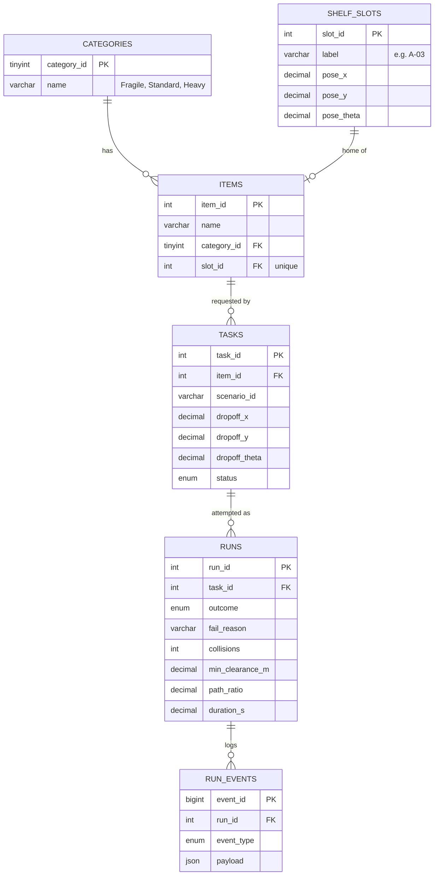
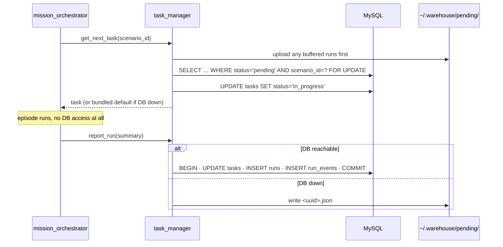

# Data Model: UC6 Warehouse Robot

MySQL 8 in Docker ([ADR-005](ADR-005-mysql-database.md)). Only `task_manager` reads or writes it. DDL: [schema.sql](schema.sql).

---

## 1. Tables at a glance

| Group | Tables | Changes when |
|-------|--------|--------------|
| **Catalog** | `categories`, `shelf_slots`, `items` | Only when the seed script runs |
| **Work** | `tasks` | Seeded per scenario batch; `status` updated per episode |
| **Evidence** | `runs`, `run_events` | One row (plus events) per episode |

---

## 2. Key rules

| Rule | Why |
|------|-----|
| `categories` holds **names only**. Speed/margin values live in `motion_profiles.yaml`. | One source of truth ([architecture.md §9](architecture.md#9-category-motion-profiles)) |
| One item has one home slot, and a slot holds at most one item (`items.slot_id` is `UNIQUE`). | Removes the old circular FK |
| `tasks.status`: `pending → in_progress → done` | `done` means an attempt was made. Whether it worked lives in `runs.outcome`. |
| `runs.outcome`: `success` or `fail`. When `fail`, `fail_reason` ∈ `nav_aborted`, `timeout`, `item_error`, `bridge_lost`. | Matches [architecture.md §11](architecture.md#11-failure-handling) |
| `run_events.event_type`: `collision`, `replan`, `recovery`, `warning` | Clearance is **not** stored per sample; only its minimum goes in `runs` |
| The robot start pose is stored in `runs` (`start_x`, `start_y`) | Needed to compute `baseline_m` |

---

## 3. Episode read/write path

---

## 4. Seeding

A script `warehouse_eval/seed.py` creates the data:

| Command | Effect |
|---------|--------|
| `seed.py --catalog` | Inserts the 3 categories, the shelf-slot grid matching the Unity scene, and the items |
| `seed.py --scenario S-02 --runs 20` | Inserts 20 `pending` tasks for S-02 (called by the runner) |
| `seed.py --reset-evidence` | Empties `runs`, `run_events` and `tasks`; keeps the catalog |

Shelf-slot poses must match the Unity scene. The Unity lead exports them once from the scene to `warehouse_eval/shelf_slots.csv`, and the seed script reads that file.
