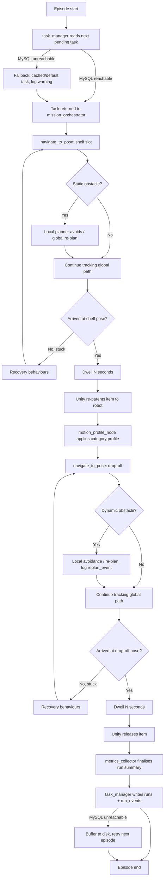
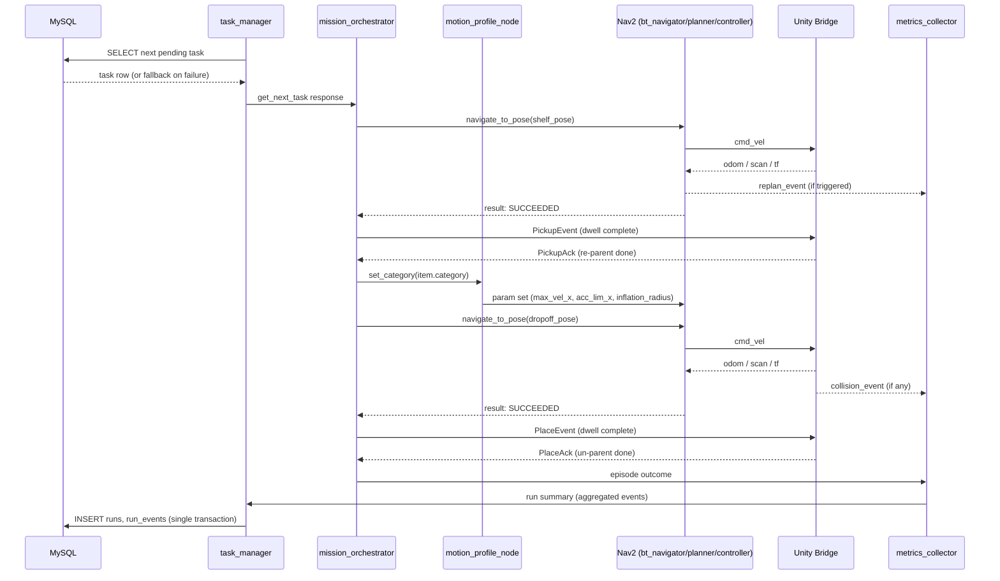
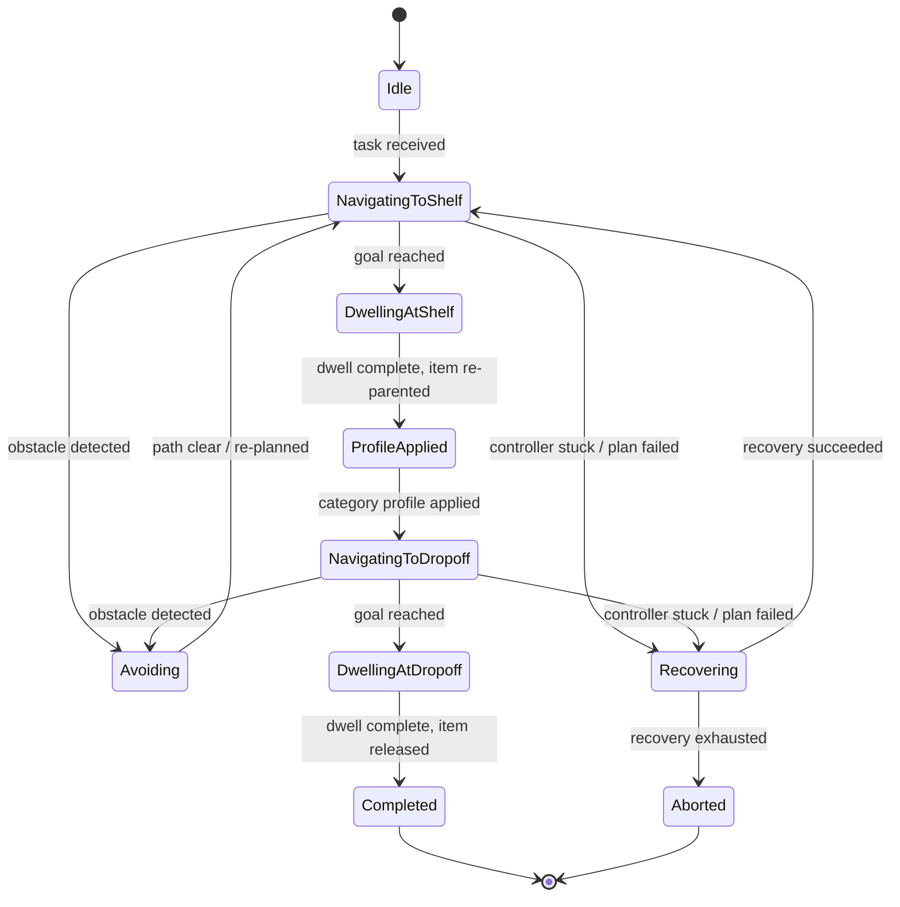
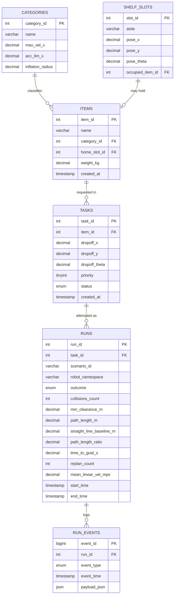
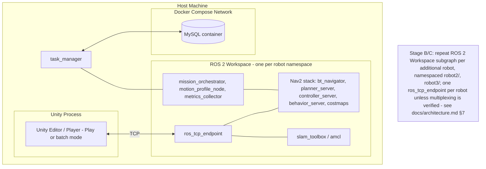

# Diagrams — UC6 Mobile Robot Warehouse System

All diagrams are Mermaid, inline, per NFR-05. No external diagramming tool output is used.

## (a) End-to-End Task Workflow (Flowchart)

## (b) Sequence Diagram — Task Dispatch to Report

## (c) Robot State Machine

## (d) Entity-Relationship Diagram

## (e) Deployment / Process View

