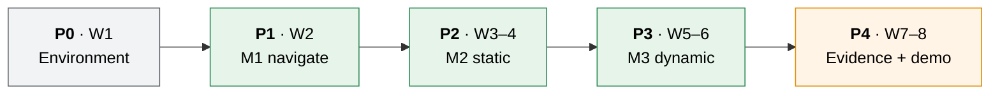

# Milestones: UC6 Warehouse Robot

8 weeks · 4 people · 1 robot. Phases do **not** overlap. A phase starts only when the previous one's exit gate passes.

---

## 1. Timeline

| Phase | Weeks | Goal | Exit gate (all must pass) |
|:-----:|:-----:|------|---------------------------|
| **P0** | 1 | Everyone can run the stack | Setup-guide smoke test (§8) passes on **all 4 machines** · MySQL up with schema · Waffle Pi imported in Unity · `/scan` and `/odom` visible in RViz |
| **P1** | 2 | **M1** | Map built with gmapping and committed · AMCL localises · S-00 meets its criteria · all 4 app nodes run end to end (even if simple) |
| **P2** | 3–4 | **M2** | S-01, S-02 and S-03 meet their criteria with DWA · category profiles switch at runtime |
| **P3** | 5–6 | **M3** | S-04 meets its criteria · ADR-004 benchmark done, planner chosen · S-05 meets its criteria |
| **P4** | 7–8 | Evidence | N = 20 CSVs for S-00 to S-05 with the final planner · each live scenario recorded on video · demo rehearsed twice · docs updated |

Week 8 is deliberately light. It is buffer for any gate that slipped.

---

## 2. Roles

| Role | Owns | Main files |
|------|------|------------|
| **Navigation lead** | Map, AMCL, `move_base` configs, DWA/TEB tuning, ADR-004 benchmark | `warehouse_bringup/config/`, `maps/` |
| **Unity lead** | Scene, Waffle Pi import, diff-drive, LIDAR, odom, clock, collisions, NPCs, scenarios | `WarehouseProjectURP/Assets/Scripts/` |
| **Mission lead** | `mission_orchestrator`, `motion_profile_node`, `metrics_collector`, `warehouse_msgs` | `warehouse_mission/`, `warehouse_msgs/` |
| **Data & eval lead** | Schema, `task_manager`, Docker, headless runner, CSV export, demo script | `warehouse_mission/task_manager.py`, `warehouse_eval/`, `infra/` |

| Role | Person |
|------|--------|
| Navigation lead | _TBD_ |
| Unity lead | _TBD_ |
| Mission lead | _TBD_ |
| Data & eval lead | _TBD_ |

Every role has a named backup, so any two people can close a gate if someone is away.

---

## 3. Work breakdown per phase

<b>P0: Environment (week 1)</b>

- [ ] All: follow [setup-windows-wsl.md](setup-windows-wsl.md) to the end
- [ ] Unity: import Waffle Pi URDF; `DiffDriveController`, `OdometryPublisher`, `LaserScanPublisher`, `ClockPublisher`
- [ ] Mission: create `warehouse_msgs` with all messages from [architecture.md §5](architecture.md#5-interface-contract); generate C# in Unity
- [ ] Nav: `bringup.launch` with endpoint + `robot_state_publisher` + RViz config
- [ ] Data: `infra/docker-compose.yml`, `.env.example`, `.gitattributes` (`ros/** text eol=lf`)
- [ ] Retire the Unity A* prototype: move `CubeCarNavigator.cs` to `_archive/` ([ADR-008](ADR-008-navigation-stack.md))

<b>P1: M1 navigate (week 2)</b>

- [ ] Nav: drive around with teleop and record a map with gmapping; save it as `maps/warehouse.yaml`
- [ ] Nav: AMCL + `move_base` with DWA at TurtleBot3 defaults; 2D Nav Goal works in RViz
- [ ] Unity: `ItemCarrier` (attach/release), `ScenarioLoader` (S-00), `CollisionReporter`
- [ ] Mission: `mission_orchestrator` state machine; `metrics_collector` basic metrics
- [ ] Data: `task_manager` get/report with the JSON fallback; seed script
- [ ] Data: headless runner v1 + CSV export → S-00 × 20

<b>P2: M2 static (weeks 3–4)</b>

- [ ] Unity: S-01, S-02 and S-03 layouts
- [ ] Nav: tune costmaps, inflation and recovery for S-01 to S-03
- [ ] Mission: `motion_profile_node` with `dynamic_reconfigure`
- [ ] Data: full metrics in CSV; summary file with PASS/FAIL

<b>P3: M3 dynamic (weeks 5–6)</b>

- [ ] Unity: `NpcMover` + S-04
- [ ] Nav: tune DWA for S-04; configure TEB; run the ADR-004 benchmark (time-boxed to 2 days)
- [ ] All: S-05 category runs

<b>P4: Evidence (weeks 7–8)</b>

- [ ] Final N = 20 batches for every scenario with the chosen planner
- [ ] Record demo videos (fallback for grading day)
- [ ] Rehearse the demo twice; freeze the code

---

## 4. Risks

| Risk | Chance | Impact | Plan |
|------|:------:|:------:|------|
| WSL networking or bridge problems on one machine | Med | High | NAT + localhost forwarding (tested); WSL-IP fallback in setup Appendix A; smoke test is the P0 gate |
| Noetic is EOL: a package breaks or disappears | Low | High | Binaries are still hosted; pin versions in P0 and keep an `apt` package list ([ADR-003](ADR-003-ros1-noetic.md)) |
| Sim time / TF timing errors across the bridge | Med | Med | Unity owns `/clock` ([ADR-009](ADR-009-simulation-clock.md)); relax `transform_tolerance` if needed |
| AMCL drifts in a repetitive warehouse | Med | Med | Reset the initial pose on every run; fall back to `fake_localization` if still unstable (document it in ADR-008) |
| DWA cannot pass S-04 | Med | High | TEB is the planned alternative (ADR-004); lower NPC speed only through the change log |
| Fragile profile too slow → timeouts | Med | Low | Tunable values; `leg_timeout_s` per scenario |
| Scope creep (perception, more robots) | Med | High | Explicit non-goals in the PRD; nothing new before P3's gate |
| Demo fails live | Low | High | Recorded videos + CSVs as backup |
