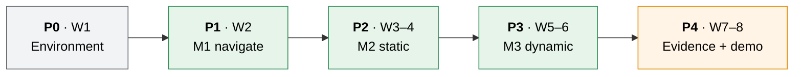

# Milestones: UC6 Warehouse Robot

8 weeks · 4 people · 1 robot. Phases do **not** overlap. A phase starts only when the previous one's exit gate passes.

> **2026-10-04:** the tasks are re-planned for the `Nhan-turtlebot` code base ([ADR-012](ADR-012-custom-python-navigation.md), [ADR-013](ADR-013-kinematic-robot-body.md), [ADR-014](ADR-014-ros-interfaces.md)). The phases, the purpose of each gate and the four roles are unchanged. The earlier `move_base` task lists are on branch `Nguyen-planning`.

---

## 1. Timeline

| Phase | Weeks | Goal | Exit gate (all must pass) |
|:-----:|:-----:|------|---------------------------|
| **P0** | 1 | Everyone can run the prototype | Setup-guide smoke test (§8) passes on **all 4 machines** · MySQL up with schema · the prototype runs end to end (planner and follower drive the robot to a goal in Unity) · `/cube/pose` and `/map` visible in RViz |
| **P1** | 2 | **M1** | Pose, map and `/cmd_vel` are in robot metres and use sim time · the map is raw and contains the walls · S-00 meets its criteria · the `mission` node runs an episode end to end (even if simple) |
| **P2** | 3–4 | **M2** | S-01, S-02 and S-03 meet their criteria · the LIDAR emulation and the obstacle layer work · category profiles switch at runtime |
| **P3** | 5–6 | **M3** | S-04 meets its criteria · S-05 meets its criteria |
| **P4** | 7–8 | Evidence | N = 20 CSVs for S-00 to S-05 with the final planner · each live scenario recorded on video · demo rehearsed twice · docs updated |

Week 8 is deliberately light. It is buffer for any gate that slipped.

---

## 2. Roles

| Role | Owns | Main files |
|------|------|------------|
| **Navigation lead** | Planner, follower, obstacle layer, replan and recovery, tuning, profile values | `ros1/cube_control/`, `ros1/warehouse_bringup/config/` |
| **Unity lead** | Scene, kinematic body and Waffle Pi model, ROS scripts (pose, map, `/cmd_vel`), LIDAR emulation, clock, collisions, NPCs, scenarios | `WarehouseProjectURP/Assets/Scripts/` |
| **Mission lead** | The `mission` node: `mission_orchestrator`, motion profile, `metrics_collector`; the interface tables in [architecture.md §5](architecture.md#5-interface-contract) | `ros1/warehouse_mission/` |
| **Data & eval lead** | Schema, `task_manager`, Docker, headless runner, CSV export, demo script | `ros1/warehouse_mission/task_manager.py`, `ros1/warehouse_eval/`, `infra/` |

| Role | Person |
|------|--------|
| Navigation lead | _TBD_ |
| Unity lead | _TBD_ |
| Mission lead | _TBD_ |
| Data & eval lead | _TBD_ |

Every role has a named backup, so any two people can close a gate if someone is away.

---

## 3. Work breakdown per phase

<b>P0: Environment (week 1)</b>

- [ ] All: follow [setup-windows-wsl.md](setup-windows-wsl.md) to the end and run the prototype ([README_ROS1_Prototype.md](../README_ROS1_Prototype.md))
- [ ] Nav: adapt `ros1/warehouse_bringup` (copied from `Nguyen-planning`): start the endpoint, planner and follower, set `use_sim_time`, RViz with fixed frame `map`; drop `robot_state_publisher` and the `/odom` and `/initialpose` displays
- [ ] Unity: pin the ROS packages in `Packages/manifest.json` (ROS-TCP-Connector v0.7.0, URDF-Importer v0.5.2)
- [ ] Data: `infra/` MySQL up (`docker compose up -d`)
- [ ] All: agree who edits `Warehouse.unity`. It merges badly, so one branch at a time

<b>P1: M1 navigate (week 2)</b>

- [ ] Unity: apply the robot scale in `CubePosePublisher`, `CubeCmdVelSubscriber` and `OccupancyGridPublisher`; `PoseStamped` with sim time; port `ClockPublisher`
- [ ] Unity: raw map: set the grid builder's Robot Radius to 0 and add the `WallPanel` tag to the obstacle tags; remove the hello scaffolding (`HelloSubscriber`, `TestPublisher` and their scene objects)
- [ ] Unity: `ItemCarrier`, `ScenarioLoader` (S-00), `CollisionReporter`; the `/sim/*` topics and `/sim/ack`
- [x] Nav: fix the prototype planner and follower: goal snap within a radius, line-of-sight that cannot miss a blocked corner, the follower reads a consistent path and checks that the pose is fresh, `/nav/cancel` and `/nav/leg_result`, inflation from `/nav/inflation_radius`. Keep the pure planning logic apart from `rospy` and cover it with `unittest` _(85 unit tests; also run on WSL against a stand-in for Unity. Not yet run with the real Unity scene)_
- [ ] Mission: `warehouse_mission` with the `mission` node: orchestrator state machine, basic metrics, `task_manager` (get/report, JSON fallback) on a worker thread
- [ ] Data: seed script; headless runner v1 + CSV export → S-00 × 20

<b>P2: M2 static (weeks 3–4)</b>

- [ ] Unity: port `LaserScanner`, `LaserScanPublisher` and `PublishTimer` from `Nguyen-planning` (ranges divided by the scale); S-01, S-02 and S-03 layouts
- [ ] Nav: obstacle layer from `/scan`; replan when blocked; recovery (stop, replan, rotate); a finer grid if S-02 needs it; clearance check after the first S-01 dry run ([ADR-012](ADR-012-custom-python-navigation.md))
- [ ] Mission: motion profile through `/nav/max_lin` and `/nav/inflation_radius`
- [ ] Data: full metrics in CSV; summary file with PASS/FAIL

<b>P3: M3 dynamic (weeks 5–6)</b>

- [ ] Unity: `NpcMover` + S-04
- [ ] Nav: tune stop and replan for S-04; add a slow/stop zone around NPCs if needed
- [ ] All: S-05 category runs

<b>P4: Evidence (weeks 7–8)</b>

- [ ] Final N = 20 batches for every scenario with the chosen planner
- [ ] Record demo videos (fallback for grading day)
- [ ] Rehearse the demo twice; freeze the code

The [mobile manipulator + inventory panel](features/mobile-manipulator-inventory/requirements.md) feature starts only after the P3 gate.

---

## 4. Risks

| Risk | Chance | Impact | Plan |
|------|:------:|:------:|------|
| WSL networking or bridge problems on one machine | Med | High | NAT + localhost forwarding (tested); WSL-IP fallback in setup Appendix A; smoke test is the P0 gate |
| Noetic is EOL: a package breaks or disappears | Low | High | Binaries are still hosted; pin versions in P0 and keep an `apt` package list ([ADR-003](ADR-003-ros1-noetic.md)) |
| Sim time errors across the bridge | Med | Med | Unity owns `/clock` ([ADR-009](ADR-009-simulation-clock.md)); every node waits for the first `/clock` message before it reads the time |
| Hard inflation leaves too little clearance for S-01 and S-02 | Med | Med | Proximity cost in A*, or the one allowed threshold revision ([ADR-012](ADR-012-custom-python-navigation.md)) |
| The custom planner cannot pass S-04 | Med | High | Add a slow/stop zone around NPCs. The fallback is the `move_base` plan on `Nguyen-planning` |
| Unity changes cannot be tested in CI | Med | Med | Edit Mode tests for the pure conversions (scale, axes); the team runs the scene checks in Unity before each gate |
| Scale conversion mistakes (divide or multiply by 3.2) | Med | Med | One helper with Edit Mode tests; the scale is read from one Transform ([ADR-010](ADR-010-robot-scale.md)) |
| `Warehouse.unity` merge conflicts | High | Med | One person edits the scene at a time; announce it in the team chat |
| Fragile profile too slow → timeouts | Med | Low | Tunable values; `leg_timeout_s` per scenario |
| Scope creep (perception, more robots) | Med | High | Explicit non-goals in the PRD; nothing new before P3's gate |
| Demo fails live | Low | High | Recorded videos + CSVs as backup |
