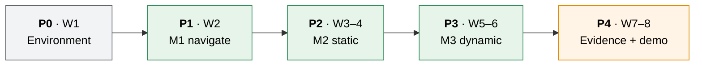

# Milestones: UC6 Warehouse Robot

8 weeks · 4 people · 1 robot. Phases do **not** overlap. A phase starts only when the previous one's exit gate passes.

> **2026-10-04:** the tasks are re-planned after the body pivot: the physical Waffle Pi at scale 4 ([ADR-015](ADR-015-physical-waffle-pi-body.md)) replaces the kinematic Cube. Navigation stays our own Python code, now in `ros1/turtlebot_control` ([ADR-012](ADR-012-custom-python-navigation.md)), with standard messages only ([ADR-014](ADR-014-ros-interfaces.md)). The phases, the purpose of each gate and the four roles are unchanged. The earlier `move_base` task lists are on branch `Nguyen-planning`.
>
> **Status (2026-10-05):** the exit of the pivot task (in P1 below) is met: the Edit Mode and Play Mode tests are green in the Unity Test Runner and the acceptance run passed (5 consecutive runs). Both were reported by the user; no figures are recorded. The remaining P1 items are the `mission` node and scenario S-00.

---

## 1. Timeline

| Phase | Weeks | Goal | Exit gate (all must pass) |
|:-----:|:-----:|------|---------------------------|
| **P0** | 1 | Everyone can run the stack | Setup-guide smoke test (§8) passes on **all 4 machines** · MySQL up with schema · the stack starts end to end (`bringup.launch` and Unity Play connect) · `/robot/pose` and `/map` visible in RViz |
| **P1** | 2 | **M1** | The Unity EditMode and PlayMode tests pass in the Unity Editor · **acceptance run**: HomePoint to the point in front of the `TurtleBotNavigator` target shelf and back, driven by ROS (planner and follower), **5 consecutive runs**, every leg `leg_result = succeeded`, stop within 0.15 m of the goal, no collision, no tip · pose, map and `/cmd_vel` are in robot metres and use sim time · the map is raw and contains the walls · S-00 meets its criteria · the `mission` node runs an episode end to end (even if simple) |
| **P2** | 3–4 | **M2** | S-01, S-02 and S-03 meet their criteria · the LIDAR emulation and the obstacle layer work · category profiles switch at runtime |
| **P3** | 5–6 | **M3** | S-04 meets its criteria · S-05 meets its criteria |
| **P4** | 7–8 | Evidence | N = 20 CSVs for S-00 to S-05 with the final planner · each live scenario recorded on video · demo rehearsed twice · docs updated |

Week 8 is deliberately light. It is buffer for any gate that slipped.

---

## 2. Roles

| Role | Owns | Main files |
|------|------|------------|
| **Navigation lead** | Planner, follower, obstacle layer, replan and recovery, tuning, profile values | `ros1/turtlebot_control/`, `ros1/warehouse_bringup/` |
| **Unity lead** | Scene, physical Waffle Pi body and physics standard, ROS scripts (pose, map, `/cmd_vel`), LIDAR emulation, clock, collisions, NPCs, scenarios | `WarehouseProjectURP/Assets/Scripts/` |
| **Mission lead** | The `mission` node: `mission_orchestrator`, motion profile, `metrics_collector`; the interface tables in [architecture.md §5](architecture.md#5-interface-contract) | `ros1/warehouse_mission/` |
| **Data & eval lead** | Schema, `task_manager`, Docker, headless runner, CSV export, demo script | `ros1/warehouse_mission/task_manager.py`, `ros1/warehouse_eval/`, `infra/` |

| Role | Person |
|------|--------|
| Navigation lead | _TBD_ |
| Unity lead | _TBD_ |
| Mission lead | _TBD_ |
| Data & eval lead | _TBD_ |

Every role has a named backup, so any two people can close a gate if someone is away.

---

## 3. Work breakdown per phase

<b>P0: Environment (week 1)</b>

- [ ] All: follow [setup-windows-wsl.md](setup-windows-wsl.md) to the end and run the stack ([ros1/turtlebot_control/README.md](../ros1/turtlebot_control/README.md))
- [x] Nav: `ros1/warehouse_bringup`: `roslaunch warehouse_bringup bringup.launch` starts the endpoint, planner, follower and RViz (fixed frame `map`, shows `/map` and `/planned_path`); `nav:=false` starts only the bridge, the robot model and RViz _(ran against the real Unity in the acceptance run, reported by the user on 2026-10-05)_
- [x] Unity: pin the ROS packages in `Packages/manifest.json` (ROS-TCP-Connector v0.7.0, URDF-Importer v0.5.2)
- [ ] Data: `infra/` MySQL up (`docker compose up -d`)
- [ ] All: agree who edits `Warehouse.unity`. It merges badly, so one branch at a time

<b>P1: M1 navigate (week 2)</b>

**Pivot task** ([ADR-015](ADR-015-physical-waffle-pi-body.md)): the physical Waffle Pi at scale 4, driven by `turtlebot_control`. It was built first; its exit, the Unity tests and the acceptance run named in the P1 gate above, was met on 2026-10-05 (reported by the user). The clock, pose, raw map, `/cmd_vel` and collision report and the navigation nodes belong to it; S-00 checks them again later.

- [x] Nav: `ros1/turtlebot_control`, the algorithm and structure of the earlier `cube_control` in true robot metres on sim time: goal snap within a radius, line of sight that cannot miss a blocked corner, a follower that checks the pose is fresh, `/nav/cancel` and `/nav/leg_result`, inflation from `/nav/inflation_radius`, restart of the Unity clock handled. The planning logic is plain Python apart from `rospy` _(109 unit tests pass on Windows, Python 3.14, and in WSL, Python 3.8.10; they include a closed-loop model of a Waffle Pi that checks the 0.257 m footprint never touches a wall)_
- [x] Nav: the real nodes against a stand-in for Unity in WSL (sim time, clock restart), built with `catkin_make` in a throw-away workspace _(scenarios A to I pass: around a wall, cancel, closed pocket gives `no_path`, `/nav/max_lin`, `/nav/inflation_radius`, stale pose, bad goals, clock restart, follower restart ignores the latched path)_
- [x] Unity: physical body and physics standard taken from `Nguyen-planning`: `DiffDriveController` (speed ramps, holding brake `WheelHold`), `FloorColliderFix`, `PhysicalBody`, the menu *Robotics > Warehouse > Apply Physics Standard* ([ADR-011](ADR-011-physics-standard.md)), `TurtleBotNavigator` as a Unity-only test mode with `autoStart` off _(Edit Mode and Play Mode tests green in the Unity Test Runner, reported by the user on 2026-10-05)_
- [x] Unity: ROS scripts in robot metres on sim time: `ClockPublisher`, `CmdVelSubscriber` (`/cmd_vel` in robot metres, passed straight to `DiffDriveController`, which applies the scale), `RobotPosePublisher` (`/robot/pose` and TF `map` to `base_footprint`), `WarehouseMapPublisher` (raw `/map` from the static `PhysicalBody` colliders), `CollisionReporter` (`/sim/collision`), plus the *Add ROS Bridge* menu _(all 7 assembly groups compile offline with Unity's own Roslyn, 0 new warnings, and the project compiles in the Editor without error; *Add ROS Bridge* has been run and the scene saved with the new components; at the one Play seen in Editor.log, without the ROS endpoint, the map was built as 317 × 317 cells of 0.05 m, 3.7 % blocked; 30 pure Edit Mode tests, `MapGridMathTests` and `CollisionBookTests`, pass outside Unity (2 more need the Unity runtime); the Edit Mode and Play Mode tests are green in the Unity Test Runner, reported by the user on 2026-10-05)_
- [x] Unity: the Cube prototype scripts (`CubeCarNavigator`, `CubeCmdVelSubscriber`, `CubePosePublisher`, `OccupancyGridPublisher`, `HelloSubscriber`, `TestPublisher`, `StripPhysicsFromRobot`) moved to `_archive/unity-cube-prototype/`
- [x] Unity: run the Edit Mode and Play Mode tests in the Test Runner, including the new `WarehouseMapTests`; `RobotNavigatorTests` now calls `GoToTarget()` itself **(exit criterion, met 2026-10-05: green, reported by the user)**
- [x] All: acceptance run, 5 consecutive runs as in the gate above, driven by ROS **(exit criterion, met 2026-10-05: passed, reported by the user, no per-run figures)**. The robot does not spawn on the HomePoint (ROS map frame, robot metres: start x 5.01, y -0.05; HomePoint x 6.32, y 5.87; target shelf x -3.75, y -3.13), which a run has to account for
- [x] Nav: after the acceptance run passed, archived `ros1/cube_control` and `README_ROS1_Prototype.md` to [`_archive/ros1-cube-prototype/`](../_archive/ros1-cube-prototype/README.md) and ADR-013 to [`_archive/2026-10-04-kinematic-cube-plan/`](_archive/2026-10-04-kinematic-cube-plan/README.md)

Not part of this exit: the mission node, the database, the S-xx scenarios, the obstacle layer from `/scan`, NPCs, recovery behaviours and per-category inflation profiles. They come with the items below and with P2 and P3.

- [ ] Unity: `ItemCarrier`, `ScenarioLoader` (S-00); the `/sim/*` command topics and `/sim/ack`
- [ ] Mission: `warehouse_mission` with the `mission` node: orchestrator state machine, basic metrics, `task_manager` (get/report, JSON fallback) on a worker thread
- [ ] Data: seed script; headless runner v1 + CSV export → S-00 × 20

<b>P2: M2 static (weeks 3–4)</b>

- [ ] Unity: S-01, S-02 and S-03 layouts. The LIDAR (`LaserScanner`, `LaserScanPublisher`) is already in the project and publishes `/scan`, but navigation does not use it yet. A dynamic box lying in an aisle is not in the map (only static bodies are)
- [ ] Nav: obstacle layer from `/scan`; replan when blocked; recovery (stop, replan, rotate). The map already has 0.05 m cells. **Open:** the 0.15 m clearance of S-01 cannot be met with inflation 0.35 m (about 9 cm); the first S-01 dry run decides between a cost near obstacles in A* and a threshold fix ([test-plan.md](test-plan.md), [ADR-012](ADR-012-custom-python-navigation.md))
- [ ] Mission: motion profile through `/nav/max_lin` and `/nav/inflation_radius`
- [ ] Data: full metrics in CSV; summary file with PASS/FAIL

<b>P3: M3 dynamic (weeks 5–6)</b>

- [ ] Unity: `NpcMover` + S-04
- [ ] Nav: tune stop and replan for S-04; add a slow/stop zone around NPCs if needed
- [ ] All: S-05 category runs

<b>P4: Evidence (weeks 7–8)</b>

- [ ] Final N = 20 batches for every scenario with the chosen planner
- [ ] Record demo videos (fallback for grading day)
- [ ] Rehearse the demo twice; freeze the code

The [mobile manipulator + inventory panel](features/mobile-manipulator-inventory/requirements.md) feature starts only after the P3 gate.

---

## 4. Risks

| Risk | Chance | Impact | Plan |
|------|:------:|:------:|------|
| WSL networking or bridge problems on one machine | Med | High | NAT + localhost forwarding (tested); WSL-IP fallback in setup Appendix A; smoke test is the P0 gate |
| Noetic is EOL: a package breaks or disappears | Low | High | Binaries are still hosted; pin versions in P0 and keep an `apt` package list ([ADR-003](ADR-003-ros1-noetic.md)) |
| Sim time errors across the bridge | Med | Med | Unity owns `/clock` ([ADR-009](ADR-009-simulation-clock.md)); every node waits for the first `/clock` message before it reads the time |
| Hard inflation leaves too little clearance for S-01 and S-02: the footprint reaches 0.257 m, so inflation 0.35 m keeps about 9 cm | High | Med | Proximity cost in A*, or the one allowed threshold revision; decided at the first S-01 dry run ([ADR-012](ADR-012-custom-python-navigation.md), [test-plan.md](test-plan.md)) |
| The custom planner cannot pass S-04 | Med | High | Add a slow/stop zone around NPCs. The fallback is the `move_base` plan on `Nguyen-planning` |
| Unity changes cannot be tested in CI | Med | Med | Edit Mode tests for the pure logic (scale and axes, map grid, collision book); the team runs the Edit Mode and Play Mode tests and the scene checks in Unity before each gate |
| Scale conversion mistakes (divide or multiply by 4) | Med | Med | One helper (`RosConversions`) with Edit Mode tests; the scale is read from the robot root Transform ([ADR-010](ADR-010-robot-scale.md)) |
| The physical body tips, slides or pivots weakly | Low | High | Speed ramps and the holding brake in `DiffDriveController`; only scale 4 is verified, so keep it; the acceptance run requires no tip ([ADR-015](ADR-015-physical-waffle-pi-body.md)) |
| `Warehouse.unity` merge conflicts | High | Med | One person edits the scene at a time; announce it in the team chat |
| Fragile profile too slow → timeouts | Med | Low | Tunable values; `leg_timeout_s` per scenario |
| Scope creep (perception, more robots) | Med | High | Explicit non-goals in the PRD; nothing new before P3's gate |
| Demo fails live | Low | High | Recorded videos + CSVs as backup |
