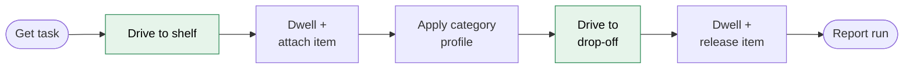

# PRD: UC6 Warehouse Robot

| | |
|---|---|
| **Course** | 61CSE326 · Use case UC6 (e-commerce fulfilment, simulated) |
| **Team** | 4 students · 8 weeks |
| **Stack** | Unity 2021.1 (URP) on Windows · ROS 1 Noetic in WSL2 Ubuntu 20.04 · MySQL 8 |
| **Robots** | 1 × TurtleBot3 Waffle Pi |

---

## 1. Problem

A warehouse must move items from shelves to drop-off points using an autonomous mobile robot. The robot must not collide with **static obstacles** (boxes, pallets) or **moving obstacles** (scripted NPC workers).

The course grades **obstacle avoidance**, in three milestones:

| Milestone | Graded capability |
|-----------|-------------------|
| **M1** | The ROS navigation stack drives the robot to a goal in the Unity warehouse |
| **M2** | Safe navigation around **static** obstacles |
| **M3** | Safe navigation around **dynamic** obstacles |

## 2. Goals

| ID | Goal |
|----|------|
| G1 | The robot reaches shelf and drop-off goals using the ROS 1 navigation stack (`move_base`). |
| G2 | It avoids static obstacles, with numeric pass/fail evidence. |
| G3 | It avoids moving NPCs, with numeric pass/fail evidence. |
| G4 | Item category (Fragile / Standard / Heavy) changes speed and safety margin. This supports avoidance; it is not a separate feature. |
| G5 | Every run is recorded (MySQL + CSV) without the database ever blocking the simulation. |
| G6 | An automated runner produces N = 20 runs per scenario as grading evidence. |

## 3. Non-goals

| ID | We will **not**… | Why |
|----|------------------|-----|
| NG1 | Detect items with ML or cameras | Ungraded. Shelf poses come from the catalog ([ADR-002](ADR-002-perception-scope.md)) |
| NG2 | Grasp with an arm | The Waffle Pi has no arm. Pickup = dwell, then attach in Unity ([ADR-001](ADR-001-robot-platform.md)) |
| NG3 | Write our own path planner | We configure `move_base`; we do not rebuild it ([ADR-008](ADR-008-navigation-stack.md)) |
| NG4 | Run more than one robot | Descoped ([ADR-006](ADR-006-single-robot.md)) |
| NG5 | Write C++ | ROS nodes in Python 3 (rospy); Unity scripts in C# |

## 4. Scope: one episode, end to end

Green = graded path (navigation + avoidance). Everything else is supporting work.

## 5. Functional requirements

### Navigation (graded)

| ID | Requirement | Milestone |
|----|-------------|:---------:|
| FR-01 | `mission_orchestrator` sends each leg's goal to `move_base` as a `MoveBaseAction`. | M1 |
| FR-02 | The robot localises on a pre-built static map using AMCL. | M1 |
| FR-03 | The global planner finds a path around obstacles present in the map. | M2 |
| FR-04 | The local planner avoids static obstacles that are **not** in the map, seen by the LIDAR. | M2 |
| FR-05 | The local planner avoids moving NPCs that cross the path. | M3 |
| FR-06 | When stuck, `move_base` runs recovery behaviours (clear costmap, rotate) before failing the leg. | M2, M3 |

### Mission and category profile (supporting)

| ID | Requirement |
|----|-------------|
| FR-07 | On arrival at the shelf, the robot dwells `dwell_s` seconds, then Unity attaches the item to the robot. |
| FR-08 | Before the drop-off leg, `motion_profile_node` applies the item category's speed/margin profile. |
| FR-09 | On arrival at the drop-off, the robot dwells, then Unity releases the item. |
| FR-10 | If a leg fails or exceeds its timeout, the episode ends with `outcome = fail` and a `fail_reason`. |

### Data and evidence (supporting)

| ID | Requirement |
|----|-------------|
| FR-11 | `task_manager` reads the next pending task from MySQL at episode start. |
| FR-12 | `metrics_collector` measures collisions, replans, recoveries, minimum clearance, path length, duration and mean speed. |
| FR-13 | `task_manager` writes one `runs` row plus its `run_events` in a single transaction at episode end. |
| FR-14 | If MySQL is down: at start, use a bundled default task; at end, save the record to a local JSON file and upload it later. The run is never blocked. |
| FR-15 | The headless runner executes a scenario N times and exports a CSV per scenario. |

## 6. Non-functional requirements

| ID | Requirement |
|----|-------------|
| NFR-01 | Our ROS nodes are Python 3 (rospy). Unity scripts are C#. No custom C++. |
| NFR-02 | Only `task_manager` talks to MySQL. No navigation node ever waits on the database. |
| NFR-03 | Category profiles change at runtime via `dynamic_reconfigure`, without restarting `move_base`. |
| NFR-04 | Every acceptance criterion is a number with a pass/fail threshold. |
| NFR-05 | Everything that ROS touches runs in WSL2 Ubuntu 20.04. Unity runs on Windows ([ADR-007](ADR-007-windows-wsl-environment.md)). |
| NFR-06 | Diagrams are Mermaid, inline in Markdown. |

## 7. Success criteria (headline)

The full matrix is in [test-plan.md](test-plan.md). Each gate uses **N = 20 runs**.

| Milestone | Scenario | Pass when |
|-----------|----------|-----------|
| **M1** | S-00 open room | success ≥ 90 % · 0 collisions |
| **M2** | S-01 single box | success ≥ 95 % · 0 collisions · min clearance ≥ 0.15 m |
| **M2** | S-02 corridor | success ≥ 90 % · 0 collisions · min clearance ≥ 0.10 m · path ratio ≤ 1.4 |
| **M2** | S-03 dead end | success ≥ 85 % · 0 collisions |
| **M3** | S-04 crossing NPC | success ≥ 85 % · ≤ 1 collision in 20 runs |
| — | S-05 category speeds | mean speed Fragile < Heavy < Standard, each gap ≥ 0.03 m/s |

These thresholds are starting values. They may be revised once, after the first dry run of each phase, and the change must be written into [test-plan.md](test-plan.md) with the reason.
