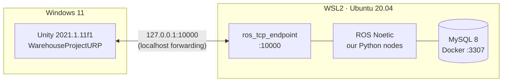

# Setup Guide: Windows + Unity + WSL2 (ROS 1 Noetic)

Follow the steps in order. Each step ends with a **✅ Check**. Do not move on until the check passes.



**Time needed:** about 2–3 hours, mostly downloads.

---

## 0. Requirements

| Item | Minimum |
|------|---------|
| OS | Windows 10 (build 19041+) or Windows 11 |
| RAM | 16 GB recommended (8 GB goes to WSL) |
| Free disk | 40 GB on C: |
| BIOS | Virtualisation (Intel VT-x / AMD-V) enabled |
| Unity Hub | Installed, with **Unity 2021.1.11f1** (the project's version) |

---

## 1. Install WSL2 and Ubuntu 20.04

ROS Noetic runs **only** on Ubuntu 20.04 (Focal). Do not use 22.04 or 24.04.

Open **PowerShell as Administrator**:

```powershell
wsl --install -d Ubuntu-20.04
```

Reboot when asked. On first launch Ubuntu asks for a Linux username and password.

If WSL was already installed:

```powershell
wsl --update
wsl --install -d Ubuntu-20.04
```

✅ **Check:** the Ubuntu-20.04 line shows `VERSION 2`.

```powershell
wsl -l -v
```

---

## 2. Configure WSL: networking and memory

### 2a. Windows side: `%UserProfile%\.wslconfig`

Create or edit `C:\Users\<you>\.wslconfig`:

```ini
[wsl2]
networkingMode=nat
localhostForwarding=true
memory=8GB
processors=8
```

- `localhostForwarding=true`: when a program in WSL listens on a port (the ROS endpoint on `10000`), Windows can reach it at **`127.0.0.1:10000`**. Unity never needs the WSL IP address.
- **Why not `networkingMode=mirrored`?** We tested it: the Hyper-V firewall silently drops Windows → WSL connections, even with an allow rule for port 10000. NAT + localhost forwarding goes through `wslrelay`, which bypasses that firewall and works out of the box.
- `memory` / `processors`: give WSL about half the machine; Unity on Windows needs the rest. With 16 GB RAM and 16 threads, use `8GB` / `8`.
- Save the file as UTF-8 **without BOM** (Notepad: *Save as → Encoding: UTF-8*).

### 2b. Linux side: `/etc/wsl.conf`

Check what is there first. It may already contain `[user] default=<name>`, and overwriting that breaks your login user:

```bash
cat /etc/wsl.conf
```

Then **add only the missing sections**. The end result should look like this, keeping any existing `[user]` block:

```ini
[boot]
systemd=true

[automount]
options="metadata"

[user]
default=<your-linux-user>
```

To edit it, run `sudo nano /etc/wsl.conf`.

- `systemd=true` is recommended for a normal Ubuntu environment (services, `systemctl`).
- `metadata` lets `chmod +x` work on files under `/mnt/c`, which our Python nodes need.

### 2c. Restart WSL

In PowerShell:

```powershell
wsl --shutdown
```

Then reopen Ubuntu.

✅ **Check 1:** in Ubuntu, `systemctl is-system-running` prints `running` or `degraded`, not an error, and this prints `nat`:

```bash
wslinfo --networking-mode
```

✅ **Check 2: Windows → WSL on port 10000.** Start a test listener in Ubuntu:

```bash
python3 -c "import socket;s=socket.socket();s.bind(('0.0.0.0',10000));s.listen(1);print('listening');s.accept();print('connected')"
```

Then, in a normal Windows PowerShell, this must print `True`, and Ubuntu prints `connected`:

```powershell
(Test-NetConnection 127.0.0.1 -Port 10000).TcpTestSucceeded
```

---

## 3. Install ROS 1 Noetic

Noetic reached end of life in May 2025, but its packages are still hosted on `packages.ros.org` ([ADR-003](ADR-003-ros1-noetic.md)). The ROS apt key changed in 2025, so use the **`ros-apt-source`** package below. Old guides that use `apt-key` will fail.

```bash
sudo apt update && sudo apt install -y curl

# 3.1 Add the ROS apt repository and key
export ROS_APT_SOURCE_VERSION=$(curl -s https://api.github.com/repos/ros-infrastructure/ros-apt-source/releases/latest | grep -F '"tag_name"' | awk -F'"' '{print $4}')
curl -L -o /tmp/ros-apt-source.deb \
  "https://github.com/ros-infrastructure/ros-apt-source/releases/download/${ROS_APT_SOURCE_VERSION}/ros-apt-source_${ROS_APT_SOURCE_VERSION}.focal_all.deb"
sudo dpkg -i /tmp/ros-apt-source.deb

# 3.2 Install ROS Noetic desktop-full
sudo apt update
sudo apt install -y ros-noetic-desktop-full

# 3.3 Build tools
sudo apt install -y python3-rosdep python3-catkin-tools python3-pip build-essential git
sudo rosdep init
rosdep update

# 3.4 Load ROS in every new terminal
echo "source /opt/ros/noetic/setup.bash" >> ~/.bashrc
source ~/.bashrc
```

✅ **Check:** the first command prints `noetic`, and after starting `roscore` you see `started core service [/rosout]`. Stop it with `Ctrl+C`.

```bash
rosversion -d
roscore
```

---

## 4. Install the extra packages

```bash
sudo apt install -y \
  python3-pymysql \
  python-is-python3 \
  ros-noetic-turtlebot3-description
```

| Package | Why |
|---------|-----|
| `python3-pymysql` | MySQL driver for `task_manager` |
| `python-is-python3` | Makes `python` mean `python3`. `ros_tcp_endpoint` starts with `#!/usr/bin/env python`; started with its own `endpoint.launch` or `rosrun`, it dies silently without it |
| `ros-noetic-turtlebot3-description` | The Waffle Pi model that `bringup.launch` loads as `robot_description` for RViz |

> The `navigation`, `teb-local-planner`, `gmapping` and `turtlebot3` packages are **not** needed: navigation is our own Python code ([ADR-012](ADR-012-custom-python-navigation.md)).

✅ **Check:** this prints a version number, and `python` is found.

```bash
python3 -c "import pymysql; print(pymysql.__version__)"
python --version
```

---

## 5. Build the catkin workspaces

The repo stays on Windows, where Unity needs it. WSL **links** to two of its `ros1` packages, and the build output stays on the Linux disk for speed. There are two workspaces:

| Workspace | Holds | Why separate |
|-----------|-------|--------------|
| `~/catkin_ws` | `ros_tcp_endpoint` (anything else already there stays) | Unity's bridge, built once and never touched again |
| `~/nav_ws` | Links to `ros1/turtlebot_control` and `ros1/warehouse_bringup` | Our code; it builds on top of `~/catkin_ws` |

```bash
# 5.1 Point REPO at the Windows clone (or git worktree) that holds ros1/turtlebot_control (change the path!)
echo 'export REPO="/mnt/c/Honguyen/VGU/Nam 4/Project/Auto_SupplyChain"' >> ~/.bashrc
source ~/.bashrc

# 5.2 Unity's ROS endpoint (ROS 1 = main branch; pin to the connector version)
mkdir -p ~/catkin_ws/src
cd ~/catkin_ws/src
git clone -b v0.7.0 https://github.com/Unity-Technologies/ROS-TCP-Endpoint.git ros_tcp_endpoint
cd ~/catkin_ws
rosdep install --from-paths src --ignore-src -r -y
catkin_make
source ~/catkin_ws/devel/setup.bash

# 5.3 Our packages, linked from the repo (nav_ws builds on the catkin_ws sourced above)
mkdir -p ~/nav_ws/src
ln -s "$REPO/ros1/turtlebot_control" ~/nav_ws/src/turtlebot_control
ln -s "$REPO/ros1/warehouse_bringup" ~/nav_ws/src/warehouse_bringup
cd ~/nav_ws
catkin_make

# 5.4 Load both in every new terminal (catkin_ws first, nav_ws last)
echo "source ~/catkin_ws/devel/setup.bash" >> ~/.bashrc
echo "source ~/nav_ws/devel/setup.bash" >> ~/.bashrc
source ~/.bashrc
```

> If `~/catkin_ws/src` already holds other packages (for example an older `warehouse` link), leave them alone. `~/nav_ws` is sourced last, so its packages win over a package of the same name there (the older `warehouse` link also provides a `warehouse_bringup`). The old `cube_control` package is not needed any more; a link to it already in `~/nav_ws/src` does no harm.

> ⚠️ **Line endings.** Python files edited on Windows can get CRLF endings, which breaks `#!/usr/bin/env python3` in WSL. The repo's `.gitattributes` must contain `ros1/** text eol=lf`. If a node fails with `python3\r: No such file`, run `dos2unix` on that file.

✅ **Check:** each command prints a path, and the last two are under `~/nav_ws/src` (the links). If `warehouse_bringup` points into `~/catkin_ws/src`, `~/nav_ws` is sourced before `~/catkin_ws`: fix the order in `~/.bashrc` (step 5.4).

```bash
rospack find ros_tcp_endpoint
rospack find turtlebot_control
rospack find warehouse_bringup
```

---

## 6. MySQL in Docker (Docker Desktop + WSL integration)

We use **Docker Desktop on Windows** and let Ubuntu-20.04 use it. Do **not** also install Docker Engine inside Ubuntu (`get.docker.com`): two Docker daemons conflict. You also do **not** need `usermod -aG docker`, because that group only exists with a native Docker Engine.

### 6.1 Enable WSL integration (Windows)

1. Install [Docker Desktop](https://www.docker.com/products/docker-desktop/) if you don't have it, then **start it** and wait until it says *Engine running*.
2. **Settings → General:** ✅ *Use the WSL 2 based engine*.
3. **Settings → Resources → WSL integration:** turn on **Ubuntu-20.04** → **Apply & restart**.
4. Optional: **Settings → General → Start Docker Desktop when you sign in**. MySQL only runs while Docker Desktop runs.

✅ **Check (in Ubuntu-20.04):** open a **new** terminal. `docker version` must show both *Client* and *Server*, and `hello-world` must print `Hello from Docker!`.

```bash
docker version
docker run --rm hello-world
```

### 6.2 Start MySQL

The compose file is [`infra/docker-compose.yml`](../infra/docker-compose.yml). It loads `docs/schema.sql` on first start and publishes MySQL on `127.0.0.1:3307` only. Port 3306 is avoided because a locally installed MySQL (Windows service `MySQL80`) often uses it; change `MYSQL_HOST_PORT` in `.env` if needed.

```bash
cd "$REPO/infra"
cp .env.example .env
nano .env            # set MYSQL_ROOT_PASSWORD and MYSQL_PASSWORD
docker compose up -d
docker compose ps    # wait until STATUS shows (healthy)
```

`infra/.env` is git-ignored, so never commit it.

✅ **Check:** the output lists the six tables (`categories`, `items`, `run_events`, `runs`, `shelf_slots`, `tasks`).

```bash
docker compose exec mysql mysql -uwarehouse -p warehouse -e "SHOW TABLES;"
```

> The schema only loads on the **first** start of an empty volume. After changing `schema.sql`, reset with `docker compose down -v && docker compose up -d`. This **deletes all data**.

---

## 7. Unity project (Windows)

1. Open **Unity Hub → Add →** the `WarehouseProjectURP` folder of your clone (or git worktree), with Unity **2021.1.11f1**. Git must be installed: Unity downloads the two ROS packages from GitHub. **The first import is long.** Wait until the progress bar ends.
2. The two ROS packages are pinned in `Packages/manifest.json`, so there is nothing to add by hand:
   ```text
   https://github.com/Unity-Technologies/ROS-TCP-Connector.git?path=/com.unity.robotics.ros-tcp-connector#v0.7.0
   https://github.com/Unity-Technologies/URDF-Importer.git?path=/com.unity.robotics.urdf-importer#v0.5.2
   ```
3. **Robotics → ROS Settings:**
   - Protocol: **ROS1**
   - ROS IP Address: **127.0.0.1**
   - ROS Port: **10000**
4. **The robot** is the physical TurtleBot3 Waffle Pi in the `Warehouse` scene ([ADR-015](ADR-015-physical-waffle-pi-body.md)): the URDF-Importer model in `Assets/URDF/`, scale 4, wheels as `ArticulationBody`, driven by `DiffDriveController`. There is nothing to import. Do not re-import the URDF: a straight import does not drive, and [ADR-010](ADR-010-robot-scale.md) lists the five fixes. If you ever rebuild the model, the `.urdf` must sit directly in `Assets/URDF/`, next to the `turtlebot3_description/` folder.
5. **Add the ROS bridge.** With `Assets/Scenes/Warehouse.unity` open, run **Robotics → Warehouse → Add ROS Bridge**, then **save the scene** (`Ctrl+S`). The menu adds what is missing to the robot (`OdometryPublisher`, `LaserScanPublisher`, `CmdVelSubscriber`, `RobotPosePublisher`, `WarehouseMapPublisher`, `CollisionReporter`) and one `RosClock` object (`ClockPublisher`). It is safe to run twice. It also switches off `OdometryPublisher.publishTf` (`RobotPosePublisher` owns the TF `map → base_footprint`) and `TurtleBotNavigator.autoStart` (ROS drives the robot; the Unity-only mission stays available as a test mode).
   - ✅ **Check:** the Console prints `Add ROS Bridge: N component(s) added …` (N is 0 when the scene already has them) and the scene title shows no unsaved mark.
6. **Run the tests.** **Window → General → Test Runner**, then **Run All** on the **EditMode** tab and on the **PlayMode** tab. They need no ROS. The PlayMode tests load the *saved* `Warehouse` scene, so save it first (step 5).
   - ✅ **Check:** both tabs are green. If `WarehousePhysicsSceneTests` fails, run **Robotics → Warehouse → Apply Physics Standard**, save the scene and run again.
   - Status on 2026-10-05: the Python tests (§9) and an offline C# compile check are done; the EditMode and PlayMode tests are green in the Unity Test Runner (reported by the user, no figures).
7. Press **Play** once without ROS (the HUD arrows stay red and the Console shows `Connection to 127.0.0.1:10000 …` lines; both are expected while the ROS endpoint is not running). ✅ **Check:** the robot stands on the floor and does not move, and the Console prints a `RobotPosePublisher` line with the home point, the target shelf and the robot in the ROS map frame (robot metres), then (after a few seconds) `WarehouseMapPublisher: built … cells of 0.05 m`.

There are no custom ROS messages to generate: all interfaces use standard types ([ADR-014](ADR-014-ros-interfaces.md)).

---

## 8. End-to-end smoke test

| Step | Where | Command / action | Expected |
|:----:|-------|------------------|----------|
| 1 | WSL terminal 1 | `roslaunch warehouse_bringup bringup.launch` | Starts `roscore`, the Unity endpoint (port 10000), the planner, the follower and RViz in one go. The log shows `Starting server on 0.0.0.0:10000` and `astar_planner ready: send a goal to /move_base_simple/goal`. RViz opens on Windows via WSLg (fixed frame `map`) |
| 2 | PowerShell | `Test-NetConnection 127.0.0.1 -Port 10000` | `TcpTestSucceeded : True` |
| 3 | Unity | Press **Play** | HUD arrows in the top-left turn blue (connected). RViz shows `/map` after a few seconds |
| 4 | WSL terminal 2 | `rostopic hz /robot/pose` and `rostopic echo -n1 /map/info` | About 30 Hz; `resolution: 0.05` |
| 5 | WSL terminal 2 | `rostopic pub -r 10 /cmd_vel geometry_msgs/Twist '{linear: {x: 0.1}}'` | The robot drives forward in Unity. After `Ctrl+C` it stops (Unity's watchdog, 0.5 s without a command) |
| 6 | WSL terminal 2 | Send a goal, step 8a | The robot drives to the goal and `/nav/leg_result` reports `succeeded` |

When all 6 rows pass, the environment is ready. Start `bringup.launch` before pressing Play; if you press Play again later, the follower ends a running leg as `aborted` / `cancelled` and carries on.

`roslaunch warehouse_bringup bringup.launch nav:=false` starts only the bridge, the robot model and RViz (no planner or follower), for driving by hand with `/cmd_vel`. `rviz:=false` skips RViz.

### 8a. Send a goal and read the result

The planner and the follower are **silent until a goal arrives**: if everything is connected and the robot stands still, no goal has been sent. A goal is a `PoseStamped` in frame `map`, in robot metres. Take `x` and `y` from the `RobotPosePublisher` line that Unity prints in the Console at Play (`home point`, `target shelf`, `robot now`), or click a point in RViz with the *2D Nav Goal* tool. A goal that lies inside a wall or a shelf is moved to the nearest free cell within 2.0 m.

Terminal 2, read the results first:

```bash
rostopic echo /nav/leg_result
```

Terminal 3, send the goal. The `x` and `y` below are the **home point** from that Console line on 2026-10-05. They are an example: replace them with the numbers your own Console prints.

```bash
rostopic pub -1 /move_base_simple/goal geometry_msgs/PoseStamped "{header: {frame_id: 'map'}, pose: {position: {x: 6.32, y: 5.87, z: 0.0}, orientation: {w: 1.0}}}"
```

For reference, the same log showed the target shelf at x=-3.75 y=-3.13 and the robot at x=5.01 y=-0.05. The robot does not start on the home point: it is about 6 m away.

The planner logs `Planned: N corners, …`, the robot drives, the follower logs `Arrived at the goal`, and `/nav/leg_result` prints one JSON line:

| `/nav/leg_result` | Meaning |
|-------------------|---------|
| `{"outcome": "succeeded", "reason": ""}` | The follower reached the goal |
| `{"outcome": "aborted", "reason": "no_path"}` | The planner found no path or refused the goal (not in frame `map`, no `/map` or `/robot/pose` yet, pose older than 1 s). The planner log says which |
| `{"outcome": "aborted", "reason": "cancelled"}` | `/nav/cancel` was sent, or Unity pressed Play again |

Other things to try: `rosparam set /nav/max_lin 0.15` and `rostopic pub -1 /nav/cancel std_msgs/Empty "{}"`. The topics and parameters are listed in [ros1/turtlebot_control/README.md](../ros1/turtlebot_control/README.md).

---

## 9. Python unit tests

The navigation logic is plain Python, tested without ROS and without Unity. At the time of writing, 109 tests pass on both Windows (Python 3.14) and WSL (Python 3.8.10, the Noetic version). They include a closed-loop model of a Waffle Pi that checks that the footprint circle (0.257 m) never touches a wall.

Windows (PowerShell, from the repo root):

```powershell
cd ros1\turtlebot_control
python -m unittest discover -s test -v
```

WSL:

```bash
cd "$REPO/ros1/turtlebot_control"
python3 -m unittest discover -s test -v
```

✅ **Check:** the output ends with `Ran 109 tests … OK`.

---

## Troubleshooting

| Symptom | Fix |
|---------|-----|
| Unity HUD stays red, and the Console shows `Connection to 127.0.0.1:10000 …` lines (refused or failed) | The ROS endpoint is not running yet. Start `roslaunch warehouse_bringup bringup.launch`, check that the port test (§8, row 2) passes, then press Play again. Also check that ROS Settings says `127.0.0.1` and **ROS1** |
| `TcpTestSucceeded : False` | Is something listening on 10000 in WSL (`ss -ltn`)? Does `.wslconfig` have `networkingMode=nat` + `localhostForwarding=true`? Did you run `wsl --shutdown` after editing it? |
| `usermod: group 'docker' does not exist` | Expected with Docker Desktop. Skip `usermod`; enable WSL integration instead (step 6.1). |
| `failed to read …/infra/.env: key cannot contain a space` | `.env` has a non `KEY=value` line (e.g. a pasted command). Keep only the lines from `.env.example`. |
| `ports are not available: exposing port TCP 127.0.0.1:3306` | Another MySQL already uses that port. Set `MYSQL_HOST_PORT` in `.env` to a free port (default 3307). |
| Nodes see time 0, or time jumps | Check that `use_sim_time` is `true` (`bringup.launch` sets it) and that `/clock` is publishing (`rostopic hz /clock`). Unity only publishes it while it is playing, so the follower logs `Waiting for Unity's /clock` until you press Play. If you press Play again, the follower ends a running leg as `aborted` / `cancelled` and carries on |
| `Permission denied` on `rosrun` | `chmod +x` the script. Needs the `metadata` mount option (step 2b). |
| `apt update` fails with a GPG / NO_PUBKEY error | You used an old `apt-key` guide. Redo step 3.1. |
| `python` not found for `ros_tcp_endpoint` (for example `env: 'python': No such file or directory`), or the endpoint "starts" but nothing listens on 10000 (`ss -ltn` empty, not in `rosnode list`) | No `python` command in WSL. Run `sudo apt install python-is-python3` (step 4). `bringup.launch` starts the endpoint with `python3` and works even without it; `endpoint.launch` and `rosrun` do not |
| `python3\r: No such file or directory` | CRLF line endings. See the note in step 5. |
| URDF import: `DirectoryNotFoundException … turtlebot3_description\turtlebot3_description\meshes` | The `.urdf` is one folder too deep. It must sit next to the `turtlebot3_description/` folder, not inside it (see step 7.4). |
| Imported robot is **pink** | URP project, Built-in materials. Select `Assets/URDF/turtlebot3_description/Materials/*` → **Edit → Render Pipeline → Universal Render Pipeline → Upgrade Selected Materials to UniversalRP Materials**. |
| RViz does not open | Run `wsl --update` (WSLg needs a recent WSL), then `wsl --shutdown`. |
| Everything is connected but the robot stands still | The planner and the follower are silent until a goal arrives. Send one (§8a) and watch `rostopic echo /nav/leg_result` |
| `/nav/leg_result` reports `aborted` / `no_path` at once | The goal is not in frame `map` (it is refused), or `/map` or `/robot/pose` has not arrived yet, or the pose is older than 1 s. The planner log says which |
| `rospack find warehouse_bringup` points into `~/catkin_ws/src` | `~/nav_ws` is sourced before `~/catkin_ws`, so the older `warehouse` link wins. Source `~/catkin_ws` first, `~/nav_ws` last (step 5.4) |
| Everything is slow | Raise `memory=` in `.wslconfig`. Close the Unity Scene view while running headless batches. |

---

## Appendix A: Fallback if localhost forwarding fails

If Check 2 in step 2 still fails with NAT + `localhostForwarding`, point Unity at the WSL IP address instead:

```bash
hostname -I        # in WSL, e.g. 172.24.18.5
```

Put that IP in Unity's **ROS Settings**. It changes after each `wsl --shutdown` or reboot, so check it every session.
