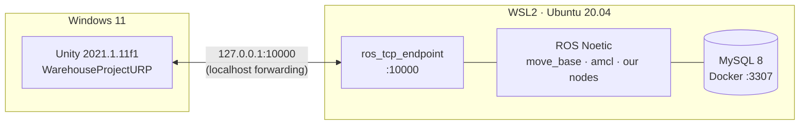

# Setup Guide: Windows + Unity + WSL2 (ROS 1 Noetic)

Follow the steps in order. Each step ends with a **✅ Check**. Do not move on until the check passes.



**Time needed:** about 2–3 hours, mostly downloads.

---

## 0. Requirements

| Item | Minimum |
|------|---------|
| OS | Windows 10 (build 19041+) or Windows 11 |
| RAM | 16 GB recommended (8 GB goes to WSL) |
| Free disk | 40 GB on C: |
| BIOS | Virtualisation (Intel VT-x / AMD-V) enabled |
| Unity Hub | Installed, with **Unity 2021.1.11f1** (the project's version) |

---

## 1. Install WSL2 and Ubuntu 20.04

ROS Noetic runs **only** on Ubuntu 20.04 (Focal). Do not use 22.04 or 24.04.

Open **PowerShell as Administrator**:

```powershell
wsl --install -d Ubuntu-20.04
```

Reboot when asked. On first launch Ubuntu asks for a Linux username and password.

If WSL was already installed:

```powershell
wsl --update
wsl --install -d Ubuntu-20.04
```

✅ **Check:** the Ubuntu-20.04 line shows `VERSION 2`.

```powershell
wsl -l -v
```

---

## 2. Configure WSL: networking and memory

### 2a. Windows side: `%UserProfile%\.wslconfig`

Create or edit `C:\Users\<you>\.wslconfig`:

```ini
[wsl2]
networkingMode=nat
localhostForwarding=true
memory=8GB
processors=8
```

- `localhostForwarding=true`: when a program in WSL listens on a port (the ROS endpoint on `10000`), Windows can reach it at **`127.0.0.1:10000`**. Unity never needs the WSL IP address.
- **Why not `networkingMode=mirrored`?** We tested it: the Hyper-V firewall silently drops Windows → WSL connections, even with an allow rule for port 10000. NAT + localhost forwarding goes through `wslrelay`, which bypasses that firewall and works out of the box.
- `memory` / `processors`: give WSL about half the machine; Unity on Windows needs the rest. With 16 GB RAM and 16 threads, use `8GB` / `8`.
- Save the file as UTF-8 **without BOM** (Notepad: *Save as → Encoding: UTF-8*).

### 2b. Linux side: `/etc/wsl.conf`

Check what is there first. It may already contain `[user] default=<name>`, and overwriting that breaks your login user:

```bash
cat /etc/wsl.conf
```

Then **add only the missing sections**. The end result should look like this, keeping any existing `[user]` block:

```ini
[boot]
systemd=true

[automount]
options="metadata"

[user]
default=<your-linux-user>
```

To edit it, run `sudo nano /etc/wsl.conf`.

- `systemd=true` is recommended for a normal Ubuntu environment (services, `systemctl`).
- `metadata` lets `chmod +x` work on files under `/mnt/c`, which our Python nodes need.

### 2c. Restart WSL

In PowerShell:

```powershell
wsl --shutdown
```

Then reopen Ubuntu.

✅ **Check 1:** in Ubuntu, `systemctl is-system-running` prints `running` or `degraded`, not an error, and this prints `nat`:

```bash
wslinfo --networking-mode
```

✅ **Check 2: Windows → WSL on port 10000.** Start a test listener in Ubuntu:

```bash
python3 -c "import socket;s=socket.socket();s.bind(('0.0.0.0',10000));s.listen(1);print('listening');s.accept();print('connected')"
```

Then, in a normal Windows PowerShell, this must print `True`, and Ubuntu prints `connected`:

```powershell
(Test-NetConnection 127.0.0.1 -Port 10000).TcpTestSucceeded
```

---

## 3. Install ROS 1 Noetic

Noetic reached end of life in May 2025, but its packages are still hosted on `packages.ros.org` ([ADR-003](ADR-003-ros1-noetic.md)). The ROS apt key changed in 2025, so use the **`ros-apt-source`** package below. Old guides that use `apt-key` will fail.

```bash
sudo apt update && sudo apt install -y curl

# 3.1 Add the ROS apt repository and key
export ROS_APT_SOURCE_VERSION=$(curl -s https://api.github.com/repos/ros-infrastructure/ros-apt-source/releases/latest | grep -F '"tag_name"' | awk -F'"' '{print $4}')
curl -L -o /tmp/ros-apt-source.deb \
  "https://github.com/ros-infrastructure/ros-apt-source/releases/download/${ROS_APT_SOURCE_VERSION}/ros-apt-source_${ROS_APT_SOURCE_VERSION}.focal_all.deb"
sudo dpkg -i /tmp/ros-apt-source.deb

# 3.2 Install ROS Noetic desktop-full
sudo apt update
sudo apt install -y ros-noetic-desktop-full

# 3.3 Build tools
sudo apt install -y python3-rosdep python3-catkin-tools python3-pip build-essential git
sudo rosdep init
rosdep update

# 3.4 Load ROS in every new terminal
echo "source /opt/ros/noetic/setup.bash" >> ~/.bashrc
source ~/.bashrc
```

✅ **Check:** the first command prints `noetic`, and after starting `roscore` you see `started core service [/rosout]`. Stop it with `Ctrl+C`.

```bash
rosversion -d
roscore
```

---

## 4. Install the navigation packages

```bash
sudo apt install -y \
  ros-noetic-navigation \
  ros-noetic-teb-local-planner \
  ros-noetic-gmapping \
  ros-noetic-turtlebot3 \
  ros-noetic-turtlebot3-msgs \
  python3-pymysql
```

| Package | Why |
|---------|-----|
| `navigation` | `move_base`, `amcl`, `map_server`, `global_planner`, `dwa_local_planner`, costmaps |
| `teb-local-planner` | Second local-planner candidate ([ADR-004](ADR-004-local-planner.md)) |
| `gmapping` | Build the warehouse map once |
| `turtlebot3` | Waffle Pi URDF, meshes, reference nav configs |
| `python3-pymysql` | MySQL driver for `task_manager` |

✅ **Check:** both commands print a path.

```bash
rospack find move_base
rospack find teb_local_planner
```

---

## 5. Build the catkin workspace

The repo stays on Windows, where Unity needs it. WSL **links** to its `ros/src` folder, and the build output stays on the Linux disk for speed.

```bash
# 5.1 Point REPO at your Windows clone (change the path!)
echo 'export REPO="/mnt/c/Honguyen/VGU/Nam 4/Project/Auto_SupplyChain"' >> ~/.bashrc
source ~/.bashrc

# 5.2 Workspace with a link to our packages
mkdir -p ~/catkin_ws/src
ln -s "$REPO/ros/src" ~/catkin_ws/src/warehouse

# 5.3 Unity's ROS endpoint (ROS 1 = main branch; pin to the connector version)
cd ~/catkin_ws/src
git clone -b v0.7.0 https://github.com/Unity-Technologies/ROS-TCP-Endpoint.git ros_tcp_endpoint

# 5.4 Dependencies + build
cd ~/catkin_ws
rosdep install --from-paths src --ignore-src -r -y
catkin_make
echo "source ~/catkin_ws/devel/setup.bash" >> ~/.bashrc
source ~/.bashrc
```

> ⚠️ **Line endings.** Python files edited on Windows can get CRLF endings, which breaks `#!/usr/bin/env python3` in WSL. The repo's `.gitattributes` must contain `ros/** text eol=lf`. If a node fails with `python3\r: No such file`, run `dos2unix` on that file.

✅ **Check:** this prints a path.

```bash
rospack find ros_tcp_endpoint
```

---

## 6. MySQL in Docker (Docker Desktop + WSL integration)

We use **Docker Desktop on Windows** and let Ubuntu-20.04 use it. Do **not** also install Docker Engine inside Ubuntu (`get.docker.com`): two Docker daemons conflict. You also do **not** need `usermod -aG docker`, because that group only exists with a native Docker Engine.

### 6.1 Enable WSL integration (Windows)

1. Install [Docker Desktop](https://www.docker.com/products/docker-desktop/) if you don't have it, then **start it** and wait until it says *Engine running*.
2. **Settings → General:** ✅ *Use the WSL 2 based engine*.
3. **Settings → Resources → WSL integration:** turn on **Ubuntu-20.04** → **Apply & restart**.
4. Optional: **Settings → General → Start Docker Desktop when you sign in**. MySQL only runs while Docker Desktop runs.

✅ **Check (in Ubuntu-20.04):** open a **new** terminal. `docker version` must show both *Client* and *Server*, and `hello-world` must print `Hello from Docker!`.

```bash
docker version
docker run --rm hello-world
```

### 6.2 Start MySQL

The compose file is [`infra/docker-compose.yml`](../infra/docker-compose.yml). It loads `docs/schema.sql` on first start and publishes MySQL on `127.0.0.1:3307` only. Port 3306 is avoided because a locally installed MySQL (Windows service `MySQL80`) often uses it; change `MYSQL_HOST_PORT` in `.env` if needed.

```bash
cd "$REPO/infra"
cp .env.example .env
nano .env            # set MYSQL_ROOT_PASSWORD and MYSQL_PASSWORD
docker compose up -d
docker compose ps    # wait until STATUS shows (healthy)
```

`infra/.env` is git-ignored, so never commit it.

✅ **Check:** the output lists the six tables (`categories`, `items`, `run_events`, `runs`, `shelf_slots`, `tasks`).

```bash
docker compose exec mysql mysql -uwarehouse -p warehouse -e "SHOW TABLES;"
```

> The schema only loads on the **first** start of an empty volume. After changing `schema.sql`, reset with `docker compose down -v && docker compose up -d`. This **deletes all data**.

---

## 7. Unity project (Windows)

1. Open **Unity Hub → Add →** `WarehouseProjectURP`, with Unity **2021.1.11f1**.
2. **Window → Package Manager → + → Add package from git URL**, and add both:
   ```text
   https://github.com/Unity-Technologies/ROS-TCP-Connector.git?path=/com.unity.robotics.ros-tcp-connector#v0.7.0
   https://github.com/Unity-Technologies/URDF-Importer.git?path=/com.unity.robotics.urdf-importer#v0.5.2
   ```
3. **Robotics → ROS Settings:**
   - Protocol: **ROS1**
   - ROS IP Address: **127.0.0.1**
   - ROS Port: **10000**
4. **Import the Waffle Pi.** Run this in WSL:
   ```bash
   URDF_DIR="$REPO/WarehouseProjectURP/Assets/URDF"
   mkdir -p ~/tb3_urdf "$URDF_DIR/turtlebot3_description" && cd ~/tb3_urdf
   rosrun xacro xacro $(rospack find turtlebot3_description)/urdf/turtlebot3_waffle_pi.urdf.xacro > turtlebot3_waffle_pi.urdf
   cp turtlebot3_waffle_pi.urdf "$URDF_DIR/"
   cp -r $(rospack find turtlebot3_description)/meshes "$URDF_DIR/turtlebot3_description/"
   ```
   The layout **must** be exactly this. The importer resolves `package://turtlebot3_description/...` relative to the `.urdf` file's folder:
   ```text
   Assets/URDF/
   ├─ turtlebot3_waffle_pi.urdf
   └─ turtlebot3_description/meshes/{bases,sensors,wheels}/*.stl
   ```
   Then in Unity's **Project window** (bottom panel), open `Assets/URDF`, **right-click the `.urdf` file** → **Import Robot from Selected URDF file**. In the dialog, keep the defaults (Axis Type *Y Axis*, Mesh Decomposer *VHACD*) → **Import URDF**. The robot appears in the Hierarchy. Then:
   - Move it to open floor (not inside a shelf).
   - Remove the importer's keyboard **Controller** component if present.
   - Uncheck **Immovable** on the base link's Articulation Body if it is set.
   - Save the scene (`Ctrl+S`) and drag the robot into `Assets/Prefabs/` to make a prefab.
   - ✅ **Check:** press Play; the robot rests on the floor without falling or jittering.
5. **Custom messages** (needs `ros/src/warehouse_msgs`, a P0 task): top menu **Robotics → Generate ROS Messages…** → **Browse** to `ros/src/warehouse_msgs` → **Build msgs** / **Build srvs**. C# files are generated in `Assets/RosMessages/`. Do this again whenever a `.msg` or `.srv` changes.

---

## 8. End-to-end smoke test

| Step | Where | Command / action | Expected |
|:----:|-------|------------------|----------|
| 1 | WSL terminal 1 | `roscore` | `started core service` |
| 2 | WSL terminal 2 | `roslaunch ros_tcp_endpoint endpoint.launch tcp_ip:=0.0.0.0 tcp_port:=10000` | `Starting server on 0.0.0.0:10000` |
| 3 | PowerShell | `Test-NetConnection 127.0.0.1 -Port 10000` | `TcpTestSucceeded : True` |
| 4 | Unity | Press **Play** | HUD arrows in the top-left turn blue (connected) |
| 5 | WSL terminal 3 | `rostopic hz /clock` and `rostopic echo -n1 /scan` | Messages arrive |
| 6 | WSL terminal 3 | `rostopic pub -r 10 /cmd_vel geometry_msgs/Twist '{linear: {x: 0.1}}'` | Robot drives forward in Unity |
| 7 | WSL terminal 3 | `rviz` | RViz window opens on Windows via WSLg |

When all 7 rows pass, the environment is ready. From then on you start everything with:

```bash
roslaunch warehouse_bringup bringup.launch
```

---

## Troubleshooting

| Symptom | Fix |
|---------|-----|
| Unity HUD stays red | Is the endpoint running? Does step 3 pass? Is ROS Settings set to `127.0.0.1` and **ROS1**? |
| `TcpTestSucceeded : False` | Is something listening on 10000 in WSL (`ss -ltn`)? Does `.wslconfig` have `networkingMode=nat` + `localhostForwarding=true`? Did you run `wsl --shutdown` after editing it? |
| `usermod: group 'docker' does not exist` | Expected with Docker Desktop. Skip `usermod`; enable WSL integration instead (step 6.1). |
| `failed to read …/infra/.env: key cannot contain a space` | `.env` has a non `KEY=value` line (e.g. a pasted command). Keep only the lines from `.env.example`. |
| `ports are not available: exposing port TCP 127.0.0.1:3306` | Another MySQL already uses that port. Set `MYSQL_HOST_PORT` in `.env` to a free port (default 3307). |
| TF "extrapolation into the future" errors | Check that `use_sim_time` is `true` (the bringup launch sets it) and that `/clock` is publishing. |
| `apt update` fails with a GPG / NO_PUBKEY error | You used an old `apt-key` guide. Redo step 3.1. |
| `python3\r: No such file or directory` | CRLF line endings. See the note in step 5. |
| URDF import: `DirectoryNotFoundException … turtlebot3_description\turtlebot3_description\meshes` | The `.urdf` is one folder too deep. It must sit next to the `turtlebot3_description/` folder, not inside it (step 7.4). |
| Imported robot is **pink** | URP project, Built-in materials. Select `Assets/URDF/turtlebot3_description/Materials/*` → **Edit → Render Pipeline → Universal Render Pipeline → Upgrade Selected Materials to UniversalRP Materials**. |
| Robot falls through the floor / jitters on Play | Floor needs a Collider; spawn the robot in open space, slightly above the floor (Y ≈ 0.05). |
| RViz does not open | Run `wsl --update` (WSLg needs a recent WSL), then `wsl --shutdown`. |
| Everything is slow | Raise `memory=` in `.wslconfig`. Close the Unity Scene view while running headless batches. |

---

## Appendix A: Fallback if localhost forwarding fails

If Check 2 in step 2 still fails with NAT + `localhostForwarding`, point Unity at the WSL IP address instead:

```bash
hostname -I        # in WSL, e.g. 172.24.18.5
```

Put that IP in Unity's **ROS Settings**. It changes after each `wsl --shutdown` or reboot, so check it every session.
