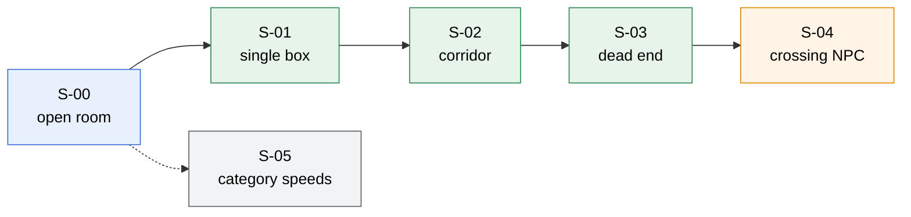
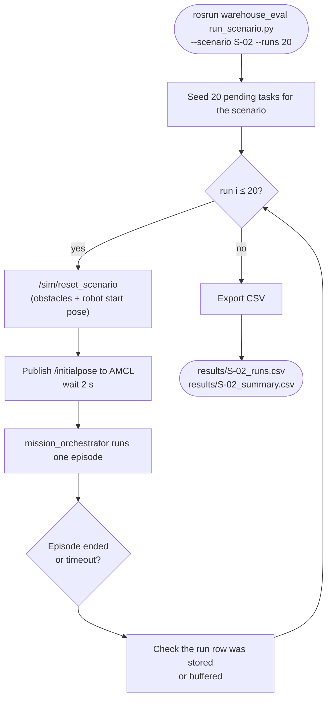

# Test Plan: UC6 Warehouse Robot

Every claim we make to the grader is backed by **20 automated runs per scenario**, exported as CSV.

---

## 1. Scenarios

All scenarios use one robot, the same static map (walls + shelves), and a fixed start pose. Obstacles are placed by Unity's `ScenarioLoader` and are **not** in the map.

| ID | Name | Setup | Tests | Milestone |
|----|------|-------|-------|:---------:|
| **S-00** | Open room | No extra obstacles. Standard item. | Basic navigation | M1 |
| **S-01** | Single box | One 0.5 m box on the straight line between shelf and drop-off | Static avoidance | M2 |
| **S-02** | Corridor | 1.0 m wide corridor (≈ 3× robot width) with boxes along both sides | Precise static avoidance | M2 |
| **S-03** | Dead end | A box row closes the short route; the robot must back out and take the long route | Recovery + replanning | M2 |
| **S-04** | Crossing NPC | An NPC walks across the robot's path at 0.5 m/s, every 8 s | Dynamic avoidance | M3 |
| **S-05** | Category speeds | Same route as S-00; 20 runs each of Fragile, Standard and Heavy (60 total) | Profile changes behaviour | supports G4 |



<sub>Blue = M1 · Green = M2 · Orange = M3 · Grey = supporting evidence. Build scenarios in this order; each one reuses the previous setup.</sub>

---

## 2. Acceptance criteria (N = 20 per scenario)

| ID | Success rate | Collisions (total over 20) | Min clearance | Path ratio | Other |
|----|:-----:|:-----:|:-----:|:-----:|-------|
| S-00 | ≥ 90 % | 0 | — | ≤ 1.3 | — |
| S-01 | ≥ 95 % | 0 | ≥ 0.15 m | ≤ 1.5 | — |
| S-02 | ≥ 90 % | 0 | ≥ 0.10 m | ≤ 1.4 | — |
| S-03 | ≥ 85 % | 0 | ≥ 0.10 m | — | recoveries ≥ 1 in ≥ 15 of 20 runs (proves the recovery path is exercised) |
| S-04 | ≥ 85 % | ≤ 1 | — | — | replans and recoveries are **reported, not gated** |
| S-05 | ≥ 90 % per category | 0 | — | — | mean drop-off speed: Fragile < Heavy < Standard, each gap ≥ 0.03 m/s |

"Min clearance" is the worst single value across all 20 runs, not an average.

**Changing a threshold** is allowed once per scenario, after its first dry run. Record the old value, the new value and the reason in the change log at the bottom of this file.

---

## 3. Metrics

How each metric is measured is defined in [architecture.md §10](architecture.md#10-how-each-metric-is-measured-metrics_collector). Summary:

| Metric | Unit | Meaning |
|--------|------|---------|
| success rate | % | runs with `outcome = success` ÷ 20 |
| collisions | count | Unity contacts between the robot and a wall, shelf, obstacle or NPC |
| min clearance | m | closest LIDAR distance minus the robot radius |
| path ratio | — | distance driven ÷ straight-line distance (shelf leg + drop-off leg) |
| duration | s | from dispatch to item release |
| replans | count | global replans beyond the first plan of each leg |
| recoveries | count | `move_base` recovery behaviours triggered |
| drop-off mean speed | m/s | mean speed during the drop-off leg (where the category profile applies) |

---

## 4. Headless runner (`warehouse_eval`)



| Rule | Value |
|------|-------|
| Unity | Stays running (Play mode or a built player). The runner resets the scene between runs; it does not relaunch Unity. |
| Per-leg timeout | `leg_timeout_s` from `scenarios.yaml` (default 90 s) |
| Isolation | Each run gets its own `task` row, so `runs.task_id` identifies exactly one trial |
| Local planner | `--local-planner dwa\|teb`, which is how the ADR-004 benchmark is run |

---

## 5. CSV output

**`<scenario>_runs.csv`**: one row per run.

```text
run_id, scenario_id, task_id, category, local_planner, outcome, fail_reason,
collisions, replans, recoveries, min_clearance_m, path_length_m, baseline_m,
path_ratio, duration_s, dropoff_mean_speed_mps, started_at, ended_at
```

**`<scenario>_summary.csv`**: one row per scenario (per category for S-05), containing each §2 criterion with its measured value and `PASS`/`FAIL`.

---

## 6. Grading-day demo (≈ 10 min)

| # | Show | Proves |
|:-:|------|--------|
| 1 | `docker compose up`, then `SELECT * FROM tasks LIMIT 5` | The data layer is live and separate |
| 2 | Unity Play + `roslaunch warehouse_bringup bringup.launch` + RViz | The full stack comes up |
| 3 | S-02 live, narrating the costmap and planned path in RViz | M2 |
| 4 | S-04 live, narrating local avoidance as the NPC crosses | M3 |
| 5 | Fragile vs Standard back to back | Profiles change behaviour |
| 6 | The `*_summary.csv` tables | The numbers behind every claim |
| ↩ | If a live run misbehaves, play the recorded video of that scenario | The demo cannot be derailed |

---

## Threshold change log

| Date | Scenario | Old | New | Reason |
|------|----------|-----|-----|--------|
| | | | | |
